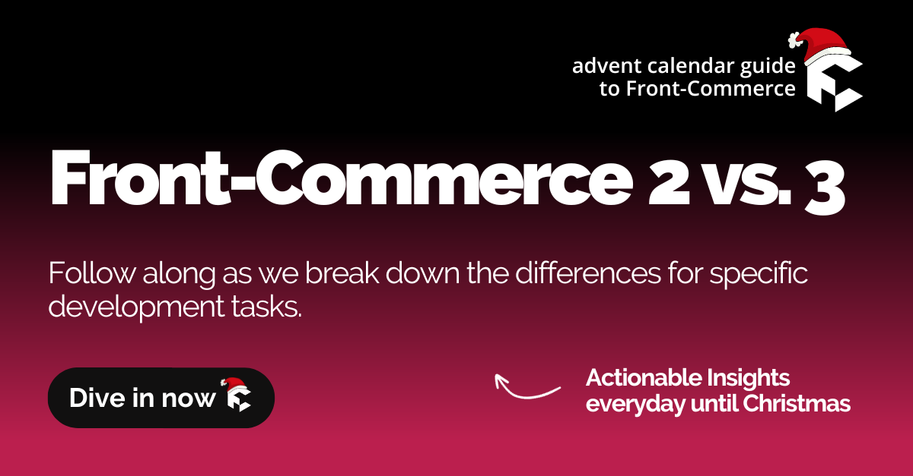

We're happy to announce that over the next 24 days, we'll be sharing with you
some actionable insights about Front-Commerce!

As we gear up for the holiday season, we wanted to take a moment to reflect on
our most important release so far: **Front-Commerce Remixed!**

<!-- truncate -->

## Let’s dive in!

In these series, we’ll break down specific development tasks tackled in
Front-Commerce projects. We’ll compare how it was done in 2.x, and its
counterpart in the present, so we can all learn and grow together.

Over the years, we've gained valuable insight into how our product can better
serve our users. As we introduced new features and more projects and teams were
providing feedback, we noticed some recurring themes.

We recognize that developers are continually seeking ways to streamline their
workflow and improve their development process. That's what drove our vision for
the changes we brought in Front-Commerce Remixed.

## A series made for you!

**Small, easy to digest, knowledge bites even when you're on the go.** A new
article every day that can fit into the busiest of workdays. Keep track of all
the articles in this series by referring to the index we've provided below
(we’ll keep it up-to-date):

1. 🎉🎄 Introducing the Front-Commerce Advent Calendar series! 🎄🎉 _(you're
   reading it!)_
2. [Front-Commerce: your project’s dependency](/blog/2023-advent-calendar/02-front-commerce-your-projects-dependency)
3. [How-to create a new Front-Commerce project?](/blog/2023-advent-calendar/03-how-to-create-a-new-front-commerce-project)
4. [Remix extended for Composable Commerce](/blog/2023-advent-calendar/04-remix-extended-for-composable-commerce)

## We Value Your Feedback!

From the entire FC team, we want to say thank you for your continued support and
feedback that has helped us to create and continuously refine the best possible
product for developers and merchants.

**Let’s make it a conversation! 🗣️**  Your thoughts and feedback on these
articles, new APIs, or features are always welcome. We're eager to chat and
listen to your ideas and suggestions. Don't hesitate to **share your thoughts
with us on Slack, support channels or email**. We're in this together!

## Stay tuned!

Stay tuned for tomorrow's post, where we'll start diving into concrete changes
between Front-Commerce versions 2.x and 3.x.

Follow us on [Twitter](https://twitter.com/front_commerce),
[LinkedIn](https://www.linkedin.com/company/front-commerce/posts/) or subscribe
to [our RSS feed](pathname:///blog/rss.xml) (simple and efficient!) so you don’t
miss an article.

Happy holidays! 🎁🎅
