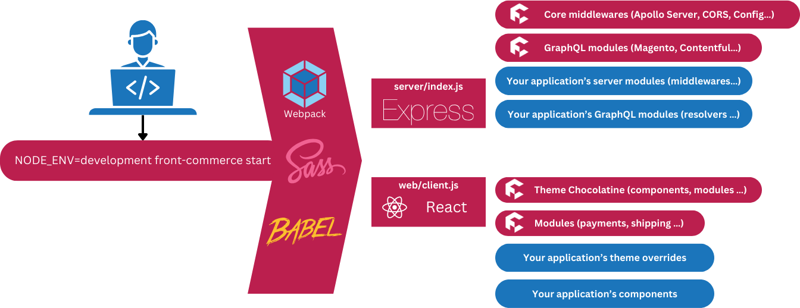
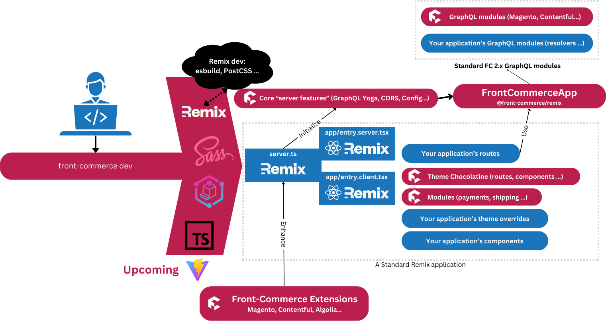

Since 2016, Front-Commerce has been dedicated to supporting teams that operate
in the Headless and Composable commerce space. Being among the first
Frontend-as-a-service providers presented us with its unique challenges, but we
have built solid foundations over the years.

Now, with Front-Commerce v3, we are excited to bring all our experience from the
past seven years to the Remix ecosystem.

Read more to discover how Front-Commerce extends Remix to incorporate all the
features available in Front-Commerce v2.

<!-- truncate -->

:::info Developer Guide series

This article is part of
[our Developer Guide series](./01-introducing-the-front-commerce-advent-calendar-series.mdx).
We're publishing a new articles all year. **Stay tuned!**

:::

## Front-Commerce 2.x: the “all-inclusive” solution

When Front-Commerce was created, React and GraphQL were still evolving with
limited frameworks for developers to use. Most of the ecosystem relied on Create
React App for client-side rendered applications or Gatsby for static site
generation.

Our team understood that **server-side rendering was a more accurate option for
eCommerce storefronts**, which is why we made it a core feature of
Front-Commerce.

With the release of Front-Commerce 2.x, we integrated all the necessary features
you would need into the core: from bundling and server-side rendering, to
routing and HTTP caching.

To illustrate, the components of a Front-Commerce 2.x app look like this:

Key highlights of a Front-Commerce 2.x:

- Front-Commerce must be an Express.js Node application.
- During server-side rendering (SSR), developers can only use Front-Commerce's
  extension points to access server-side-rendered data.
- Front-Commerce only supports the addition of Express middlewares at specific
  extension points.
- Hydration is managed by Front-Commerce with some restrictions such as
  inability to register global React context providers

## Front-Commerce 3.x: leveraging Remix

Fast-forwarding to 2023, the industry has seen the emergence of several stable
and popular frameworks, with Next.js and Remix at the forefront. After careful
consideration,
[we decided to adopt Remix for several reasons previously outlined in another article](/changelog/front-commerce-is-getting-a-remix).

Our priority has always been to ensure that the development experience with
Front-Commerce is seamless and **consistent with how these technologies can be
used outside of Front-Commerce**. This approach not only ensures that agencies
can efficiently onboard new developers, but also guarantees that projects
developed with Front-Commerce are future-proof and can evolve with the industry.

To achieve this, we've made a fundamental change: **we made Front-Commerce
usable in any standard Remix applications**. This is a change for developers
familiar with Front-Commerce 2.x, but it means that developers have more freedom
and autonomy.

In short: **you own your Remix application, Front-Commerce brings the batteries
powering your composable storefront.**

Technically, the components of a Front-Commerce 3.x app look like this:

Key points to take away from this:

- Your application is based on a standard Remix app.
- Launch your application using Front-Commerce's CLI, which takes care of
  running additional tools such as GraphQL Codegen, Sass compilation,
  TypeScript, and more.
- Front-Commerce provides additional features such as Extensions, theme
  management, configuration, and GraphQL unified schema.
- To initialize Front-Commerce, certain key components such as Remix’s
  `server.ts` must bootstrap it.
- You interact with a `FrontCommerceApp` from your loaders and actions to use
  Front-Commerce.
- The skeleton contains a boilerplate: it is completely transparent when
  creating a new application.
- Currently, Front-Commerce only supports `@remix-run/express`, but it has been
  designed to be easily portable to other deployment targets (Cloudflare,
  Netlify, Vercel, etc.) in the future.

## How do you feel about this?

We’re aware that it may not be totally clear for you yet. We recommend to keep
this in mind while reading the rest of our Advent Calendar Series that will dive
into each component, and provide practical examples of using every
Front-Commerce feature in a Remix application.

If you have any questions or concerns, **feel free to keep the conversation
going: we’ll be happy to answer!**

Join us again for the next article in our
[Developer Guide series!](./01-introducing-the-front-commerce-advent-calendar-series.mdx)
