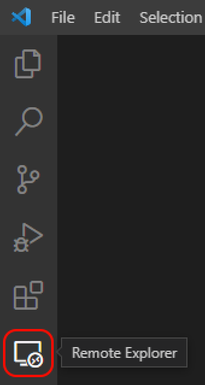
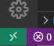
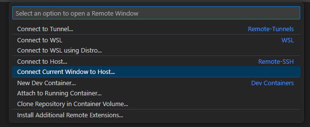
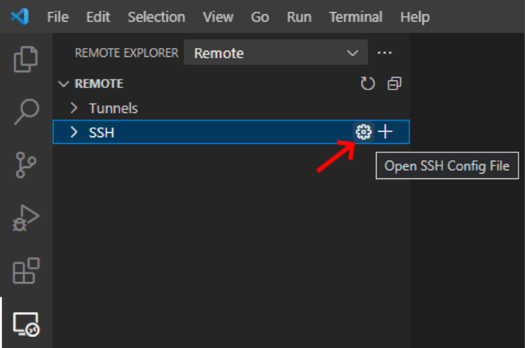

Every developer has their own preferences for their setup, whether it be
software or hardware. I’ve been a remote developer since 2018, and since then
I’ve tried various ways to organize my workspace at home, that would fit both my
work and personal times.

A typical remote developer kit will often include a laptop and one or more
monitors. In my case, because I already had a multi-monitor setup for my
personal desktop PC, all I needed was to come up with a way to homogenize and
make it work with the company’s provided laptop.

<!--truncate-->

## My current setup: **VS Code Remote Development**

### What is it ?

[VS Code Remote Development](https://code.visualstudio.com/docs/remote/remote-overview)
is an extension pack for Microsoft’s widely used IDE VS Code. It allows
developers to “use a container, remote machine, or the Windows Subsystem for
Linux (WSL) as a full-featured development environment”. What it means, is that
you will have your source code located on a single place, and you will be able
to update it seamlessly from another system using VS Code.

_Note: see our
[blog post on installing a WSL development environment](https://developers.front-commerce.com/blog/wsl-development-environment)
if you're interested._

The requirements are:

- For the client, pretty much anything capable of running VS Code _(with special
  needs for containers for Microsoft Windows due to Docker’s own requirements)_
- For the host, a wide range of systems are supported. If you’re not using a
  “mainstream” OS or distribution, you might want to check the requirements
  section of the
  [extension pack’s Marketplace page](https://marketplace.visualstudio.com/items?itemName=ms-vscode-remote.vscode-remote-extensionpack).

In this blog post, we’ll only talk about the SSH connections, so you will need
to ensure that your host has an SSH Host set up. If you don’t, you can follow
[Microsoft’s guide on how to setup one](https://code.visualstudio.com/docs/remote/troubleshooting#_installing-a-supported-ssh-server).
For example, on Ubuntu, you can the command
`sudo apt-get install openssh-server`.

### Installation

:::info

At the time of writing, this guides uses screenshots and instructions for VS
Code 1.78.0 and Remote Development 0.24.0.

:::

That’s where this method shines.

The package installation on the client side is really simple: you’ll only have
to install the
**[Remote Development](https://marketplace.visualstudio.com/items?itemName=ms-vscode-remote.vscode-remote-extensionpack)**
extension pack from Visual Studio Marketplace on your local machine’s VS Code.
This will provide your IDE with all needed extensions to work on your remote
environment.

Once that’s done, you will notice two new icons

- One in your Activity Bar (the vertical bar on the left of VS Code) which is
  the “Remote Explorer”. Clicking on it will reveal the explorer’s sidebar, in
  which where you will be able to see your different connections.



- One in the left of your Status bar (the horizontal bar at the very bottom of
  VS Code’s window), which will display what host the current window is
  “attached” to.



In our case, we’ll create a new SSH connection by clicking on the icon in the
Status bar, and select “Connect Current Window to Host…” in the popup that
appears:



Then, select “Add New SSH Host…”, and type in the ssh command you’d normally use
to connect to your host machine; typically `ssh <my_user>@<my_host>`. You might
be asked to enter your host user’s password, and then VS Code will install all
the necessary packages on your host machine (you will notice a notification
stating “Setting up SSH Host on …”).

And that’s it! Hopefully once that is done, you'll already be set to develop on
your host from your local machine. You’ll notice the icon in your Status bar is
now showing the host you’re connected to, and you’ll be able to see the new
connection in the Remote Explorer.

### Password-less connection with VS Code Remote Development

One thing that might get tiring using VS Code Remote, is that you might need to
type your password each time you open a new VS Code window or each time your it
gets disconnected from your host, if your internet or local network connection
has hiccups for example. To solve this issue, I configured the SSH connection so
that is uses a RSA key I created for this purpose. Here’s how it is done:

#### Create a new key

You can use `ssh-keygen` to create one. it is available on most Linux
subsystems, and on Windows Powershell.

```bash
ssh-keygen -q -b 2048  -f "./<myhost>_rsa" -t rsa
```

This will create two files: `<myhost>_rsa` (the private key) and
`<myhost>_rsa.pub` (the public key). The private key will stay on your client
(typically in the `~/.ssh/` folder on Linux subsystems)

The public key will need to be copied onto your host. On Linux systems you will
need to add the content of the public key to the end of the
`~/.ssh/authorized_keys` file. If the file doesn’t exist, copy your public key
in `~/.ssh/`, rename the file to `authorized_keys` and give it a permission of
600:

```bash
chmod 600 ~/.ssh/authorized_keys
```

#### Make VS Code use the key

On your client IDE, go to the Remote Explorer, and click the cog icon next to
the SSH section, and then open the config file shown in the popup by clicking on
it:



In this file, you’ll find the connection you set up and its configuration. In
order to make VSCode use the key you created, add these lines to the
configuration section:

```bash
Host <my_host>
  HostName <my_host>
  User <my_user>
  Port 22
  PreferredAuthentications publickey
  IdentityFile "~/.ssh/<my_host>_rsa"
```

After this, VS Code should not ask for your user's password again!

## Pros and cons

Every method has its own advantages and disadvantages, and using this one
certainly does not make any exception to this rule.

### Pros

#### Ease of use

As stated in during the installation part, one of the most convenient points of
this method is the ease of use. Installation is really easy and well documented
on VS Code docs, and within VS Code itself. Configuring it on a brand new
machine should not take more than a few minutes, and you will immediately have
access to all of your host’s installed extension without needing to authenticate
to your Microsoft of Visual Studio account.

#### Connectivity

Similarly, any terminal opened on the client will actually be an ssh connection
on your host, and VS Code is (most of the time) able to analyze your local app’s
log to automatically forward the right port on your local machine, which means
you will be able still connect to `localhost:XXXX` on your local machine during
development, without any server running locally. If VS Code does not detect the
local port correctly, you will only have to add it quickly through the Command
Palette `"Forward a Port"` command.

#### Portability

On the hardware side, my host (laptop, in my case) still stays as portable as
ever, as I would only have to put in in my bag and I’ll still be able to develop
on-the-go the same way I do on my desktop, without having to unplug anything
(beside the laptop’s charger). And once I’m back, I can reuse my home setup.

#### Development and tests

Finally, having such a setup with two machines is also an advantage for
development. Two machines means potentially two OSs, and it can become handy to
test some code on two completely different, yet very “real” environments. In my
case, My desktop runs on Windows and my laptop on Ubuntu, meaning I can easily
test OS-specific features if the need arises (it used to be really useful for
Internet Explorer, luckily gone are those days! 😅), while keeping the Linux CLI
environment I prefer.

### Cons

Here’s a catch though: two machines, also means two _running_ machines, which in
turn means more energy consumption as well. This is definitely not an
environment friendly method!

During specific use cases, I sometimes encounter issues with port forwarding
that force me to get back to my laptop’s keyboard, for example when using
[Docker](https://www.docker.com/) with [Traefik](https://traefik.io/traefik/),
VS Code is sometimes confused about what port to forward and where to forward it
to.

On the hardware side, this method renders your laptop (or host) a bit less
useful, as most of the time you’ll work at home you won’t touch it much, besides
turning it on or off. We will see in the next part other methods I tried that
actually uses both machines actively.

On the management side, depending on how you manage your local machine, and how
(if) you use it outside of work, you’ll have to take extra care of not mixing
work and personal things, which can be extra tricky for some, especially if
you’re pretty new to working at home.

## Comparison with other methods I have tried

### Why not use a dock ?

Most docks are really great at what they are meant to do. Unfortunately, this
doesn’t include sharing peripherals between devices, which was my goal here. I
still use my dock, however in my current setup, because I use the same keyboard
/ mouse for both my machines, it would mean plugging / unplugging those everyday
which is kind of painful.

### Using both machine efficiently: Synergy / Barrier

This was by far my most preferred method. [Synergy](https://symless.com/synergy)
(and its open source clone [Barrier](https://github.com/debauchee/barrier)) is a
keyboard and mouse sharing software, that enable a single pair of peripherals to
work on many different machines at the same time. Unlike VS Code remote (or SSH)
only, using Synergy you are able to actually use every device’s UI as well, and
coupled to VS Code Remote, you can basically use “any” number of machines the
same way you’ll be using one.

Unfortunately, I had a bug on Ubuntu using Barrier that made me stop using this
method some times ago as I couldn’t find a solution. If this issue was to be
fixed however, I would hop in the Barrier train any day!

### Another point of view: the Virtual Machine way, and Tmux

That’s a solution that requires a bit more setup, and isn’t really compatible
with VS Code either, but might be interesting for Vi / Vim and terminal power
users out there. Tmux is a terminal multiplexer, a software capable of running
multiple terminal session in a single windows. This also allows terminal session
to be “saved” and accessed from another device, meaning using terminal based
editors, your could pickup your work right where you left it seamlessly, from
pretty much any terminal on OSs supporting tmux (even from your phone!).
Coupling Tmux with a Virtual-machine hosted source code, it would be one of the
best method I can think of in terms of accessibility and portability (given you
always have an internet connection where you go, which is not a hard requirement
to satisfy in 2023).

However, because I’m not yet accustomed to terminal based IDEs, I only used this
method for very small tasks and personal projects.

## Conclusion

My current setup is not definitive, nor perfect. I keep updating and tweaking it
as time goes on. For example, another solution I might look up in the future is
[KVMs](https://symless.com/guides/share-keyboard-mouse#usb-kvm-switches), a
physical interface that connect peripherals to devices, the same way as Synergy
does on the software side. Those have been out for a while, but compatibility
was not great for a long time.

I think every developer should invest a bit of their time to think about their
setup from time to time. A lot of time is spend at our desks, and we now have
all kind of tools, whether they be software or hardware, to make our lives
better, so let’s take advantage of them!

I hope you enjoyed this quick tour of my own setup, and if you want to learn
more about other topics related to development, please tune in for more blog
posts!
