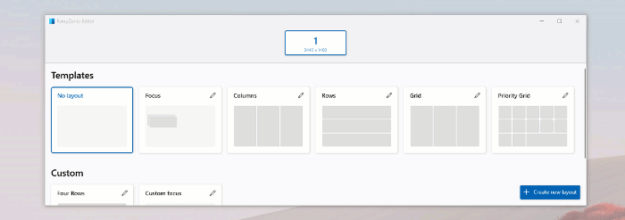
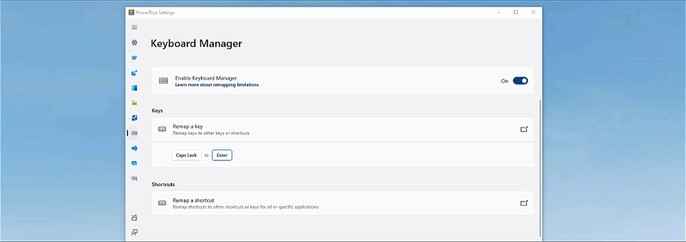
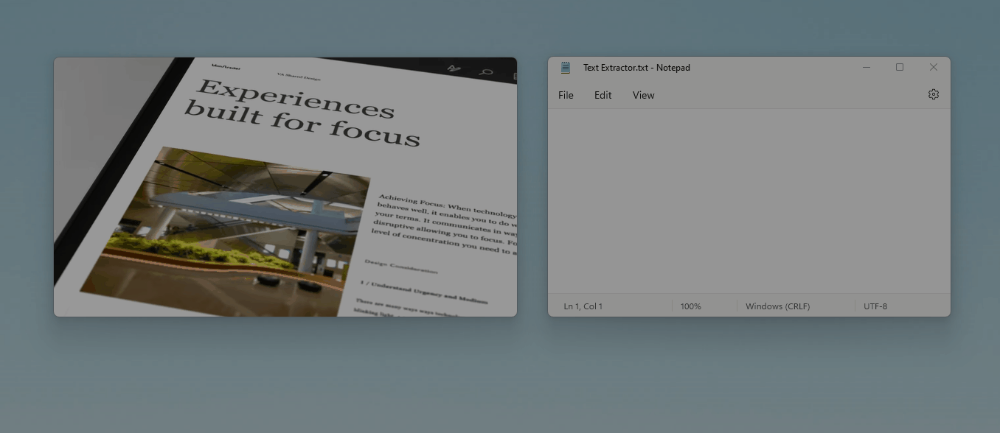

# Set up a WSL development environment.

Looking to take your Windows development environment to the next level? Look no
further than Windows Subsystem for Linux (WSL)! With this powerful tool, you can
quickly and easily set up a Linux-based development environment on your Windows
machine. This guide has everything you need to get started, from installing WSL
to updating packages and setting up Windows Terminal. Plus, we'll show you how
to install Node.js and Git, and give you tips for using Visual Studio Code, Zsh,
and Oh My Zsh.

<!--truncate-->

You have two options for installation: you can either follow the
[full installation guide](https://docs.microsoft.com/en-gb/windows/wsl/install),
or you can refer to the
[best practices for setup](https://docs.microsoft.com/en-gb/windows/wsl/setup/environment),
which includes a step-by-step setup guide and explains important concepts such
as
[File Storage](https://docs.microsoft.com/en-gb/windows/wsl/setup/environment#file-storage).

:::info Prerequisites

To set up WSL in Windows, virtualization should be enabled, commonly referred to
as SVM mode. Ensure that it is enabled in your BIOS, you can follow
[this guide](https://support.microsoft.com/en-us/windows/enable-virtualization-on-windows-11-pcs-c5578302-6e43-4b4b-a449-8ced115f58e1)
to locate it (it will differ depending on your motherboard). Once enabled,
proceed to Install WSL in Windows.

:::

## Install WSL ([📑 docs](https://docs.microsoft.com/en-gb/windows/wsl/setup/environment#get-started))

ℹ️ _If you have already followed the
[full install guide](https://docs.microsoft.com/en-gb/windows/wsl/install), you
can skip this step._

To install Ubuntu, open PowerShell or Windows Command Prompt in
**administrator** mode by right-clicking and selecting "Run as administrator",
then enter the `wsl --install` command.

After running the WSL install command and restarting, Ubuntu will be installed
by default. You may change the distribution name by passing in a new name with
the `-d` flag: `wsl --install -d <Distribution Name>`.

However, I suggest staying with Ubuntu. 🙂

## Update and upgrade packages ([📑 docs](https://docs.microsoft.com/en-gb/windows/wsl/setup/environment#update-and-upgrade-packages))

When starting a new development project, updating your packages is always a good
idea. After setting up your Unix account, you can simply run this one-liner to
update the package manager:

```bash
sudo apt update && sudo apt upgrade
```

:::caution

If you receive an error message saying
`Temporary failure resolving ‘archive.ubuntu.com’`, it is usually due to an
invalid nameserver on the WSL installation. This can cause the WSL instance to
be unable to connect to the internet.

To confirm if this is the case, try to `ping www.google.com`. If it cannot be
pinged, this should confirm that the nameserver configuration is the issue. You
can update your configurations to the following:

```bash
$ cat /etc/wsl.conf
  [network]
  generateResolvConf = false # disables auto generation of resolv config
  generateHosts = false # disables auto generation of hosts /etc/hosts

$ cat /etc/resolv.conf
  nameserver 1.1.1.1
```

Finally, as a last step, you can protect the `resolv.conf` file by forcing the
overwrite to be disabled.

```bash
sudo chattr -f +i /etc/resolv.conf
```

:::

## Set up Windows Terminal ([📑 docs](https://docs.microsoft.com/en-gb/windows/wsl/setup/environment#set-up-windows-terminal))

You can install any terminal, but personally, I prefer using the Preview build
because it ships features much faster than the normal version. For example, the
GUI feature only arrived around a year later on the standard version, and I have
never found it to be really stable.

To install, visit the Microsoft Store Apps for either:

- [Windows Terminal Preview](https://apps.microsoft.com/store/detail/windows-terminal-preview/9N8G5RFZ9XK3?hl=en-us&gl=US)
- [Windows Terminal](https://apps.microsoft.com/store/detail/windows-terminal/9N0DX20HK701?hl=en-us&gl=US)

And as mentioned above, GUI is supported! That means you can
[run Linux GUI apps on WSL](https://learn.microsoft.com/en-us/windows/wsl/tutorials/gui-apps)
😇


## File storage ([📑 docs](https://docs.microsoft.com/en-gb/windows/wsl/setup/environment#file-storage))

To open your WSL project in Windows File Explorer, enter: `explorer.exe .` Be
sure to add the period at the end of the command to open the current directory.

:::tip

[For the fastest performance, store your project files on the same operating system](https://learn.microsoft.com/en-gb/windows/wsl/filesystems#file-storage-and-performance-across-file-systems)
as the tools you plan to use. If you are working with Linux tools in a Linux
command line (Ubuntu, OpenSUSE, etc), store your files in the WSL file system.
If you're working with Windows tools in a Windows command line (PowerShell,
Command Prompt), store your files in the Windows file system. Files can be
accessed across operating systems, but doing so may significantly slow down
performance.

:::

## **Install Node.js on WSL** ([📑 docs](https://docs.microsoft.com/en-us/windows/dev-environment/javascript/nodejs-on-wsl))

We will be using Node Version Manager (`nvm`). Follow these steps to install it
on Ubuntu (or a similar distribution):

1. Open your command line.
2. Install cURL using the following command: `sudo apt-get install curl`. cURL
   is a tool used for downloading content from the internet in the command-line.
3. Go to the [nvm repository](https://github.com/nvm-sh/nvm/releases) and find
   the latest release.
4. Install nvm using the following command:
   ```bash
   curl -o- <https://raw.githubusercontent.com/nvm-sh/nvm/v0.39.3/install.sh> | bash
   ```

## **Setting up your shell ([Zsh](https://www.zsh.org/) + [Oh My Zsh](https://ohmyz.sh/))**

This step is optional, but you may want to use Zsh and Oh My Zsh if you are
looking for a more customizable and powerful shell experience.

### Installing zsh

To install zsh, open the Ubuntu app installed from the App Store and run the
following command in the terminal:

```bash
sudo apt-get install zsh
```

Once it's installed, type `zsh` in the terminal. It will prompt you to choose
some configuration options. We will do this later on while installing
`oh-my-zsh`, so choose option `0` to create the config file and prevent this
message from showing again.

### Installing oh-my-zsh

Before anything else, you need to have `git` installed on your system. You can
install it by running the following command in a terminal:

```bash
sudo apt-get install git
```

After installing `git`, you can then use `curl` to install oh-my-zsh.

```bash
sh -c "$(curl -fsSL <https://raw.githubusercontent.com/robbyrussell/oh-my-zsh/master/tools/install.sh>)"
```

This command will clone the repository and replace the existing `~/.zshrc` file
with a template from `oh-my-zsh`.


### Installing OhMyZsh Plugins

We can supercharge our command line by adding some oh-my-zsh plugins. First,
open the zsh config by running `vim ~/.zshrc`. Next, find the line `plugins=`
and add the desired plugins.

```bash
plugins=(git nvm history zsh-autosuggestions jsontools command-not-found zsh-syntax-highlighting)
```

I have listed my favorite plugins here, but feel free to use your own set based
on your needs. You can find a list of plugins
[here](https://github.com/ohmyzsh/ohmyzsh/wiki/Plugins). Additionally, I use 3rd
party plugins that must be pulled separately:

- [https://github.com/zsh-users/zsh-autosuggestions](https://github.com/zsh-users/zsh-autosuggestions)
  ([installation instructions](https://github.com/zsh-users/zsh-autosuggestions/blob/master/INSTALL.md#oh-my-zsh))
- [https://github.com/zsh-users/zsh-syntax-highlighting](https://github.com/zsh-users/zsh-syntax-highlighting)
  ([installation instructions](https://github.com/zsh-users/zsh-syntax-highlighting/blob/master/INSTALL.md#oh-my-zsh))

### Enable NVM autoload in zsh

Enabling the nvm autoload plugin allows you to use the appropriate node version
based on the specifications in a `.nvmrc` file in any of your projects. This
feature is especially helpful when working on multiple projects with different
node versions, as it eliminates the need to switch between incompatible
versions. With nvm autoload, you can easily switch between projects while
ensuring you are using the correct node version.

```bash
zstyle ':omz:plugins:nvm' autoload yes
```

### Useful gists for aliases

To create an `.aliases` file in your home directory, run the command
`touch ~/.aliases`. Then, ensure that it is sourced in your `.zshrc` file by
adding `source ~/.aliases` to it.

Next, you can add the aliases and configurations used in the terminal by
following the instructions in
[this link](https://gist.github.com/paul-vd/c1ea26e19414bfcb66e7656ed7c22444).

You will notice that there is an alias for `npm`. This is to detect which
package manager to use by searching for the nearest lock file. An alternative to
this is [ni](https://github.com/antfu/ni), which is highly recommended.

## Git Credential Manager setup ([📑 docs](https://docs.microsoft.com/en-us/windows/wsl/tutorials/wsl-git#git-credential-manager-setup))

The credential manager can assist with any HTTPS authentication, utilizing the
[Windows Credential Manager](https://support.microsoft.com/help/4026814/windows-accessing-credential-manager).

To download the latest version, visit the repository at
[https://github.com/GitCredentialManager/git-credential-manager/releases](https://github.com/GitCredentialManager/git-credential-manager/releases).

After installation and configuration, you should also add it to your Linux
shell.

```bash
git config --global credential.helper "/mnt/c/Program\ Files/Git/mingw64/bin/git-credential-manager-core.exe"
```

## VSCode ([📑 docs](https://docs.microsoft.com/en-gb/windows/wsl/tutorials/wsl-vscode))

To get started,
[download and install VSCode](https://code.visualstudio.com/download). Then, add
the remote
[development extension](https://marketplace.visualstudio.com/items?itemName=ms-vscode-remote.vscode-remote-extensionpack).

That's it you should be ready to start developing in WSL.

:::caution

If your WSL container resolves the `code` path to an Ubuntu installation of
VSCode, it can cause issues when you try to open a folder using a command like
`code ./my-folder`. If Git extensions crash at startup, create an alias for the
`code` command to point to your Windows installation of VSCode. Run `which code`
to detect which VSCode installation is being used.

**Solution:**

Add an alias for the `code` command that points to your Windows installation by
including it in your `.aliases` file.

```bash
alias code="/mnt/c/Users/%userprofile%/AppData/Local/Programs/Microsoft\ VS\ Code/bin/code"
```

:::

## Microsoft PowerToys: Utilities to customize Windows ([📑 docs](https://docs.microsoft.com/en-us/windows/powertoys/))

As you're setting up your Windows development environment, you might be
interested in exploring some of the additional tools available to you. One of my
personal favorites are the Microsoft PowerToys, a set of utilities designed to
help streamline and customize your Windows experience for greater productivity.
[Install Microsoft PowerToys](https://docs.microsoft.com/en-us/windows/powertoys/install)
to keep tweaking Windows!

Here are a few PowerToys features that I find particularly useful:

### FancyZones

If you want to easily manage the position of each application window on your
Windows desktop, check out
[FancyZones](https://learn.microsoft.com/en-us/windows/powertoys/fancyzones).
This tool allows you to customize the size and positioning of your snapping grid
with efficient layouts that suit your needs.



### Keyboard Manager

<p>
  With the PowerToys Keyboard Manager, you can redefine keys and shortcut
  combinations on your keyboard. For instance, you can swap the <kbd>A</kbd> key
  for the <kbd>B</kbd> key. You can also swap <kbd>Ctrl</kbd> + <kbd>C</kbd> for{" "}
  <kbd>⊞ Win</kbd> + <kbd>C</kbd>. This will copy text when <kbd>⊞ Win</kbd> +
  <kbd>C</kbd> is pressed. If no specific application is targeted in the
  PowerToys Keyboard Manager, the changes will apply globally across Windows.
</p>



### File Explorer Preview Pane

The Preview Pane is an existing feature in Windows File Explorer that lets you
see a preview of a file's contents in the view's reading pane. PowerToys
enhances this feature by adding support for multiple file extensions, including
Markdown, SVG, PDF, and G-code. It also adds support for source code files with
more than 150 file extensions.


### ColorPicker

This Windows color picker is a must-have tool for designers and themers. It
allows you to easily select colors from any application and customize them to
your liking. The interface is user-friendly and you can copy colors to your
clipboard in different formats, including hexadecimal, RGB, and HSL. This tool
simplifies color palette management and is lightweight. Download it today to
improve your design work!


### Text Extractor utility

Text Extractor allows you to copy text from anywhere on your screen, including
inside images or videos.

<p>
  To activate the capture feature, use the shortcut (default: <kbd>⊞ Win</kbd> +{" "}
  <kbd>Shift</kbd> +<kbd>T</kbd>). This will display an overlay on your screen.
  Click and hold your primary mouse button, then drag to capture the text. The
  captured text will be saved to your clipboard.
</p>



### Run Utility

PowerToys Run is a quick launcher for power users that includes additional
features without sacrificing performance. It is open source and modular,
allowing for additional plugins to be added.

<p>
  To use PowerToys Run, simply press <kbd>Alt</kbd> + <kbd>Space</kbd> and start
  typing!
</p>


## Enable ‘God Mode’

God Mode will give you access to all of Windows’ control panels from one folder.
To enable it right-click on the desktop and select **New > Folder**. Re-name the
new folder with this bit of code:

```bash
GodMode.{ED7BA470-8E54-465E-825C-99712043E01C}
```

## **Sharing SSH keys between Windows and WSL 2** ([📑 docs](https://devblogs.microsoft.com/commandline/sharing-ssh-keys-between-windows-and-wsl-2/))

1. If you have setup ssh in windows you can copy it to your linux

   ```bash
   cp -r /mnt/c/Users/<username>/.ssh ~/.ssh
   ```

2. Fix the permissions

   ```bash
   chmod 600 ~/.ssh/id_rsa
   ```

3. Add keychain to linux

   ```bash
   sudo apt install keychain
   ```

4. Run the keychain every time you start a shell instance, you can append this
   to the top of your `.zshrc` file.

   ```bash
   eval ``keychain  --quiet --eval --agents ssh id_ed25519
   command clear # this is why we add it to the top so that we can still se other outputs, I have not yet found a better way of silencing the keychain export messages
   ```

## Conclusion

You have just learned how to set up WSL on your Windows machine and create a
powerful and efficient development environment. By following this guide, you
have installed WSL and updated packages, set up Windows Terminal and installed
Node.js and Git. These tools will help you code faster, easier, and more
securely.

🥳 Congratulations on completing this guide! We hope you enjoyed it and found it
useful. If you want to learn more about other topics related to development,
stay tuned as our blog will be growing!
