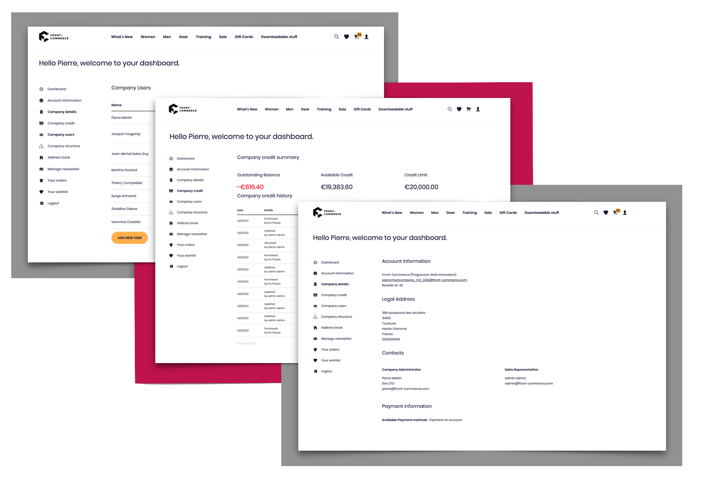

import Calendly from "@site/src/components/Calendly";
import ContactLink from "@site/src/components/ContactLink";

## B2B for Adobe Commerce: new features available! Try our beta version of Magento's Page Builder for Front-Commerce

**With its 2.11 release, Front-Commerce continues its exploration of the wide
world of B2B commerce!** You'll now be able to deal with Company accounts and
company users on Magento 2. A big step for us, knowing the ever-increasing
popularity if B2B e-commerce websites.

You will also discover various changes and bug corrections, to **make your
Front-Commerce instances even more efficient!**

During this release, we have welcomed **2 new developers, Paul and Alexandre and
our first Product Manager, Josquin!** Do not hesitate to contact us with any
requests regarding the Front-Commerce product roadmap, your feedback is precious
💎

<Calendly />

<!--truncate-->

import ChangelogFooter from "@site/src/components/ChangelogFooter";

## B2B for Adobe Commerce: allow your clients to manage their company from Front-Commerce

As a merchant in a B2B sector, your clients are businesses that need to manage
their company information, users' access rights as well as the different
expenses made by their team on your B2B e-commerce platform: with this
functional package, you can make them autonomous and reduce your customer
support interventions.

  

### **Payment on account and credit limit**

One of the preferred payment methods for a business is **payment on account**:
orders can be placed according to a credit limit and invoicing is managed
between the buying company and the seller.

Thanks to this set of features you'll be able to: display the user's remaining
credit limit from his personal account and during checkout and have a view on
the timeline of company credit available.

### Company account page

Display all useful information regarding your company profile such as legal
address, useful contacts or payment information.

### Company users

Manage your users and assign them dedicated roles to know who has access to the
B2B platforms! With the features from this release, you can add and edit new
users while assigning existing roles or set inactive selected users, directly
from Front-Commerce.

## UI improvement: Zoom-in on product images

**Desktop version**

<iframe
  width="100%"
  height="422"
  src="https://www.youtube-nocookie.com/embed/xmlZWAA5xek"
  title="YouTube video player"
  frameborder="0"
  allow="accelerometer; autoplay; clipboard-write; encrypted-media; gyroscope; picture-in-picture"
  allowfullscreen
></iframe>

**Mobile version**

<iframe
  width="100%"
  height="422"
  src="https://www.youtube-nocookie.com/embed/jlqoO51G6B0"
  title="YouTube video player"
  frameborder="0"
  allow="accelerometer; autoplay; clipboard-write; encrypted-media; gyroscope; picture-in-picture"
  allowfullscreen
></iframe>

Many of you asked for it, we did it!

You can now offer your end-users the possibility to zoom in on a product from
the photo gallery using Front-Commerce. They can inspect the details of your
products and you can boost your conversion rates!

## SmartForms improvement: check the new feature out!

<iframe
  width="100%"
  height="422"
  src="https://www.youtube-nocookie.com/embed/WNphykptcw8"
  title="YouTube video player"
  frameborder="0"
  allow="accelerometer; autoplay; clipboard-write; encrypted-media; gyroscope; picture-in-picture"
  allowfullscreen
></iframe>

We have enhanced our [Smartforms](/docs/2.x/advanced/features/smart-forms)
solution: from now on, the postal codes (codes postaux 🇫🇷) of your customers
living in France are displayed by locality with a greater precision, to avoid
any confusion during checkout.

## Page Builder early version: help creative teams build pages directly from Magento (feedback needed)

Magento's Page Builder allows any team member to create pages via a drag and
drop interface, adding any type of component to a page (text, banner, image,
video etc...)

In this version 2.11, we give you access to the early version of **the Page
Builder by Front-Commerce:** you can take the module in hand, test its mechanics
and give us your first feedback to improve its performance for our 2.12
version... and beyond!

<blockquote>
  📨 <b>Feedback needed:</b> <ContactLink /> to give your feedback! or{" "}
  <Calendly variant="link">Schedule a meeting</Calendly> in our calendar.
</blockquote>

Specifically in this version you can :

- Integrate the basic contents of the Page Builder on Magento2
- The available content types are for the moment: text, heading, divider, row,
  style (other content types will be integrated step by step)

## Other changes

- **[Mondial Relay](/docs/2.x/advanced/shipping/mondial-relay):** we now support
  all MondialRelay pickup types (24R, 24L, DRI) in Magento2
- **Quick-order:** a new component to order directly by SKU
- **Alert component:** we now have a component way to display warning alert
  messages to users
- New: add a mailto link with the new `<MailToLink>` component

  `<MailToLink email="user@example.com" />` or
  `<MailToLink email="user@example.com">Contact us</MailToLink>`

- **Wysiwyg:** add a `<Style>` component to include scoped styles
- **[Prismic](/docs/2.x/category/prismic)**: improve resilience on remote
  Prismic errors in case of HTTP errors or timeouts
- **[Adyen](/docs/2.x/advanced/payments/adyen#install-and-configure-the-adyen_payment-magento2-extension-72--90):**
  payment with Adyen can now be used in a multi server architecture
- The Magento1 module
  ([version 1.4.1](https://gitlab.blackswift.cloud/front-commerce/magento1-module-front-commerce/-/compare/master...1.4.1))
  now supports batch cache invalidation for better performance
- Bug fixes:
  - The _estimate shipping_ block was not updated on cart change on chocolatine
    theme
  - We fixed an issue in the Magento2 module
    ([version 2.4.2](https://gitlab.blackswift.cloud/front-commerce/magento2-module-front-commerce/-/releases/2.4.2))
    leading to some GraphQL errors on Magento Cloud and other read only file
    systems
  - Products name in carts and minicarts did not display special characters well
    in Magento2
  - Clicking on a related product sometimes caused an error
  - allowed more than 10 related products to be retrieved for Magento1
  - made product attributes more resilient to invalid remote product data
  - ensured that the mobile menu at the bottom of user account area is the same
    as in the top

Fixes from the 2.11 version have also been backported into previous minor
versions. The following patch versions were released:
[2.4.9](https://gitlab.blackswift.cloud/front-commerce/front-commerce/-/releases/2.4.9),
[2.5.5](https://gitlab.blackswift.cloud/front-commerce/front-commerce/-/releases/2.5.5),
[2.6.3](https://gitlab.blackswift.cloud/front-commerce/front-commerce/-/releases/2.6.3),
[2.7.4](https://gitlab.blackswift.cloud/front-commerce/front-commerce/-/releases/2.7.4),
[2.8.5](https://gitlab.blackswift.cloud/front-commerce/front-commerce/-/releases/2.8.5),
[2.9.4](https://gitlab.blackswift.cloud/front-commerce/front-commerce/-/releases/2.9.4)
and
[2.10.2](https://gitlab.blackswift.cloud/front-commerce/front-commerce/-/releases/2.10.2).

<ChangelogFooter>

[Upgrade to Front-Commerce 2.11.0](/docs/2.x/appendices/migration-guides#2100---2110)
or
[read the full changelog (Customers only)](https://gitlab.blackswift.cloud/front-commerce/front-commerce/-/releases/2.11.0)

</ChangelogFooter>
