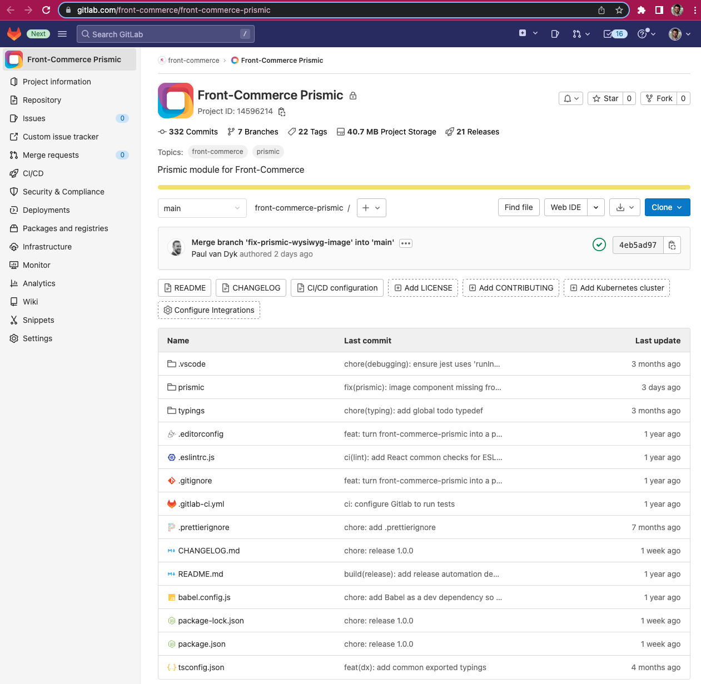
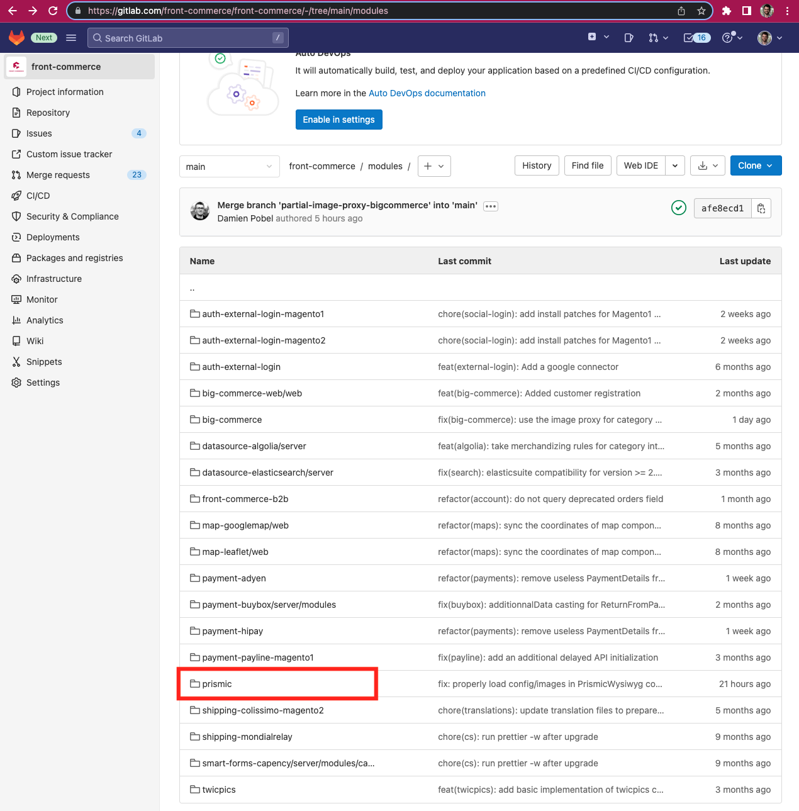

# 2.18: Improvements and fixes on our payment modules (Adyen, Lyra, PayPal), Prismic: 1.0.0 and major change, end of our migration from [Platform.sh](http://Platform.sh) to Front-Commerce Cloud, based on GCP

It is back to school time! After a very (very) hot summer, during which we all enjoyed a well-deserved break, the Front-Commerce team is back and raring to go 💪

We are pleased to welcome [Alice](https://www.linkedin.com/in/alice-malby-343383132/) to the team, who joins Rachael's marketing team as Lead Generation Manager. Welcome Alice!

Concerning the 2.18.0 release, it will certainly appear less packed than usual, because of the holiday in August and because we made progress on projects that we will reveal publicly a little later 🍿

So here is Front-Commerce 2.18:

- We have made improvements to our payment modules (PayPal, Lyra, Adyen)
- We made the official 1.0.0 tag of our Prismic module and modified the way we manage it, see below for details
- We have made progress on our connector with the search and merchandising solution [Attraqt](https://attraqt.com/), which will be released in a beta version in the coming weeks, stay tuned!
- We added the reset my password feature to our BigCommerce connector: every essential e-commerce feature is now available for this connector!
- Our cloud offer is gradually being strengthened with the implementation of an interface to manage your instances! All our sites are now switched to our cloud offer 🎉

We wish you all the best for Q4! As for us, we're all set 😎

As always, should you have any requests regarding the product roadmap, do not hesitate to contact Josquin 👋

<!--truncate-->

import ChangelogFooter from "@site/src/components/ChangelogFooter";
import BackportList from "@site/src/components/BackportList";

## ❕Prismic: tag of the 1.0.0 of the module and major change starting from 2.18

Starting from Front-Commerce 2.18.0, we will change the way we work with our Prismic connector.

Until now, the Prismic connector was delivered in a dedicated module with its own release cadence and versioning. We did this to be able to deliver improvements and new features faster to our early adopters.

Now that several customers have proven the robustness of the module and its APIs for integrators, we consider it as stable and tagged a final version 1.0.0 for the module.

As of 2.18.0, this module is now in the Front-Commerce core. New features and improvements will follow [our usual release cadence](https://developers.front-commerce.com/docs/appendices/release-process) and predictability for integrators and merchants.

Before 2.17.X (included): final version 1.0.0 for the the Front-Commerce Prismic module

From 2.18.0 (included): the module is now in the Front-Commerce core

## About Front-Commerce Cloud

In August we migrated every front-end hosted by Front-Commerce to our new infrastructure, Front-Commerce Cloud. They are all now up and running 😎

This allows merchants to benefit from auto-scaling (environments automatically add resources to handle the load), better reliability, and better monitoring and support!

And in regards to our support offer, we are working on a nice interface so that you will be able to monitor your infrastructures, deal with environment variables and quickly access our support team: more to come (very) soon 👀

## Improvements in our payment modules

With the release of Magento 2.4.4, we had to adapt parts of our modules to ensure compatibility: that was the case for [our Adyen connector](https://developers.front-commerce.com/docs/advanced/payments/adyen)

For our [PayPal](https://developers.front-commerce.com/docs/advanced/payments/paypal) and our [Lyra](https://developers.front-commerce.com/docs/advanced/payments/payzen) integrations, we worked on payments IPN improvements (Instant Payment Notification) ****to provide asynchronous validation for embedded payments and other improvements from customer feedback. Want to know more about it? Read [the documentation about payments with Front-Commerce!](https://developers.front-commerce.com/docs/category/payments)

# Other changes

### Bug Fixes

- **CSS:** avoid loading CSS twice
- **Downloadable-products:** page crash if the customer has no product
- **image:** wrong condition on presets
- **Magento2:** Added description in shipping method objects
- **Magento2:** propagate additional headers in Admin HTTP calls
- **PWA:** load manifest.json from base url not asset base url
- **RMA:** properly created date with the corresponding timezone
- **Routes:** don't loose dynamic routes with same name than subdirectory
- **Routes:** prioritize more specific children routes of a dynamic path
- **Social login:** merge guest and user cart on login with Magento2

### Features

- **BigCommerce:** add an image proxy to serve resized and optimized images
- **BigCommerce:** reset my password
- **GraphQL:** remove FRONT_COMMERCE_WEB_UNSAFE_USE_DEPRECATED_FIELDS env. Gsupport
- **UX:** prevent event propagation on clicks on a pending button
- **Front-Commerce Prismic module:** add default preset format for image transformer

<BackportList
  currentVersion={"2.18.0"}
  previousVersions={[
    "2.17.1",
    "2.16.2",
    "2.15.4",
    "2.14.5",
    "2.13.8",
    "2.12.7",
    "2.11.8",
    "2.10.11",
  ]}
/>

<ChangelogFooter>

[Upgrade to Front-Commerce 2.18.0](/docs/appendices/migration-guides#2170---2180)
or
[read the full changelog (Customers only)](https://gitlab.com/front-commerce/front-commerce/-/releases/2.18.0)

</ChangelogFooter>
