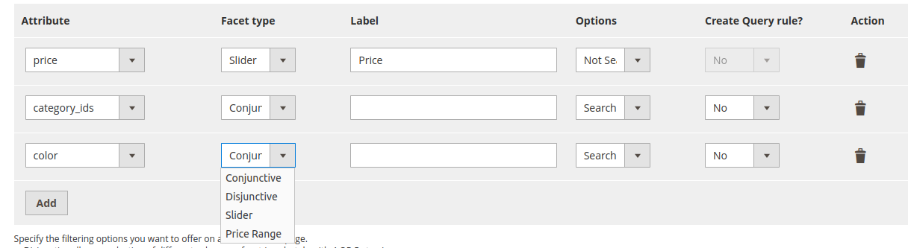
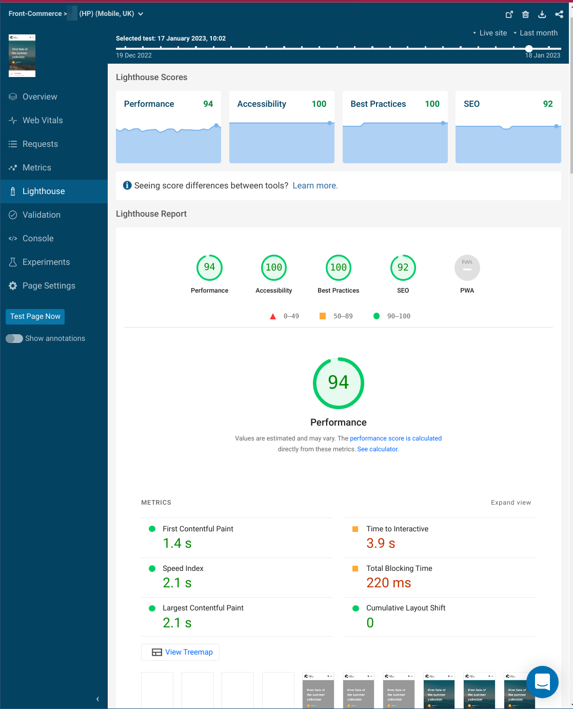

## Starting 2023 with better images, Algolia for Magento2 improvements, bugfixes… and a teaser

Our first release of 2023 is out!

Front-Commerce 2.21 is focused on bug fixes and minor improvements. Over the past 6 weeks, each team member took a well-deserved break for the holidays. We also had our biannual off-site week, during which all of our team members got together, which is crucial for a mainly remote team like ours.

And we’ve also been working on a little something secret 😉

<!-- truncate -->

import Calendly from "@site/src/components/Calendly";
import ChangelogFooter from "@site/src/components/ChangelogFooter";
import BackportList from "@site/src/components/BackportList";
import ContactLink from "@site/src/components/ContactLink";

## Image improvements

Following the release of version 2.20, we have further enhanced our image component.

The TwicPics integration has been refactored to use the image adapter introduced in 2.20.
It allowed us to improve the performance of this component by rendering performant images during server-side rendering. You now have the best of both worlds!

We also integrated new Web APIs for all images to improve web performance (LCP) for browsers supporting these standards:

- priority images now leverage the [fetchpriority](https://web.dev/priority-hints/) hint
- non-priority images are now [decoded asynchronously](https://developer.mozilla.org/en-US/docs/Web/API/HTMLImageElement/decoding)

## Magento2: supporting more Algolia facets configurations

In this release, the Algolia Magento2 module in Front-Commerce now supports more configurations from the official Magento module.

Facets now honors the Conjunctive/Disjunctive facet type from the configuration to decide whether several selected values must be considered as an `AND` or `OR` criteria condition.



## We’ve been working on something…

Here is a small teaser of what we’ve also been working on during this release. In 2023, Front-Commerce aims at being one of the fastest storefront solutions out there.

Be prepared for future releases bringing significant web performance improvements, and new announcements allowing developers and merchants to embrace a performance culture.

We’re excited about what’s next and wanted to start by sharing a screenshot containing several clues 🕵 (Work In Progress).<br/>
Stay tuned for more details over the next months!



## Other changes

```mdx-code-block
<details>
  <summary><h3 className="mb-0">Bug Fixes</h3></summary>
```
- **cart:** the cart cache is now properly cleared during checkouts using the async order flow (with asynchronous notifications)
  - server-side when using `FRONT_COMMERCE_CART_CACHE_ENABLE`
  - client-side in Apollo cache
- **payment:**
  - **checkout:** only show Apple Pay payment method if the device supports it
  - **paypal:** fixed a regression where PayPal payments captures would not be correctly send to the backend
- **search / facets:**
  - **magento1:** fixed a regression that led to a crash when filtering on a facet
  - **magento2:** prevent search failures when an arbitrary filter is used
  - **prismic/algolia:** fixed a regression leading to application not starting when Algolia datasource and Prismic module were active together
- **proxy:** the image proxy now uses a fixed user agent when proxying requests to remote systems
- **helmet:** fixed an issue when CSP is enabled with `reportOnlyDirectivescontent` that led to loosing previous helmet configurations
- **magento2:** prevent issues due to remote configuration fetching when Magento is in maintenance mode
- **LinkListSelector:** fixed an issue that could redirect users to an incorrect parent page. In default theme, users on mobile where redirected to `/user/orders` when navigating to `/user/orders/123` from their account.
- **log:** ensured logs using the `console` output were fully formatted as JSON for more portability
- **deps:** update dependency style-to-object to ^0.4.0
- **proptype:** fixed typo for `placeholder` in the form Select component

```mdx-code-block
</details>
```

<BackportList
  currentVersion={"2.21.0"}
  previousVersions={[
    "2.20.2",
    "2.19.8",
    "2.18.6",
    "2.17.7",
    "2.16.8",
    "2.15.9",
    "2.14.9",
    "2.13.12",
  ]}
/>

<hr />

<ChangelogFooter>

[Upgrade to Front-Commerce 2.21.0](/docs/appendices/migration-guides#2200---2210)
or
[read the full changelog (Customers only)](https://gitlab.blackswift.cloud/front-commerce/front-commerce/-/releases/2.21.0)

</ChangelogFooter>
