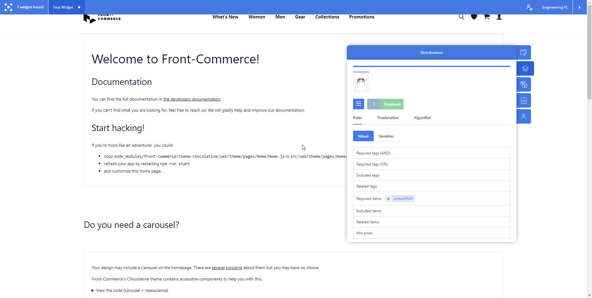
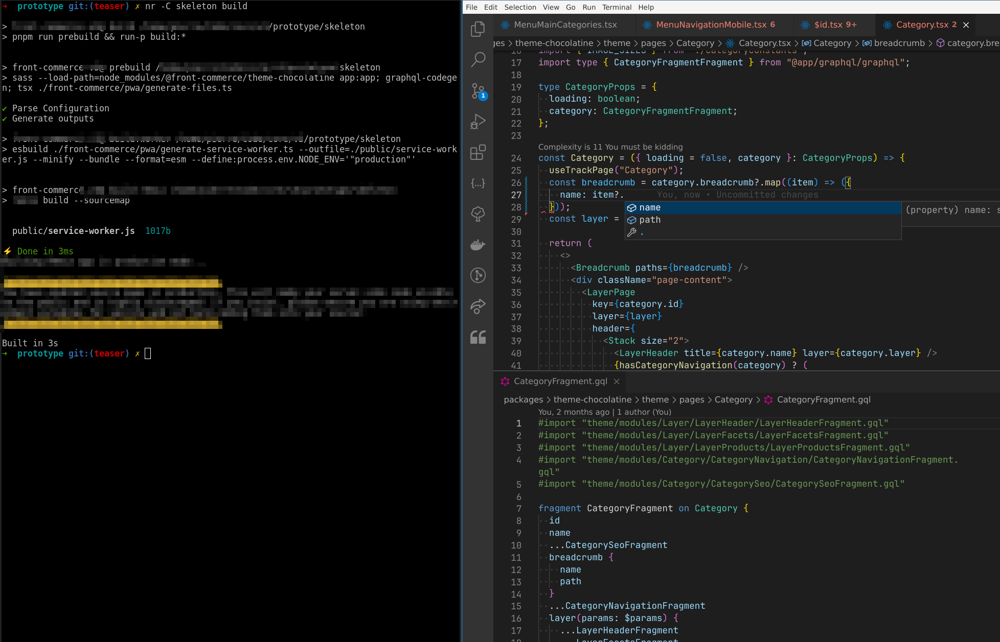

## Adyen Payment for Google and Apple Pay, Attraqt's Experience Orchestrator, and a Sneak Peek at upcoming DX improvements

We are excited to share the latest updates on Front-Commerce, including new
payment options with Adyen, enhanced merchandizing analysis with Attraqt's
Experience Orchestrator extension, and a sneak peek into our upcoming DX.

This release also contains performance improvements and bug fixes. Keep reading
for more details. 😊

<!-- truncate -->

import ChangelogFooter from "@site/src/components/ChangelogFooter";
import BackportList from "@site/src/components/BackportList";
import ContactLink from "@site/src/components/ContactLink";

## Adyen payment now supports Google and Apple Pay

We have added support for Google Pay and Apple Pay to our
[Adyen integrations](/docs/2.x/advanced/payments/adyen), making it easier for
customers to make purchases on our platform.

Those were the last 2 payment methods we didn’t support. We’ve updated our
documentation to
[list the main payment providers supported and tested](/docs/2.x/advanced/payments/adyen#payment-methods-support),
and are confident that any Adyen payment method is now supported by
Front-Commerce.

## Attraqt Experience Orchestrator

Merchants can now analyze their recommendation strategies right from their
website with Attraqt's Experience Orchestrator (XO) extension.



By using
[primitives included in our Attraqt module](/docs/2.x/magento2/search-engine#using-attraqt-orchestrator-chrome-extension),
developers can ensure that the application matches the requirements for exposing
the merchandizing rules and algorithms. This extension, improves the experience
for common tasks such as updating a recommendation strategy or troubleshooting
parameters to Attraqt’s API.

## We’ve continued working on something…[](https://developers.front-commerce.com/changelog/front-commerce-2.21#weve-been-working-on-something)

As
[teased in our previous changelog entry](/changelog/front-commerce-2.21#weve-been-working-on-something),
we’ve been busy working on something new. In 2023, Front-Commerce aims at
providing a top-level DX.

Future releases will contain several improvements that developers have been
asking for, for months! Be prepared for what’s next. Here is another screenshot
containing some more clues 🕵 (Work In Progress). Stay tuned for more details
over the next **weeks**!



## Other changes

```mdx-code-block
<details>
  <summary><h3 className="mb-0">Bug Fixes</h3></summary>
```

- **magento2:** we fixed race conditions to prevent incorrect order state upon
  concurrent payment status updates
- **categories:** we fixed possible SSR errors which could be caused when an
  incorrect sort parameter was used
- **payzen:** we removed an incorrect CSS rule (property name) from the
  stylesheet
- the `<ScrollTopOnUpdate />` component now use setTimeout to prevent race
  conditions with asynchronous calls
- **stock:** we now properly log a warning using FC’s logging mechanism when the
  stock provided by Magento is null
- **theme-chocolatine:** the Wishlist header icon now uses a correct label
- **wysiwyg:** WYSIWYG’s Link component now properly receives its `className`
  prop

```mdx-code-block
</details>
```

```mdx-code-block
<details>
  <summary><h3 className="mb-0">Performance Improvements</h3></summary>
```

- **cache:** video files served from public now have cache-control headers
  similar to images

```mdx-code-block
</details>
```

<BackportList
  currentVersion={"2.22.0"}
  previousVersions={[
    "2.21.1",
    "2.20.3",
    "2.19.9",
    "2.18.7",
    "2.17.8",
    "2.16.9",
    "2.15.10",
    "2.14.10",
  ]}
/>

<hr />

<ChangelogFooter>

[Upgrade to Front-Commerce 2.22.0](/docs/2.x/appendices/migration-guides#2210---2220)
or
[read the full changelog (Customers only)](https://gitlab.blackswift.cloud/front-commerce/front-commerce/-/releases/2.22.0)

</ChangelogFooter>
