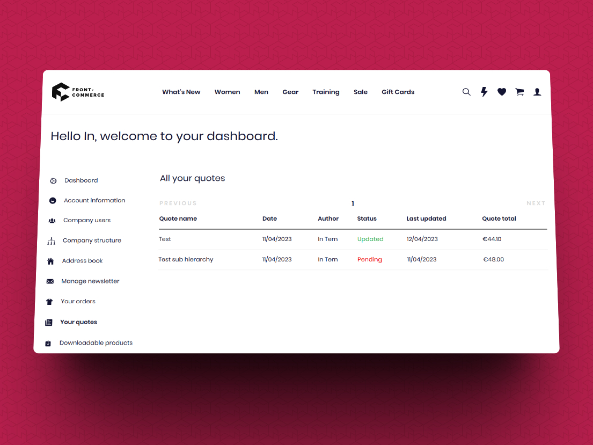
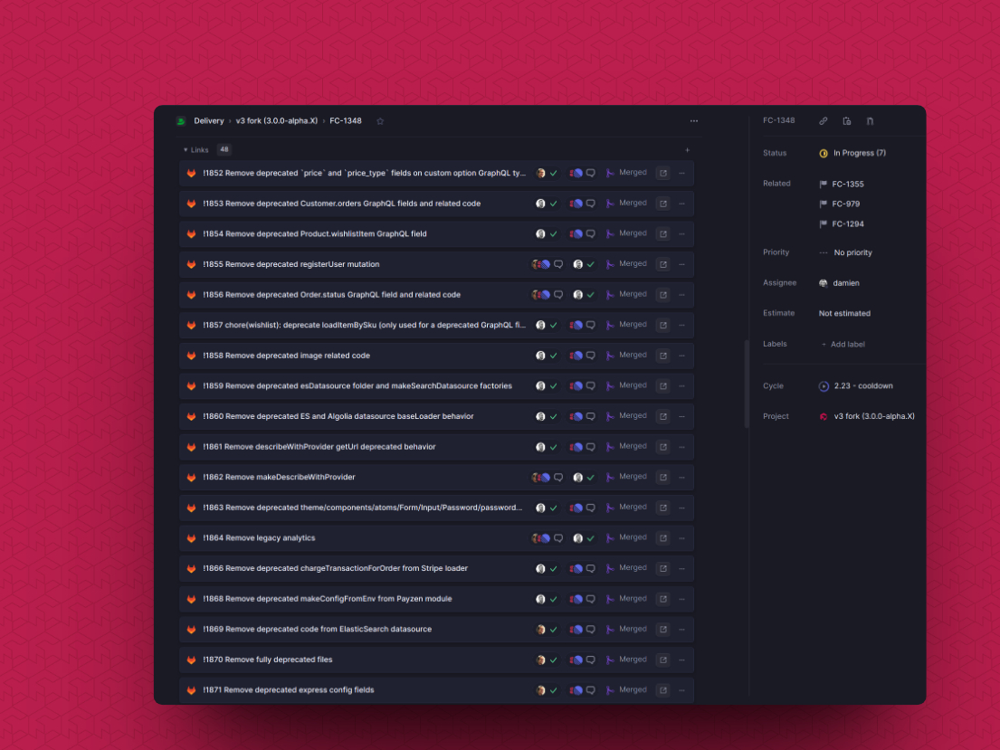

## Negotiable Quotes, Attraqt Contexts, Algolia Standalone Module, and Front-Commerce Remixed

We are excited to announce the latest release of Front-Commerce which brings powerful new features designed to help you deliver a better customer experience.

With the ability to negotiate pricing and terms on a quote-by-quote basis with authorized buyers using Adobe Commerce B2B, you can now build stronger relationships with your clients and increase loyalty. Unleash the power of Attraqt Contexts to trigger more accurate merchandising rules resulting in better results for your users.

On more technical aspects, our Algolia datasource can now be used as a standalone module in any application, giving you greater flexibility and control over your data. Finally, we have started to work on Front-Commerce Remixed in our core repository, which will bring a range of exciting new features and improvements to all of you!

☕ Read on to learn more about these updates and as always, should you have any requests regarding the product roadmap, do not hesitate to contact us 👋

<!-- truncate -->

import ChangelogFooter from "@site/src/components/ChangelogFooter";
import BackportList from "@site/src/components/BackportList";
import ContactLink from "@site/src/components/ContactLink";


## Introducing Negotiable quotes for Adobe Commerce B2B

Adobe Commerce B2B merchants now have the ability to negotiate pricing and terms on a quote-by-quote basis with authorized buyers from client companies. In Front-Commerce 2.3, we’re bringing initial support for [Negotiated quotes](https://experienceleague.adobe.com/docs/commerce-admin/b2b/quotes/quotes.html?lang=en).

This feature allows for more flexibility and efficiency for buyers and sellers, which can increase sales and customer satisfaction. With the ability to tailor pricing and terms to each individual customer, companies can build stronger relationships with their clients and increase loyalty.



Buyers can view the negotiation history and track the status of their quote requests, while sellers can monitor the progress of negotiations from their back-office and ensure that all parties are on the same page. All of this can be done asynchronously and from a single location!

This initial version is limited to the current state of Adobe B2B's GraphQL APIs. This means that some features may not be available when using Front-Commerce. However, we believe it will be sufficient for most projects.

In this release, we added support for **quote creation, comments, checkout and history**. It brings a whole new **dedicated checkout experience for negotiable quotes**, reusing the same components from the existing Cart checkout process. Our default theme fully supports **quote statuses and permissions: it only displays what users are allowed to view or actions they’re allowed to take.**

Please review [the known limitations](/docs/2.x/magento2/b2b#known-issues) and let us know which ones are important for your team so that we can prioritize the next steps for this feature.

## Provide more accurate results to your users with Attraqt Contexts

The Attraqt integration in Front-Commerce now leverages Attraqt Contexts, a new Attraqt feature that allows you to provide contextual information to your queries. With this, you can trigger merchandising rules and provide more accurate results to your users.

As always, at Front-Commerce, we strive to provide you with all the tools you need to build the user experience you want. Read [the related guide in our documentation](/docs/2.x/magento2/search-engine#add-contextual-information-to-your-queries) to learn about the different ways you can leverage this new feature in your existing application and achieve exactly what you want to do.

Additionally, in this release we have added the ability to temporarily deactivate the search module in your application.

## Use Algolia as a standalone module + active facets support

Our team has made incremental improvements to our Algolia datasource.

Firstly, we have removed the hard dependency on Magento modules, which means that our datasource can now be used as a standalone module in any application, regardless of the backend being used. This will provide greater flexibility for our clients and allow them to configure the data in whatever way is best suited to their needs, supposing that they have a way to index their data in Algolia.

Furthermore, we have added a new feature to the Algolia module that exposes active facets in the GraphQL schema. This will enable developers to build interfaces with separated facets for active ones.

We are excited to see how our clients will use these new features to improve their applications and enhance the overall user experience.

## The Front-Commerce <abbr title="DevJoy™">DJ</abbr> team has started to Remix it!

A few weeks ago, we announced that Front-Commerce would be getting a Remix (/changelog/front-commerce-is-getting-a-remix). In that announcement, we explained the goals we hope to achieve with the next major release of Front-Commerce.

So far, we have been working on a private prototype repository. Over the past few weeks, we have moved this effort into our core product repository and have started merging the initial steps of this journey.

While the `2.x` branch continues to receive new features (see 👆), we have begun removing deprecated code and components from our `main` branch. In the next cycle, we will be reorganizing things to prepare for the first alpha version of Front-Commerce Remixed!



This documentation site was also versioned, and all existing content was relocated from `/docs/*` to `/docs/2.x/*` so we can provide decent (yet succinct) documentation to Front-Commerce Remixed early adopters.


## Other changes

```mdx-code-block
<details>
  <summary><h3 className="mb-0">Features</h3></summary>
```
- **magento2:** developers can now fetch configurations from Magento’s `storeConfig` GraphQL query with the `MagentoGraphGLConfig` loader ([documentation](/docs/2.x/magento2/using-magento-configuration#use-magentos-storeconfig-graphql-query))
- **magento:** the WYSIWYG parser now supports `{{shop direct_url=""}}` shortcodes
- RMA for Adobe Commerce also got a few improvements in this release
    - **rma:** we’ve increased the range of supported input types for RMA return forms. We now support Boolean, TextArea, TextField
    - **rma:** custom attributes are now displayed on the Return detail page
    - **documentation:** we’ve reorganized our [RMA documentation page](/docs/2.x/magento2/commerce#rma) to better explain all the known limitations due to Adobe Commerce’s incomplete APIs


```mdx-code-block
</details>
```

```mdx-code-block
<details>
  <summary><h3 className="mb-0">Bug Fixes</h3></summary>
```
- **react-leaflet:** we now transpile leaflet packages to provide a workaround for its author's choice of not supporting older targets. This fixes the following error: *“Module parse failed: Unexpected token xxx. You may need an appropriate loader to handle this file type”* and allows you to use more recent versions of the package.
- **ui:** icons in theme-chocolatine are now overridable as [announced in 2.19](/docs/2.x/appendices/migration-guides#adding-custom-icons)
- **cart-cache:** fixed a tricky edge case issue preventing customers to do any operation on their cart after toggling store credit when the Cart cache was enabled (regression introduced in 2.19)
- **ui:** renamed prop `class` to `className` in the `<AccountLayout>` component

```mdx-code-block
</details>
```

```mdx-code-block
<details>
  <summary><h3 className="mb-0">Performance Improvements</h3></summary>
```

- **server:** Front-Commerce doesn’t send the deprecated `Expect-CT` headers to the browser as per Google Lighthouse recommendations

```mdx-code-block
</details>
```

<BackportList
  currentVersion={"2.23.0"}
  previousVersions={[
    "2.22.2",
    "2.21.2",
    "2.20.4",
    "2.19.10",
    "2.18.8",
    "2.17.9",
    "2.16.10",
    "2.15.11",
  ]}
/>

<hr />

<ChangelogFooter>

[Upgrade to Front-Commerce 2.23.0](/docs/2.x/appendices/migration-guides#2220---2230)
or
[read the full changelog (Customers only)](https://gitlab.blackswift.cloud/front-commerce/front-commerce/-/releases/2.23.0)

</ChangelogFooter>
