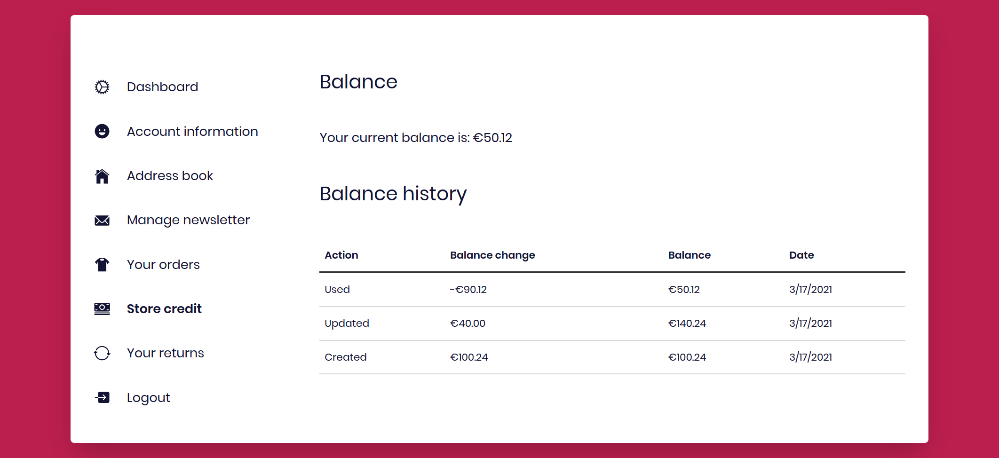

## HTTP Caching, Store credits, Wishlist sharing and remote configurations

Front-Commerce 2.6 embraces HTTP Caching to bring your storefront performance to
a whole new level.

Leverage proxy or CDN caching to **get the performance of static websites with
the flexibility you'd expect for a dynamic eCommerce storefront**. We're eager
to see what you will do with this!

We've also added new features (Store credits, wishlist improvements, remote
configuration), updated our dependencies and fixed several issues.

<!--truncate-->

import ChangelogFooter from "@site/src/components/ChangelogFooter";

## New Feature: Store Credits

In this release, we've continued to increase our feature coverage by
implementing Store Credits. **Customers can use store credits to (partially or
fully) pay for their order**. They can view their credits history and the
current balance from their account dashboard.

While the UI is platform agnostic, we implemented the supporting server
implementation in the **Magento1 Enterprise** module. It is fully integrated in
the workflow you are used to and administrators can issue Store Credits from the
admin panel as usual.

## Wishlist improvements: send by email and save product options

Wishlists are now also **supported for Magento 1**. They were only available for
Magento 2 so far.

We've also added several new features to make wishlists even more useful for
Customers:

- product options are now saved to the wishlist. It reduces the friction
  (selecting the size or color of a product) when customers are ready to
  purchase a product
- customers can share their wishlist by email using the native Magento feature
- recipients can then browse the wishlist content and add some items or the
  whole list to their cart

On product listing pages, the "is in wishlist" feature for product items caused
performance issues with our new HTTP caching mechanism. We've also revamped our
implementation to reduce the number of GraphQL queries sent by the client. It is
now much more efficient! Please
[read our migration guide](/docs/2.x/appendices/migration-guides#Wishlist-Provider)
for further details.

## Remote configurations

Front-Commerce configurations are at the core of our product.
[Configuration providers](/docs/2.x/advanced/server/configurations) allow
developers to access configurations in an homogeneous way, no matter how they
are defined. Be it an API Key, a text or other preferences administrable by a
store owner, **developers can now fetch values from a remote source without any
code change.**

The first module to leverage this feature is
[our Magento 1 Algolia integration](/docs/2.x/magento1/search-engine#Algolia).
It will reuse the configurations from your Magento administration area without
needing to duplicate them. Future Front-Commerce releases will contain more
improvements like this for other modules.

## Dependencies updates

We've updated many of our dependencies to their latest backwards compatible
version. Our
[migration guide](/docs/2.x/appendices/migration-guides#Updated-dependencies)
lists the main changes.

Since
[Node.js 10.x reaches its end of life tomorrow](https://nodejs.org/en/about/releases/),
the required minimum Node.js version has been updated to the version 12.22.1.

## 🚀 Performance: build instant storefronts that scale

Front-Commerce 2.6 brings new primitives and low-level improvements to help you
leverage underrated HTTP Caching standards. Developers now have a fine-grained
control for **two important Cache-Control values: `s-maxage` and
`stale-while-revalidate`** sent by Front-Commerce.

Basically, it means that **store owners can now scale their storefront for huge
traffic peaks by sacrificing freshness of data**:

- is it a big deal to have a change on your homepage visible at most 30 seconds
  later, if it allows to display it in less than 100ms to thousands of users
  visiting your store after a TV advertising?
- will you allow a customer to view a product page with information up to 30
  minutes old if nobody browsed the page since that time? 10 minutes? 10 seconds
  only?
- what about a CMS page, your contact form or login page?
- what about a specific set of products or categories that changes only once per
  year?
- **… you decide, not us!**

You may have heard about **the Jamstack, Static Site Generators
(<abbr title="Static Site Generators">SSG</abbr>) or global edge networks**. We
think that generating a static storefront is not yet realistic for merchants
with a significant catalog and lots of stock moves. Innovations are bubbling up
in the ecosystem and many promising patterns are experimented as we write this.
We've decided to lay this foundation stone towards our static future with
**simple, standard and proven Web features**.

This release allows to speed up the rendering of the initial page load
(<abbr title="Server Side Rendering">SSR</abbr>) and also any further navigation
interaction happening client-side! It is however limited to visitors only yet
(to prevent caching sensitive information).

Technically speaking, a reverse-proxy or a CDN is needed to benefit from this
feature and Front-Commerce Cloud supports it out-of-the-box of course!

**We are really excited by this first step and are listening to your feedbacks
as [you start using it](/docs/2.x/advanced/performance/cache-control-and-cdn) in
your specific context. Together, let's make it even better!**

## Other changes

- a new `array-or-asterisk-wildcard` configuration type has been added. It is
  useful for authorization lists for instance
- analytics integrations can now adapt their configuration to the user consents
- the cookie bar now display a "Deny all" button by default
- improved the success page UI to display more obvious "pending" payment
  messages to users (for payment modules that supports it)
- improved the Payline module to handle more error scenarios and have a better
  payment step integration
- the current shipping and billing addresses are now exposed in the `Cart`
  GraphQL type
- improved typography and fix mistakes in the french translations
- sitemap generation is now using the search datasources for more efficiency
- guest orders are now tracked as other orders in eCommerce analytics
  integrations
- not shippable orders (with virtual products only) don't have a "Delivered to"
  area on the recap page any more
- improved the `perCurrency` cache strategy (Magento 1) to prevent creating
  sessions for anonymous visitors
- fixed several component PropTypes and other warnings in our Storybook stories
- fixed incorrect Guest detection in Cart that could lead to some embedded
  payments sending incorrect customer details
- fixed invoices loading in Magento 2 when increment id did not matched their
  entity id
- fixed the `<Selector>` component (theme Chocolatine only) to always send the
  selected value!
- fixed products and CMS pages duplication in the Magento 1 sitemap

<ChangelogFooter>

[Upgrade to Front-Commerce 2.6.0](/docs/2.x/appendices/migration-guides#2-5-0-gt-2-6-0)
or
[read the full changelog (Customers only)](https://gitlab.blackswift.cloud/front-commerce/front-commerce/-/releases/2.6.0)

</ChangelogFooter>
