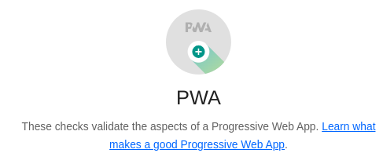
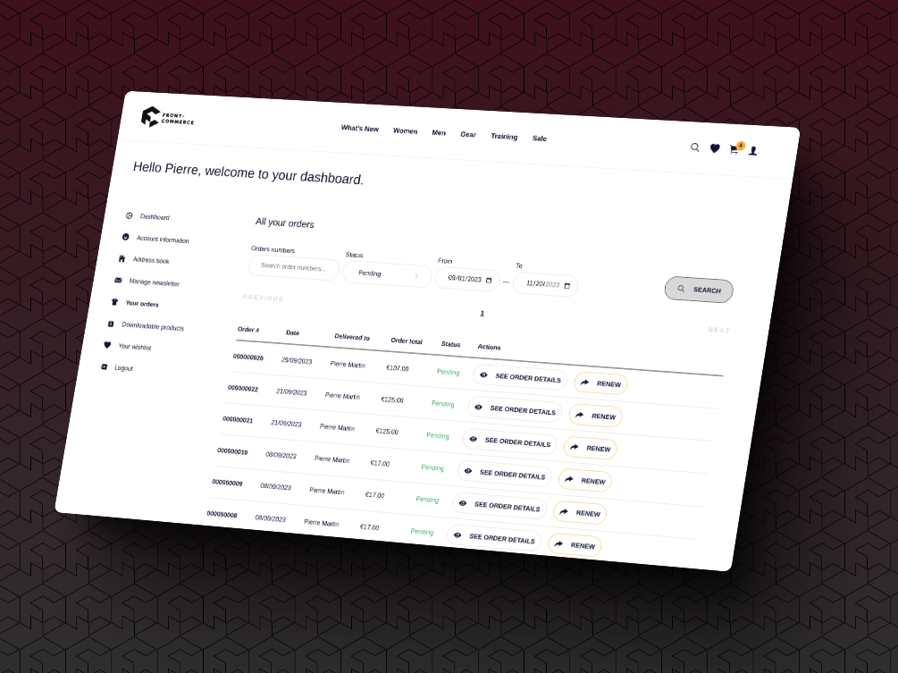

## A Blend of New Features and Core Stabilization

Black Friday is fast approaching. We understand that you've been putting a lot
of effort into getting ready for the holiday season, and our support team has
been there to support you every step of the way.

This release is unique as it signifies a return to our regular release schedule
**with both new features and bug fixes every 6 weeks**. This is also the
inaugural release that combines new 2.x and 3.x minor versions. Just to remind
you, Front-Commerce 3.0 was a major version that introduced **new technical
foundations without adding new features**. Now, with Front-Commerce 3.1, we're
back to delivering new features for this major version.

Some of these features are also incorporated into Front-Commerce 2.27.0,
facilitating **quicker adoption for existing projects**. As time progresses, we
anticipate more projects transitioning to 3.x, and the number of new features
released for both major versions will gradually decrease.

Let's dive in and explore what's new in Front-Commerce…

<!-- truncate -->

import ChangelogFooter from "@site/src/components/ChangelogFooter";
import BackportList from "@site/src/components/BackportList";
import ContactLink from "@site/src/components/ContactLink";

## Improvements to Front-Commerce Remixed

The following features and enhancements are available in Front-Commerce 3.1
only. They're direct improvements to Front-Commerce 3.0, and new features for
projects using our Remix version.

### Core stabilization!

In the process of **migrating the first Front-Commerce 2.x project to version
3.x**, we encountered and addressed several issues.

These included problems related to our Codemods assisting with large-scale
codebase refactors. We also dealt with issues concerning theme overrides, with
some edge-cases found from _real-world_ use cases.

<abbr title="Hot Module Replacement">HMR</abbr> issues were another area of focus,
as we detected some drawbacks in projects, under certain circumstances. HMR stability
has been improved and modules will update without requiring a full refresh.

We also detected shortcomings in our public API, which we addressed by exporting
additional functions and types from our core packages so that they can be used
by user-land projects when building custom features.

Finally, we addressed problems with GraphQL Codegen after detecting some edge
cases preventing the generation of correct TypeScript types for GraphQL schema
extensions, queries or mutations.

**It's our top-priority to fix these issues as fast as possible**, which is why
we're still doing more regular alpha releases on our `main` branches for the
next 3.x versions. We hope you'll get a great experience when working on
Front-Commerce 3.x, either when starting a new project or migrating an existing
one.

### Revamped <abbr title="Progressive Web App">PWA</abbr> Asset Generation

We wanted to address a common pain point detected in previous Front-Commerce
projects: **most of the time, PWA assets weren't customized when we audited
sites preparing for go live.**

In this release, we've simplified the process of generating PWA assets. There is
now a more straightforward configuration directly in your
`front-commerce.config.ts` configuration file. With a few changes (app title,
main brand color and icon), Front-Commerce will generate various aspects
allowing you to satisfy all PWA requirements available in Lighthouse audits,
such as manifest, service worker, and app icons (which generates different sizes
for various devices).

We hope that you'll love this new streamlined process for generating PWA assets!

### Core React Hooks

In our Chocolatine theme, we have incorporated new core React hooks like
`useCart` and `useCustomer`. These hooks are designed to provide easy access to
frequently shared frontend data.

The `useCart` hook allows developers to easily fetch the user's shopping cart
data. On the other hand, the `useCustomer` hook simplifies the process of
retrieving the current customer common information.

Data fetched by these hooks leverages Remix's revalidation and is automatically
refreshed when the data changes. This ensures that the data is always up to
date.  It's also possible to customize the shape of data returned by these
hooks, based on your custom needs and GraphQL schema extensions. All of this
with **TypeScript type-safety!**

For developers coming from 2.x, consider it **an easier way to access this data
without having to manually `refetchQueries` or update Apollo cache in every
mutation!**

### Magento2: order filtering

In 3.1, we introduced a new feature that allows customers to filter and search
for orders within their account. This feature was designed with the aim of
optimizing the customer's workflow and making order management more efficient
for stores that have a large number of orders per customer. **So far, it's only
supported for Magento2/Adobe storefronts.**

Customers now have the ability to search for specific terms within their orders.
A search bar has been added to the orders list for this purpose. The search
functionality is based on various criteria such as the **order's reference,
order number, and other custom conditions you'll add.**

In addition to search capabilities, customers can also refine their order list
based on the order state and the time period in which orders were placed.

For mobile users, the filter options are hidden by default for a cleaner
interface. They can be accessed by clicking on a "Filters" button.

### New training material

We have revamped our training material for Front-Commerce 3.x, aiming to equip
new teams with the necessary skills to kickstart their first Front-Commerce
project. **💌 It was a delightful experience to welcome new partners during
the training.**

We're particularly happy that **part of the training is about Remix and Web
fundamental APIs**. It means we've succeeded in our goal of making
Front-Commerce 3.x a great platform for learning and teaching modern web
development!

Please feel free to reach out to us if you are interested in learning more about
our Front-Commerce 3.x training programs.

## New features available for every project

The following features and enhancements are available in both Front-Commerce 3.1
and 2.27. Update to the version relevant to your project to take advantage of
these features.

### Magento1: Attraqt Datasource Compatibility

In the latest update, we have added compatibility for the Attraqt datasource
with Magento1. **Magento1 datasource now has feature parity with the Magento2
datasource.**

Attraqt is a product descovery tool that provides advanced search,
merchandising, and recommendation capabilities. By integrating Attraqt with
Magento1, users can optimize customer engagement and improve their e-commerce
experience.

### Magento1: Product Reviews Support

We have now extended support for product reviews to Magento1, a feature that was
previously only available for Magento2 projects. This enhancement is aimed at
boosting customer engagement and enriching the overall shopping experience for
Magento1 storefronts.

### Magento1: Facets Order Customization

This release gives Magento1 store owners more autonomy by allowing them to
define the order of facets directly in the Magento1 admin. **Using native
Magento configurations, merchants can now tweak the navigation experience** by
providing a facet ordering more adapted to their products.

Importantly, this functionality is compatible with all datasources supported in
Magento1 (including the newly released Attraqt).

### Magento2: better performance when adding multiple items to cart

The latest update significantly improves the performance when adding multiple
items to the cart, a feature particularly beneficial for Adobe Commerce B2B
projects.

**We have implemented an optimized version of `addMultipleItemsToCart` using
Magento's GraphQL API**. This enhancement results in faster and more efficient
cart operations, addressing a common pain point in B2B e-commerce where bulk
product orders are a frequent occurrence.

Please note that this is an opt-in feature. To enable it, you need to set the
following environment variable:
`FRONT_COMMERCE_OPTIMIZED_ADD_MULTIPLE_CART_ITEMS` (head over
[our related documentation for more details](/docs/2.x/magento2/advanced#optimized-add-multiple-products-to-the-cart)).
We'd love to hear your feedback on this feature!

## Bug Fixes

_We're not covering all bug fixes from the 3.x version here, but we thought it
was important to highlight the main fixes brought to all versions._

- **Adyen**: we resolved an issue with Apple Pay to ensure the correct total
  amount is displayed to the customer, enhancing payment accuracy.
- **Akamai Image Manager**: we addressed focal point cropping issues when the
  source image is smaller than the target, ensuring proper handling of image
  manipulations.

<BackportList
  currentVersion={["3.1.0", "2.27.0"]}
  previousVersions={[
    "3.0.1",
    "2.26.5",
    "2.25.7",
    "2.24.8",
    "2.23.9",
    "2.22.11",
  ]}
/>

<ChangelogFooter>

Upgrade Front-Commerce (Migration guides): 3.1.0 or
[2.27.0](/docs/2.x/appendices/migration-guides#2260---2270)  Read the full
changelog (Customers only):
[3.1.0](https://gitlab.blackswift.cloud/front-commerce/front-commerce/-/releases/3.1.0)
or
[2.27.0](https://gitlab.blackswift.cloud/front-commerce/front-commerce/-/releases/2.27.0)

</ChangelogFooter>
