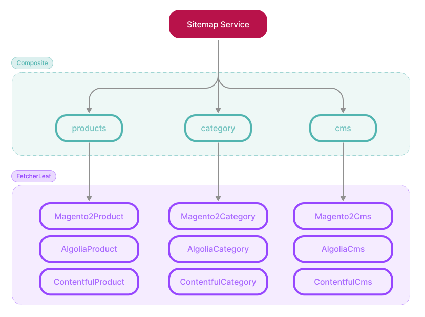

## Vite, Vite, Vite!

We are thrilled to announce that Front-Commerce has migrated to Vite! 🎉 <br/>
Vite is a tool that helps web developers build websites and web applications
faster.

**Front-Commerce 3.4 takes the development experience to a whole new level.** We
have migrated the frontend tooling of Front-Commerce projects from the Classic
Remix Compiler to [Vite](https://vitejs.dev/). In an AI-assisted development
environment, having fast feedback is key to productivity. That's why bringing
faster development feedback was important to us. It also means that
**Front-Commerce now benefits from the latest features and improvements of the
Vite ecosystem.**

In addition to these technical changes under the hood, we have also introduced
new features and improvements to the core of Front-Commerce. We have stabilized
new public core APIs for developers, added new payment modules, and enhanced the
testing experience for instant feedback 🚀

This release is very dense as it spans two usual release periods. Due to the
technical challenges of migrating to Vite, we needed more time to ensure a
smooth transition and a great developer experience. We hope this extended delay
will be worth it for you.

💌 We would like to thank our partners [Adexos](https://www.adexos.fr/),
[PH2M](https://www.ph2m.com/), and [Webqam](https://www.webqam.fr/) for their
valuable feedback during the beta testing phase of this Vite version. Their
input has been crucial in ensuring the quality of this release.

🤓 _If you haven't tried Front-Commerce 3.x yet, now is the perfect time to do
so. Let's dive into the details of Front-Commerce 3.4!_

<!-- truncate -->

## From the Classic Remix Compiler to Vite

Front-Commerce follows the path of Remix and migrates to Vite. We've been
waiting for this moment for a long time, and since
[Remix announced its stable Vite support at the end of february](https://remix.run/blog/remix-vite-stable),
we've been working hard to make this migration possible.

:::tip A recap in one sentence

A Front-Commerce project is now a Vite project with the
[Remix Vite plugin](https://remix.run/docs/en/main/file-conventions/vite-config),
enhanced by the Front-Commerce Vite Plugin (from `@front-commerce/remix`) 🤯

:::

Every feature brought by Front-Commerce has been reinvented in a Vite-compatible
way. This includes Extensions, PWA generation, GraphQL code generation, theme
overrides, unified configuration and more.

As a result, the development experience is **unified**, more **memory
efficient** and **faster than ever**. All of this thanks to Vite's blazing fast
development server, HMR and build times.

<!--
Here are some numbers to give you an idea of the improvements:


  TODO Numbers:
  - time to start the dev server: 2.x, 3.3.x, 3.4.x
  - time to hot reload: 2.x, 3.3.x, 3.4.x
  - time to build the app: 2.x, 3.3.x, 3.4.x
 -->

The migration to Vite allowed us to simplify many things, and fix a few annoying
flaws. Here are some highlights:

- in development, you can now benefit from instant reloads when you update your
  theme but also when you update an environment variable or a GraphQL module
- you can now directly import your SCSS file in components (instead of a
  generated CSS)
- you can now override a component SCSS file in your project without having to
  create a sibling `tsx` file reexporting the original component
- routes don't require a parent layout if it exists in a parent theme, and you
  don't need an empty `root.tsx` in your `routes` directory anymore
- we're now enforcing the use of ESM modules everywhere: no more CommonJS
  modules in a Front-Commerce project codebase!
- we replaced several dependencies with ESM alternatives, and patched imports
  for the ones that were not (yet!) ESM-compatible

It also opens up new possibilities for your project. **You can now leverage
tools from the Vite ecosystem directly in your project.** We have already
updated the skeleton to use [**Storybook 8**](https://storybook.js.org/) (Vite
compatible) and added some example stories to help you get started. Similarly,
we have updated the skeleton to use [**Vitest**](https://vitest.dev/) for
testing and included some sample tests to assist you.

We have also provided documentation for a working example extension that
demonstrates how to use [**Tailwind**](https://tailwindcss.com/) within a
Front-Commerce project. Additionally, we are working on more examples (such as
MDX) to help you effectively utilize the Vite ecosystem.

## From Jest to Vitest

We took this opportunity to migrate our entire test suite from Jest to Vitest.
This change brings **more consistency between the application and tests**,
simplifies the codebase, and improves overall test performance.

Please, read the [**Your first test**](/docs/3.x/get-started/your-first-test)
guide to learn more about how to use it to improve the quality of your project.
We started to expose some useful testing utilities in our packages, such as the
`FrontCommerceProviderStub` to help you test your components in isolation. Let
us know if you need more utilities to test your project!

:::tip Test cases and bug reports

🖖 One of the first things our support team does when receiving a bug report is
to find a way to reproduce the issue. A test case is the best way to ensure that
the bug is fixed and that it doesn't come back in the future.

🥰 If you can provide a test case, it will help us to understand the issue and
fix it faster… 🚀

:::

Speaking of tests, we also updated the version of the **Pact library** (used for
testing interactions with remote services) to the latest one. This involved a
huge effort from the team, but that's for the best! Since Pact 10, the Ruby
implementation has been replaced by a Rust one, which is much faster.

**Our test suite now runs twice as fast as before! 🚀**<br /> This speed
improvement will allow us to iterate faster and with more confidence.

## New stable APIs in the core

Public APIs play a crucial role in the experience of a software product like
Front-Commerce. They provide a standardized and documented interface for
developers to interact with the product's functionality. At Front-Commerce, we
aim to provide a **stable and reliable API for our customers so that they could
upgrade to new versions without breaking their existing codebase.**

These APIs also ensure that people can contribute to the product's growth by
developing plugins, extensions, and integrations.

We wanted to wait for the Vite migration to stabilize as it impacted many parts
of our codebase. Now that it's done, we are happy to introduce new stable APIs
in the core of Front-Commerce.

### GraphQL Module stable API

We reworked how GraphQL modules are registered to introduce a clearer and more
declarative `graphql.modules` registration API for extensions and app authors.

While conceptually similar to the way a GraphQL module was registered in 2.x,
the new API more clearly separates the concerns of a GraphQL module:

- the **module definition** (using `createGraphQLModule`) is loaded with your
  `front-commerce.config.ts` configuration declaration. It is a plain Javacript
  object that declares the responsibilities of the module and its role in the
  application. It is where you'll define the schema, name, and dependencies of
  the module.
- the **module runtime** (using `createGraphQLRuntime`) is a lazy-loaded module
  that is only loaded when the application starts. It is where you'll define the
  `resolvers` and `contextEnhancer` of your module, that is, the code that will
  be executed when a GraphQL query is made.

We hope this new API will make it easier for you to understand and maintain your
GraphQL modules. We implemented several transformers in the
`@front-commerce/codemod` 3.4 migration, to help you migrate your codebase to
this new API.

Read the
[migration guide](/docs/3.x/upgrade/migration-guides/3.3-3.4#from-graphqlunstable_module-to-graphqlmodule)
for more information about these changes.

### Sitemap API

Front-Commerce 3.4 introduces a revamped way to generate sitemaps. The new API
is more flexible and is based on Remix routes instead of CRON jobs.

Here are some highlights of the new API:

- Front-Commerce will use your defined routes to generate the sitemap
- You can customize the content of the sitemap at route level using your route
  `handle` export
- We provide a `createSeoHandle()` helper to achieve the most common use cases
  with a few lines of code
- Dynamic routes can leverage **Sitemap fetchers** from registered extensions
  (through the `SitemapService`) to generate URLs based on data from remote
  systems (like Magento or Contentful)

Here is a high-level overview of the `SitemapService` design:



Read the [Customize the sitemap](/docs/3.x/guides/customize-the-sitemap) guide
for a more technical overview of this new API.

Our core modules `@front-commerce/theme-chocolatine`, `@front-commerce/magento1`
and `@front-commerce/magento2` have has been updated to use this new API.

:::note Previous work

This API was inspired by the work of
[@balavishnuvj/remix-seo](https://www.npmjs.com/package/@balavishnuvj/remix-seo)
and the [NASA GCN fork](https://github.com/nasa-gcn/gcn.nasa.gov). Thanks to
them for their contributions!

:::

### External Login

This release introduces the ability for customers to login and register with
external providers thanks to the new `@front-commerce/external-login-providers`
package.

We revamped how this feature was implemented under the hood and crafted public
APIs that we hope are simple to use and extend than their 2.x counterparts:

- **Providers**: Providers are responsible for handling authenticating the user
  with the external systems. We support Google and Facebook out of the box, and
  you can add or contribute your own providers.
- **Adapters**: Adapters allow you to link external services users to your
  e-commerce customer account. We support Magento2 out of the box, and Magento1
  support will come soon.

Read the
[External Login Providers](/docs/3.x/extensions/external-login-providers/)
documentation to learn more about this feature.

### Rate Limiting

We implemented a `RateLimiter` core service to limit calls on pages. This
feature is useful to prevent abuse of your website:

- Rate limiting follows the best practices and HTTP standards
- You can use the `RateLimiter` service in your GraphQL resolvers or in your
  Remix loaders/actions to limit the number of requests a user can make in a
  given time frame.
- The `RateLimiter` service uses Redis to store the rate limits in a scalable
  way.
- You can configure the rate limits per namespace, allowing you to have
  different rate limits for different parts of your application.

Read the
[Prevent excessive usage with rate limits](/docs/3.x/guides/prevent-excessive-usage-with-rate-limits)
guide to learn more about this feature.

### Simplified some entrypoints for standard use cases

When we introduced **Front-Commerce Remixed**, our goal was to seamlessly
integrate it into a standard Remix project. This meant that projects would have
complete ownership of the Remix entrypoints, including the server module and
server/client entry.

However, this approach had some drawbacks. It made updates more tedious for
projects that only used the default configuration, as they had to manually apply
changes to their entrypoints in order to benefit from the low-level improvements
brought by Front-Commerce.

In Front-Commerce 3.4, we introduce a simpler API for some of them. We have
extracted our default logic for the express server and the service worker into
the `@front-commerce/remix` package, **allowing projects to use the default
configuration with just one line of code.**<br/> This eliminates the need for
manual entrypoint modifications and simplifies the update process.

Of course, projects still have the flexibility to "eject" from the default
configuration for more advanced use cases.

## New payment modules supported in 3.x

We are keeping the pace of migrating modules from 2.x to 3.x. This release
introduces the following payment modules:

- `@front-commerce/paypal` now support Paypal for Magento1 and Magento2.
- `@front-commerce/payzen` has implemented the Payzen Payment method for
  Magento1.
- `@front-commerce/stripe` has implemented the Stripe Payment method for
  Magento1 and Magento2.

:::tip Extensions

You'll find the full list of supported services in the "**Extensions**" section
of [our documentation](/docs/3.x/welcome)'s sidebar. We've alphabetically sorted
them to make it easier to find the one you're looking for.

:::

## Backed by codemods!

As you noticed, this release is packed with changes. It was a huge effort on our
side and led to changes in several parts of code you own.

We have invested a lot of time in creating a set of codemods to deal with the
tedious and bug-prone task of code updates. It should help you migrate
seamlessly to Front-Commerce 3.4.

We hope this will make your migration process as straightforward as possible but
invite you to rigorously follow the instructions in the
[migration guide](/docs/3.x/upgrade/migration-guides/3.3-3.4) to prevent issues.

🖖 As always, we are here to help you with the migration process. If you
encounter any issues, please don't hesitate to <ContactLink>reach out to our
support team</ContactLink>.

## Other changes

```mdx-code-block
<details>
  <summary><h3 className="mb-0">Features</h3></summary>
```

- **2.x only:** we added support for rolling sessions, to renew the session
  duration for recurring users.
- **Maintenance Mode:** we added a maintenance mode feature to the
  `@front-commerce/remix` package, to temporarily disable your shop for
  maintenance.
- **User**: we introduced the `UserJourney` class and exposed it as
  `user.journey` to track events and actions taken by users, and ensure they are
  only tracked once.
- **DX**: we now allow to customize success / failure HTTP codes for healthcheck
  using `successHTTPCode` and `failureHTTPCode` search params, to better test
  your healthcheck in your CI/CD pipeline or cloud environment.
- **DX**: we now prevent the application to start if no
  `FRONT_COMMERCE_COOKIE_PASS` environment variable is defined.
- **DX**: we implemented a custom `axios-debug-log` instance to help you debug
  your external API calls.
- **DX**: we removed the Magento2 configuration from the default
  `front-commerce.config.ts` so that it's unopinionated and allows to start a
  project or reproduction from a simpler setup.

```mdx-code-block
</details>
```

```mdx-code-block
<details>
  <summary><h3 className="mb-0">Bug Fixes</h3></summary>
```

We fixed several bugs in this release, based on the feedback we received from
our customers and partners and from our internal testing sessions.

_These bug fixes were also backported to `2.x` when relevant._

- **Impersonation:** we fixed an issue where the impersonation redirection URL
  was not using the current domain.
- **Service Worker:** we prevented blocking deferred response streaming in the
  service worker.
- **Front-Commerce Postinstall:** we improved the `front-commerce-postinstall`
  script for more reliable updates.
- **Core:** Fixed import location of RestPagesWalker from core.
- **Magento:**

  - we fixed an issue with the `makeAxiosInstance` function being passed the
    wrong `authToken` parameter in the case of an `AdminInstance`.
  - Fixed import location for USER_CACHE_ROOT in `perMagentoCustomerGroup`.
  - Fixed an issue where the magento checkout graphql module is overridden by
    the front-commerce checkout module.
  - _Magento1:_ we fixed an issue where the token invalidation was not detected
    correctly.
  - _Magento1:_ Fixed an issue with Magento1 module address formatting method
    not passing the right property for addresses' ids.
  - _Magento2:_ Fixed an issue with categories ID being in base64 in
    Magento2 >2.4.6.
  - _Magento2:_ Prevent a race condition for guest carts just placed: inactive
    carts are now considered as a 404.

- **Analytics:**
  - we fixed an issue where the `OrderPlaced` event was tracked multiple times
    upon page refresh.
  - we fixed an issue with the `Product searched` event payload in e-commerce
    analytics plugin.
  - we fixed an issue with the properties usage in the Google Analytics
    e-commerce plugin.
- **UI:**

  - we fixed an issue where the customer id was not tracked when the user was
    logged in for checkout success.
  - we fixed an issue where the quantity selector was not properly initialized.
  - we fixed an issue where switches were not updated properly in the Editorial
    toolbox
  - Fixed an issue where `/orders/:id` resolves to `/orders` route, due to it
    not being marked as an index route.
  - Fixed an issue where `/requisition-lists/:id` resolves to
    `/requisition-lists` route, due to it not being marked as an index route.
  - Fix an issue where defaultQuantity wasn't set when an optional product
    switch from none to a product.
  - Fixed a regression in the `PaymentForm` state management which did not allow
    state resetting or disabled button click event handler.
  - Fix an issue where `NumberInput` input component won't be updated if the
    value is 0.
  - Fixed an issue when trying to navigate via the `LinkListSelector` due to
    non-existing `props.history.push` usage resulting in a page error.
  - Fixed the functional `className` for `RouteLink` to correctly use the
    isActive prop from `@remix-run/react` `NavLink` component.
  - Fix an issue for bundle products where default quantity was set even if the
    product wasn't required.

- **Requisition List:** we fixed several edge cases after thorough testing
  sessions of this feature:
  - Fixed an issue causing a crash when trying to add products to a requisition
    list from PLPs and cart pages. This was due to missing data passed to the
    component, and to the mutation parameter being incorrect in some cases.
  - Fixed an issue with requisition list configuration modal that would not
    register option selections for configurable products.
  - Fix an issue where Page title wasn't updated properly on requisition lists
    listing.
  - Fixed an issue causing the app to crash when selecting an option in the
    product configuration modal when another select option did not have a value.
  - Fix an issue where when adding a product to a requisition list from the cart
    it adds the SKU of the already configured product instead of the main
    product with configurables.
  - Fixed an issue causing the requisition lists modal to "catch" click event
    from the configuration modal when trying to add a configurable product to a
    requisition list.
  - Fixed an issue causing the "requisition list" list not to be refreshed when
    trying to add a product to a requisition list.
  - Fixed an issue occurring when trying to add a bundle product to a
    requisition list from a PLP page. This was due to the fact configuration
    modal wasn't implemented at all for bundle products. Clicking on "Add to
    requisition list" from the PLP on a bundle product now redirects to the
    product's page.
  - Fixed a frontend issue preventing a bundle product from being added to a
    requisition list from a PDP.
  - Added missing bundle options when adding bundle products to requisition
    lists.
  - Fixed an issue with RequisitionList loaders not updating cart cache when
    modifying the cart.

```mdx-code-block
</details>
```

<hr />

<BackportList
  currentVersion={["3.4.0"]}
  previousVersions={[
    "3.3.3",
    "3.2.7",
    "3.1.5",
    "3.0.5",
    "2.29.0",
    "2.28.2",
    "2.27.4",
    "2.26.8",
    "2.25.11",
    "2.24.12",
  ]}
/>

<hr />

<ChangelogFooter>

Upgrade Front-Commerce (Migration guides):
[3.4.0](/docs/3.x/upgrade/migration-guides/3.3-3.4)<br /> Read the full
changelog (Customers only):
[3.4.0](https://gitlab.blackswift.cloud/front-commerce/front-commerce/-/releases/3.4.0).

</ChangelogFooter>
