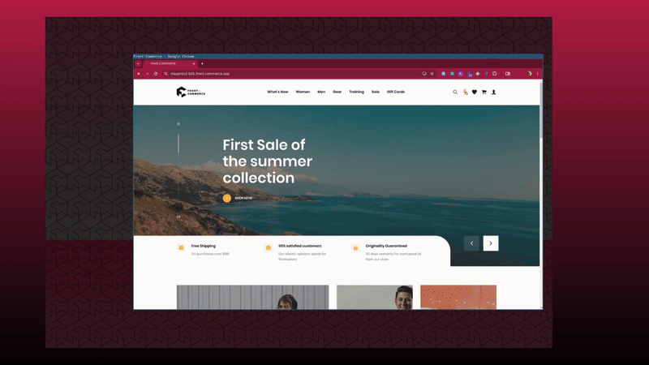
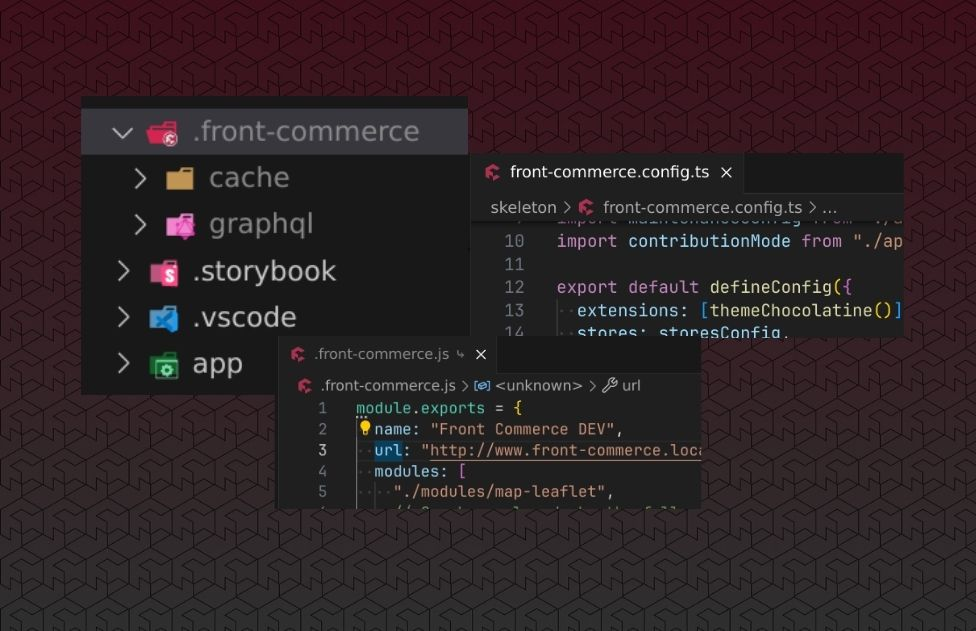

## A new Quick Order Page, Dynamic Routing, and Server-side Tracking

This double release brings several requested features to Front-Commerce. The
most notable ones are the quick order page which **allows customers to order
products in bulk seamlessly**, and different ways to switch to **server-side
tracking to cope with the decline of 3rd-party cookies**.

On a more technical side, we are happy to introduce one of the last missing
feature from 2.x in Front-Commerce 3.5: dynamic routing. Built on top of the
Remix/React-Router routes API, Front-Commerce dynamic routing allows you to
implement any URL structure you want without sacrificing performance or
features.<br />**It is unique in the Remix ecosystem, and solves several
limitations that were present in the previous versions of Front-Commerce**. We
are excited to see what you will build with it!

As usual, these releases also include several bug fixes and improvements to the
product. Let's dive in and explore what's new in Front-Commerce 3.5.

<!-- truncate -->

## Quick Order Page

The Quick Order Page is a new feature that allows customers to order products in
bulk. It is particularly useful for B2B customers who know the product codes and
quantities they need for restocking.

While the quick order page allows to manually enter product codes and
quantities, it also supports CSV import. Customers can download a CSV template,
fill it with product references and quantities, and upload it to fill the form
automatically. After validation, customers can add all products to their cart in
one click.



:::info Feature active by default

This page will be active by default at `/quick-order` after updating your
project (either to 3.5+ or 2.30+). If you want to opt-out of this feature, you
will have to remove the route from your project as documented in the migration
guide for your specific version.

:::

## Server-side tracking

With the decline of 3rd-party cookies, it is essential to have a server-side
tracking solution to keep track of your customers' behavior and understand their
needs.

Today's Front-Commerce releases introduce different options for your projects:

- **2.x (and 3.x) projects** can leverage tools such as
  [Server-side Tag Manager](https://developers.google.com/tag-platform/tag-manager/server-side)
  or commercial solutions such as [Addingwell](https://www.addingwell.com/) to
  send tracking events to 3rd-party services from a server-side context hosted
  on a subdomain. We updated our documentation to explain how to set up these
  tools with Front-Commerce's existing analytics stack.
- **3.5+ projects** can additionally benefit from
  [Server-Side events](/docs/3.x/category/server-side-events) to use our new
  server-side tracking solution that is fully integrated with Front-Commerce and
  server-side [Analytics plugins](https://getanalytics.io/plugins/). We've
  [added support for Google Analytics Measurement Protocol](/docs/3.x/guides/server-side-events/integrations/google-analytics)
  commerce events, and are looking for feedbacks to improve and extend this
  feature.

:::note Learn more

For more context on server-side tracking, you can read our recent editorial
content on the subject:

- [Understanding Server-Side Tracking](https://www.front-commerce.com/understanding-server-side-tracking/)
- [Exploring Server-Side Tracking and Server-Sent Events](https://www.front-commerce.com/exploring-server-side-tracking-and-server-sent-events/)
- [Client-side Tracking vs. Server-side Tracking: Navigating The Challenges and Solutions](https://www.front-commerce.com/client-side-tracking-vs-server-side-tracking-navigating-the-challenges-and-solutions/)
- [Exploring Server-Side Tracking with Front-Commerce](https://www.front-commerce.com/exploring-server-side-tracking-with-front-commerce/)
- [Understanding Server-Side Tracking for Enhanced Data Collection](https://www.front-commerce.com/understanding-server-side-tracking-for-enhanced-data-collection/)

:::

## Dynamic Routing in Front-Commerce 3.5

Front-Commerce 3.5 introduces dynamic routing, a feature that brings more
flexibility than ever to your Remix application. It allows you to customize your
URL structure dynamically based on your data, without sacrificing performance or
features.

**This feature is unique in the Remix ecosystem and closes the gap with the 2.x
versions of Front-Commerce.** We took the time to build it right, and we are
looking forward to seeing how we can refine or improve the feature with your
feedback.

Here is a quick overview of what you can do with dynamic routing:

- Maintain the benefits from route based data fetching, code splitting and
  mental model from Remix
- Support advanced URL structures matching. Example: `/category-:slug-:id`,
  `/latest-:brand/seo-keyword-:filter.html`, …
- Generate URLs based on identifiers contributed across different backends such
  as an E-Commerce platform, CMS service, …
- Have top-level URL segments that can render different routes based on the
  path. Example: `/my-product` can render a product route while `/my-category`
  or `/my-page` can render different routes
- Optimize the URL matching algorithm for performance by customizing URL
  matchers execution plan based on your own context. Example: run fast matchers
  in parallel, and slower ones in a second batch if needed
- Implement a redirection plan from your CMS. Example: redirect old URLs to new
  ones when the title is updated
- Implement localized URLs for your routes. Example: `/contact-us` in English
  and `/contactez-nous` in French
- A simplified URL matchers API, that is only responsible for converting URLs to
  route parameters

We built dynamic routing to solve concrete use cases and challenges from
advanced e-commerce projects. Please let us know any limitations you encounter
and how we can improve the feature.

Dynamic routing is built on top of the Route API from Remix. It can be adopted
progressively in your project. **We have updated our default routes and
extensions to use dynamic route features when relevant … as you would expect!**

:::note Learn more

Learn more about dynamic routing in our dedicated documentation guide:
[Dynamic Routing in Front-Commerce](/docs/3.x/guides/dynamic-routing).

:::

## Front-Commerce files are now supported in VSCode Icons

On a lighter note, we are happy to announce that Front-Commerce icons are now
available for FC 2.x and 3.x configuration files in the latest release of the
[VSCode Icons](https://github.com/vscode-icons/vscode-icons/releases/tag/v12.8.0)
extension. Thanks Paul!



If you're using VSCode, we recommend you to install this extension (using
`ext install vscode-icons` in the command palette) and you'll see the
Front-Commerce logo on configuration files or reserved directories 🎉

## Other changes

We also made several changes in these releases, to improve existing features and
fix bugs.

```mdx-code-block
<details>
  <summary><h3 className="mb-0">Features</h3></summary>
```

- 2.x only:
  - **stripe:** Enable IPN-based payments for Magento2 _(scheduled for 3.6)_
  - **server:** add support for an `onServerInit` callback for server modules
    ([with an example using it to implement a websocket server](https://github.com/front-commerce/examples/tree/main/websocket-server))
- **images:** Initial release of the `@front-commerce/twicpics` package for FC
  3.x, allowing to use TwicPics as a CDN for image assets.
- **theme-chocolatine:** the Skeleton now accepts a component as prop
- **magento:** added oAuth tokens to the shared configuration provider
- **core:**
  - Implement custom session storage for `UserJourney`
  - Implement a unique visitor id for a journey
  - Implement configuration file for maintenance mode
  - Replaced usages of `process.env.*` through standard configProviders
- **analytics:**
  - Implement Add To Wishlist event tracking
  - Implement Register event tracking
- **dx:**
  - Add typed commerce events for analytics
  - Allow HMR reconnection after server disconnect

```mdx-code-block
</details>
```

```mdx-code-block
<details>
  <summary><h3 className="mb-0">Bug Fixes</h3></summary>
```

_These bug fixes were also backported to `2.x` when relevant._

- **magento1:** prevent categories batch to fail if one doesn't exist by using a
  batch API call
- **theme-chocolatine:**

  - fixes add to wishlist after initial login
  - fixed CMS route to support deep identifiers (e.g: `/cms/foo/bar`)
  - fixed meta tags definition for PLP and PDP
  - fixed the CountrySelect input for the compat form
  - fixed CMS page meta description value

- **magento2:**
  - restored `MagentoWysiwyg` specific fragments to ensure full widgets support.
  - added missing content types exports to magento2 package.
  - fixed import location for magento factories
- **payments:** removed guest cart tokens on async checkout success to prevent
  race conditions fetching a partially incorrect cart during async payments
- **core:**
  - append session cookies to headers even if `Set-Cookie` exists
  - fixed an issue where the RateLimiter service would fill up the connection
    pool in redis
  - fixed the `frontCommerce` context types in `AppLoadContext` by extending the
    `@remix-run/node` types.
- **analytics:**
  - fixed an issue where analytics plugins were not detected properly
  - Added mechanism to prevent Order Completed even to trigger multiple times
  - fixed the analytics trackPage event payload
  - fixed duplicate tracking for Search page

```mdx-code-block
</details>
```

<hr />

<BackportList
  currentVersion={["3.5.0", "2.30.0"]}
  previousVersions={[
    "3.4.3",
    "3.3.4",
    "3.2.8",
    "3.1.7",
    "3.0.6",
    "2.29.2",
    "2.28.4",
    "2.27.6",
    "2.26.10",
    "2.25.15",
  ]}
/>

<hr />

<ChangelogFooter>

Upgrade Front-Commerce (Migration guides):
[3.5.0](/docs/3.x/upgrade/migration-guides/3.4-3.5),
[2.30.0](/docs/2.x/appendices/migration-guides/#2290---2300)<br /> Read the full
changelog (Customers only):
[3.5.0](https://gitlab.blackswift.cloud/front-commerce/front-commerce/-/releases/3.5.0),
[2.30.0](https://gitlab.blackswift.cloud/front-commerce/front-commerce/-/releases/2.30.0).

</ChangelogFooter>
