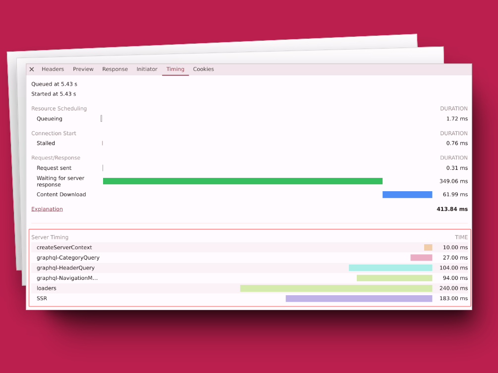

## A revamped Maintenance Mode, Cache Control, Server Timings, Summer Bug Hunt & More

Summer is here, and so is the new Front-Commerce release! 🌞

As you might know,
[Front-Commerce is now part of the Lundi Matin product family](https://www.lundimatin.co.uk/press/lundi-matin-group-strengthens-e-commerce-offering-and-consolidates-leadership-with-front-commerce-acquisition).
This release is the first one under the Lundi Matin umbrella, and you will see
that **our focus hasn't changed: we are still committed to providing you with
the best e-commerce experience!**

Front-Commerce 3.6 introduces a range of practical tools that empower developers
and operations teams in their day-to-day work.

- **Enhanced Operations:** Control downtime with `MaintenanceMode` and automated
  health checks for remote services such as Magento. Manage caching behavior
  with the `CacheControl` service, to ensure that your storefront is fast,
  always up and responsive even during peak traffic.
- **Performance analysis:** Get a better understanding of your server-side
  performance with `Server-Timing` headers. Front-Commerce provides fine-grained
  performance metrics to help you optimize your Time To First Byte by
  pinpointing bottlenecks.
- **Smoother Development:** this release also addresses several edge cases of
  dynamic routing and HMR introduced in 3.5, making development smoother.

Our team has also been working on a **Summer bug hunt**. Tackling a backlog of
bugs has resulted in numerous smaller fixes and improvements across the
codebase, further enhancing stability and performance.

These are just a few highlights. Keep reading to explore the full details!

<!-- truncate -->

## Easier Maintenance with a redesigned Maintenance Mode

Front-Commerce 3.6 brings Maintenance Mode features completely redesigned with
experience from the `2.x` lifecycle. We wanted to rethink how maintenance mode
is handled in Front-Commerce, making it easier to manage and more robust.

Our new and improved `MaintenanceMode` service gives you more control and
automates some tasks:

- **One-stop Shop:** Control everything from a central `MaintenanceMode`
  service. No more edge cases and obscure behaviors!
- **Simple switch:** In its simplest way, turn maintenance mode on or off with a
  single environment variable.
- **External Tools Integration:** For scripted scenarii, you can manage
  maintenance mode from your favorite tools with the `/api/maintenance-mode`
  endpoint.
- **Automatic Checks (Magento 1 & 2):** For critical services downtimes,
  Front-Commerce now has built-in health checks that automatically trigger
  maintenance mode if something goes wrong, preventing customer frustration.

These improvements make maintenance smoother and less stressful, letting you
focus on what matters most – running a successful online store!

Of course, developers can register new health checks for their own services, and
implement the most complex scenarios with the `MaintenanceMode` service. Read
more about it in the
[Maintenance Mode documentation](/docs/3.x/category/maintenance-mode).

## Performance Power-Up: Server Timings for your application

Front-Commerce 3.6 equips you with a new weapon in your performance arsenal:
`Server-Timing` headers.

**Think of it like a performance stopwatch for your storefront.** ⏱️

These headers give you precise insights into how long each part of your server
takes to respond. **You can view these timings in your browser's dev tools
network tab**, making it more convenient to identify slow areas and optimize
them for a lightning-fast Time To First Byte (TTFB). 🚀

[](./assets/3.6/server-timings.png)

Front-Commerce's core is instrumented to provide detailed timings out-of-the-box
for:

- **Remix Loaders & SSR:** Get a bird's eye view of how the time is spent in
  Remix's server-side rendering process.
- **GraphQL Queries & Mutations:** Measure the execution time of each GraphQL
  operations.
- **DataLoaders:** See exactly how your remote data fetching performs and
  discover caching issues.

We also provide a new `ServerTimings` service to help you record custom timings
in your application. Read more about it in the
[Add your own Server-Timings](/docs/3.x/guides/adding-your-own-server-timings)
documentation.

**Ready to make your store blazing fast?**

## Serve pages faster with `Cache-Control` headers

In this release, we wanted to address the complexity of managing `Cache-Control`
headers within Remix applications. We introduced a new `CacheControl` service
that simplifies the process of defining cache behavior in responses.

This service provides a simple API for developers to define `Cache-Control`
headers, taking care of the complex details behind the scenes.

**Key benefits:**

- **Effortlessly define cache behavior:** A user-friendly API lets you manage
  cache headers without writing complex Remix logic. Front-Commerce handles
  caching for both SSR and client-side navigation.
- **Built-in safeguards:** The `CacheControl` service automatically prevents
  caching of sensitive data like user information or dynamic content based on
  GraphQL results. It also deactivates caching in contribution mode.
- **Optimized performance:** Out-of-the-box, Front-Commerce routes now have sane
  defaults `Cache-Control` definitions to ensure efficient caching for common
  routes like HomePage, PLPs and PDPs.

:::tip Recommendation

We highly recommend you to use this 3.6 upgrade as an opportunity to ensure that
your application sends the correct `Cache-Control` headers to improve
performance and reduce server load.

:::

For more information, check out the
[`Cache-Control` headers](/docs/3.x/guides/cache-control) documentation.

## Flash messages

We brought Flash Messages to Front-Commerce `3.x`! This feature, ported from the
`2.x` version, allows you to display temporary messages to users, such as
success messages after a form submission or error messages when something goes
wrong.

It was adapted to match Remix's idiomatic way of handling sessions, and is now
exposed in `user.session` object.

Read more about it in the
[Flash Messages documentation](/docs/3.x/guides/flash-messages).

## Other changes

We also made several changes in these releases, to improve existing features and
fix bugs.

```mdx-code-block
<details>
  <summary><h3 className="mb-0">Features</h3></summary>
```

- **Core:**

  - we added an `isAnonymous` property on the shared `User` type to
    programmatically know whether the user is authenticated or not
  - we added a new `onServerInit` services lifecycle hook. Unlike the
    `onServerServicesInit` hook which runs on each request, this hook will only
    run on server start.

- **GraphQL:**

  - we renamed mutation response types to follow a coherent naming convention
    (`xxxMutationSuccess` suffix). It prevents naming conflicts between mutation
    names and types in tools such as Storybook. Read more about this change in
    the
    [ADR](https://gitlab.blackswift.cloud/front-commerce/front-commerce/-/blob/main/docs/adr/0013-coherent-schema-naming.md).
    An automated codemod will help you migrate usages of updated type names.
  - it is now possible to define custom scalars in GraphQL modules

- **Remix:**

  - we now publicly expose SEO API from the `@front-commerce/remix` package to
    allow reusing them when overriding SEO routes

- **DX:**

  - we improved the server startup log to display useful information for
    developers (Front-Commerce version, local and remote URLs, environment …)
  - we now allow session cookie for remote hosts in development mode. This
    enables login access using a remote host URL (e.g.,
    http://172.25.59.22:4000, http://mysite.dev) instead of the default
    localhost (http://localhost:4000).

- **Authorize.net:**
  - Authorize.net payments now support the CVV field (`2.x` only)
- **Codemods:**
  - migration tools now properly migrates `limitRateByClientIp` usages to
    `limitRateByGraphQLResolver`
- **DX:**
  - implemented a config validator to throw early errors when an invalid
    configuration is provided in `front-commerce.config.ts`
  - we added an `eslint` rule to disallow storybook virtual module imports
    outside of stories
- **Theme Chocolatine:**
  - refactoring: we renamed response value from `/api/checkout/shipping-methods`
    to use a consistent name: `paymentMethods` -> `shippingMethods`. No change
    is needed when using the `useShippingMethod()` hook. It's only an internal
    naming change.
  - replaced the `withPaymentError` HOC in favor of data from loader after
    payment control
- **Lyra / Payzen:**

  - the Payzen Front-Commerce Payment extension now supports for Magento 2.
    > The `payzen()` extension now requires a flavor. Example:
    > `payzen("front-commerce-magento1")` or `payzen("front-commerce-magento2")`

- **Adyen:**
  - Adyen now supports automated payment notifications

```mdx-code-block
</details>
```

```mdx-code-block
<details>
  <summary><h3 className="mb-0">Bug Fixes</h3></summary>
```

:::note DX issues: thanks for your feedback!

In Front-Commerce 3.5, we introduced dynamic routing. It was a very advanced
feature, that touched low-level internals of Vite and Remix. We received
feedback from some users, who faced issues in development mode after the
upgrade. These issues were all related to HMR and HDR. They're only detected in
typical project workflows, involving theme overrides and different types of
changes developers make on a daily basis.

These issues are hard for us to detect in our test suites and core development
tasks, due to their nature. We are grateful for the feedback we received, and we
are committed to improving the developer experience in Front-Commerce. We have
addressed these issues in this release (and sooner, with several `3.5.x` patch
releases). Please, never hesitate to report developer experience issues: these
are bugs often as critical as functional issues … so be sure that we'll take
them seriously!

Thanks everyone for your patience and understanding. We're sorry for the
inconvenience these issues may have caused to your development experience.

:::

_These bug fixes were also backported to `2.x` when relevant._

- **DX:**

  - we pinned `react` and `react-dom` to a canary version to avoid hydration
    issues during hmr. See
    https://github.com/remix-run/remix/issues/4822#issuecomment-2130006831 for
    details.
  - we fixed an issue causing the server to exit when runtime errors occurred in
    development mode
  - we fixed `HDR` updates in development mode to properly receive changes from
    loaders and actions
  - we fixed an issue which caused `HMR` changes to sometimes result in a
    `RangeError: Maximum call stack size exceeded` when having circular
    importers
  - we fixed the _"Error: No `routeModule` available"_ error which often
    occurred during `hmr` / `hdr` reloading
  - `HMR` now works as expected on custom hostnames (hostnames that are not
    `localhost`, for example `my-shop.local`)
  - `ssr` routes now have updated data for a dynamic route after `hmr` reloads

- **Global:**

  - we updated HTTP status code from `401` to `400` in several packages. It
    prevents issues when the application is behind an HTTP authentication layer.
    Impacted packages: `@front-commerce/theme-chocolatine`,
    `@front-commerce/contentful`, `@front-commerce/magento2` and
    `@front-commerce/core`
  - public configurations are now available for all modules, after loading the
    `<FrontCommerceScripts />` in the `root.tsx`'s `<head>` to ensure early
    initialization

- **Magento 1:**

  - we fixed a regression in the category batch function to allow batching more
    than 10 categories at once
  - we fixed a regression for Admin OAuth credentials to restore admin REST
    interactions

- **Theme Chocolatine:**

  - fix a regression due to Vite, where the fullscreen gallery didn't show up on
    the PDP
  - prevent the Login form submission to trigger other form submissions when the
    component is itself a child of a form (stop event propagation)
  - users can now properly create an account after a guest checkout, and are
    properly redirected to their order
  - fix an issue where `<QuickOrder>` doesn't display all fetched products
    properly
  - fix virtual cart detection in the checkout to ensure shipping steps aren't
    displayed for carts only containing virtual products
  - fix an issue where user was redirected to website home instead of checkout
    tunnel when registering from checkout tunnel
  - fix an issue where email validation fails in wishlist share modal
  - fix an issue where `<Skeleton>` component SCSS wasn't loaded properly
  - When accessing register page, redirect the user to the user account page if
    he's authenticated

- **External login providers:**

  - fixed missing translations for social logins
  - fixed missing react keys for social sign in providers

- **WYSIWYG:**

  - we replaced usages of an old library with inline implementation, to convert
    html inline styles properties to React-compliant names in Wysiwyg loaders

- **Adyen:**

  - iDeal payment method now works properly, thanks to missing field added to
    the GraphQL schema
  - we fixed a regression during Adyen client SDK initialization, a
    `withAdyenCheckout` now injects Adyen checkout library in a component
    instead the legacy `window.AdyenCheckoutLib` approach. It is more resilient
    to modern toolings and good practices

- **Stripe:**

  - we fixed an issue with Stripe IPN not using the correct additional data
    fields

- **Lyra / Payzen:**
  - the `PayzenEmbeddedFormElement` now uses `className` instead of `class`
- **Paypal:**
  - the PayPal access token is now memoized properly in multi-store contexts

```mdx-code-block
</details>
```

<hr />

<BackportList
  currentVersion={["3.6.0", "2.31.0"]}
  previousVersions={[
    "3.5.5",
    "3.4.7",
    "3.3.6",
    "3.2.9",
    "3.1.8",
    "2.30.1",
    "2.29.3",
    "2.28.5",
    "2.27.7",
    "2.26.11",
    "2.25.16",
  ]}
/>

<hr />

<ChangelogFooter>

Upgrade Front-Commerce (Migration guides):
[3.6.0](/docs/3.x/upgrade/migration-guides/3.5-3.6),
[2.31.0](/docs/2.x/appendices/migration-guides/#2300---2310)<br /> Read the full
changelog (Customers only):
[3.6.0](https://gitlab.blackswift.cloud/front-commerce/front-commerce/-/releases/3.6.0),
[2.31.0](https://gitlab.blackswift.cloud/front-commerce/front-commerce/-/releases/2.31.0).

</ChangelogFooter>
