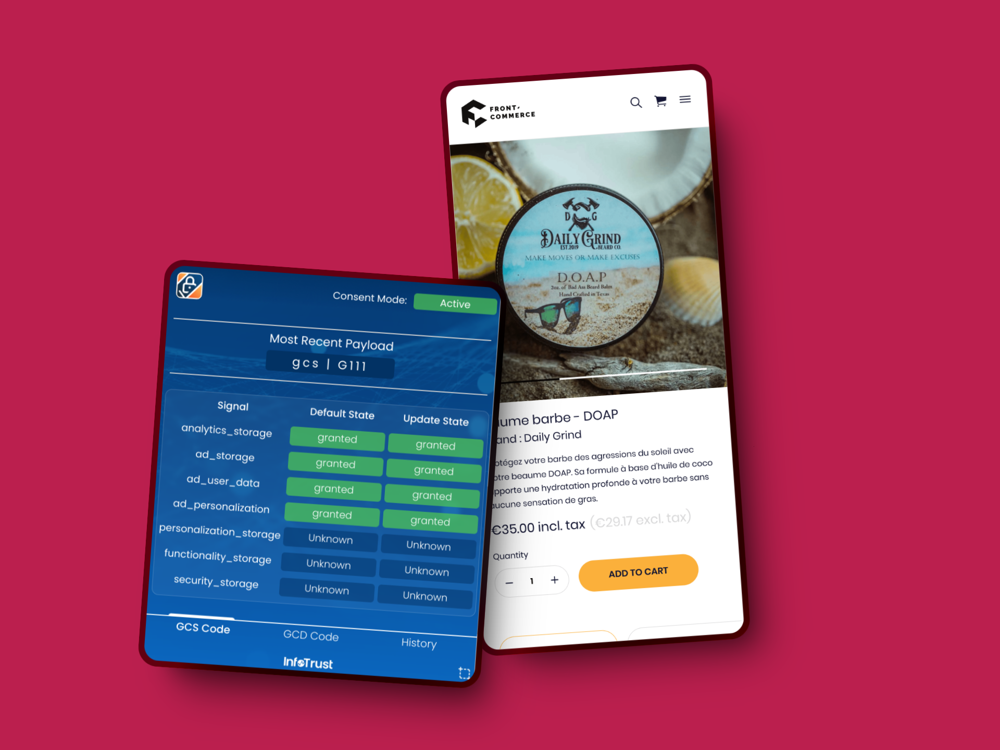

## Consent Mode V2, Consistent Price Display, Gezy advanced capabilities and Extension Features API

We know you're likely busy preparing for the Black Friday and the holiday
season, so are we! 🎄 \
For our final release of the year, we successfully introduced several new
features and enhancements in Front-Commerce versions 3.9 and 2.34.

Here's a quick overview of the key highlights in this release:

- **Google Consent Mode V2**: Enhanced analytics compliance with granular
  consent options.
- **Consistent Price Display**: New `<PriceVariant />` component for uniform
  price presentation across the theme.
- **Gezy Enhancements**: Advanced capabilities including facet filters, guest
  cart support, company accounts, advanced shipping and payment methods.
- **X-Ray Mode for Gezy**: Streamlined content management with the Magic Button
  for Gezy merchants.
- **Extension Features API**: New API for cleaner and more maintainable theme
  extensions.

Let's explore the full details!

<!-- truncate -->

## Google Consent Mode V2 for analytics services

We've enhanced our analytics capabilities to support
[Consent Mode V2 (for European Economic Area compliance)](https://support.google.com/tagmanager/answer/13695607),
**in both Front-Commerce 2.x and 3.x versions**. This update brings more
granular control over user consent for analytics services, ensuring compliance
with privacy regulations while maintaining effective data collection.

[](./assets/3.9/consent-mode-v2.png)

This change includes:

- **Granular Consent Options**: Users can now provide more specific consent for
  different aspects of data collection and usage.
- **Google Analytics and GTM integrations**: Our Google Analytics and GTM
  plugins now supports Consent Mode V2 out of the box.
- **Flexible Consent Management**: The new `withConsent` adapter method enables
  dynamic updates to consent settings as user preferences change, for custom
  plugins.

Please refer to our
[Granular Consent Updates](/docs/3.x/guides/analytics/getting-started#granular-consent-updates)
to learn more about implementing Consent Mode V2 in your Front-Commerce project.
For existing projects, follow our
[Migration Guide](/docs/3.x/upgrade/migration-guides/3.8-3.9#google-consent-v2-support)
to ensure your analytics stack is up-to-date (if you customized the analytics
integration).

## Display Prices consistently across your store

In this release, we introduced a new `<PriceVariant />` component that support
an app-wide configuration to display prices consistently across your store.

With this improvement, the theme now relies on a single source of truth for
price display configuration. Choose between displaying prices with or without
taxes, or both, to suit your business needs and improve the shopping experience
for your customers.

Some highlights of this new feature:

- **Consistent Experience**: The new configuration ensures a uniform price
  display across different sections of your store, creating a cohesive and
  professional look. It should help reduce customer confusion and potentially
  improve conversion rates.

- **Exception for Cart Summary**: To maintain clarity in financial calculations,
  the cart summary will continue to display a detailed breakdown, including
  subtotals, shipping costs, taxes, and the total amount.

- **Easy Configuration**: Set up your preferred price display format through a
  simple configuration in your theme settings (or dynamically based on custom
  business logic).

:::note Backward Compatibility

It is fully backward compatible with the previous price display system, so you
can safely upgrade your theme without any breaking changes. It can also coexist
with the previous price components (it reuses them).

:::

Learn more about this feature and how to configure it in our
[Display Prices with or without Taxes](/docs/3.x/guides/display-prices-with-or-without-taxes)
guide and the
[Price Display](/docs/3.x/extensions/theme-chocolatine/reference/price-display)
reference page.

## Gezy: advanced capabilities for demanding merchants

Building on our previous releases, we kept improving our Gezy integration to
support advanced capabilities. This release includes support for **facet filters
on Product Listing Pages (PLP)** and Search results, allowing users to easily
refine their searches and find products quickly.

We've also added guest cart support, enabling users to add items without logging
in, which streamlines the purchasing process. Additionally, **Company accounts
allow businesses to register** and access tailored functionalities. The addition
of several account-related features (address management, password update, order
history…) finalizes the account management experience for both individuals and
companies.

The checkout process has been enhanced with **sophisticated payment and shipping
methods**, meaning that most Payment and Shipping methods available in Gezy are
now supported by Front-Commerce. Finally, we've implemented a **Gezy Health
Check** to automate maintenance mode detection, preventing broken user
experiences when the platform is undergoing maintenance or unexpected issue.

These updates reflect our ongoing commitment to providing a robust platform that
meets the diverse needs of merchants and enhances user satisfaction.

## X-Ray mode for Gezy

Another feature we've added to Gezy is full compatibility with
[Front-Commerce's X-Ray mechanism (Magic Button)](/docs/3.x/guides/magic-button/x-ray).

[](./assets/3.9/gezy-x-ray.png)

Store managers can now use the Magic Button to identify Gezy content and
directly open the related Gezy admin page. This feature streamlines content
management and improves daily operations!

<ContactLink>Reach out to us</ContactLink> to schedule a personalized demo of
Gezy and Front-Commerce, and **discover how our platform can support your
specific business requirements.**

## Introducing the Extension Features API for theme extensions

We're proud to introduce a new
[**Features API**](/docs/3.x/category/extension-features) in Front-Commerce. It
introduces cleaner extension points for common project needs. **We hope it will
improve maintainability of Front-Commerce applications when it comes to
customizing the default theme.**

The Features API introduces a new way to extend specific parts of the theme
(menus, actions, additional data, etc.), replacing the previous reliance on
conventions and overrides. This new API introduces:

- **Component Maps**: Implement extension points for common project needs by
  defining component maps for specific features in your theme.
- **Feature Flags**: Define and manage feature flags when registering features
  in extension definitions.
- **Extension Hooks**: New hooks for registering and extending feature component
  maps.

In this release, we've refactored several components in the core theme to
leverage the new Features API. As of today, Front-Commerce supports customizable
features for things like
[dynamic facets, newsletter management, account deletion](/docs/3.x/extensions/theme-chocolatine/reference/features)
or
[root error meta customization](/docs/3.x/api-reference/front-commerce-remix/features#root-error-meta).

<details>
  <summary><h3 className="mb-0">🤿 Diving into a quick technical example 🤿</h3></summary>

Hi 👋

We hope you'll be using this feature as you work on your Front-Commerce
projects. So here's a code snippet to illustrate how you'll be able to use this
new API as of today. Let's register new components or override existing ones
using the `registerFeature` hook:

```typescript
// extensions/acme-extension/index.ts
export default defineExtension({
  unstable_lifecycleHooks: {
    // this hook is called when Features are initialized, allowing you to interact with the Features API
    onFeaturesInit: (hooks) => {
      // Each feature will have its own unique identifier (e.g. "acme-feature") documented in the theme's extension guide
      hooks.registerFeature("acme-feature", {
        // This is how you can define the components that will be used in the theme
        ui: {
          componentsMap: {
            Header: new URL("./components/AcmeHeader.tsx", import.meta.url),
            Footer: new URL("./components/AcmeFooter.tsx", import.meta.url),
          },
        },
      });

      // Another example with a feature flag that can be toggled on/off
      hooks.registerFeature("newsletter", {
        flags: {
          enabled: false,
        },
      });
    },
  },
});
```

This is just a quick overview of the new Features API. We hope you'll find it
useful in your projects. If you have any questions or need help, don't hesitate
to reach out to us!

</details>

These first use cases showcase the potential of the Features API. **Expect more
extensive usage in future versions as we continue to explore the
possibilities!**

## Other changes

We additionally worked on changes and bug fixes across different areas of the
product. You'll find a summary of these changes below.

```mdx-code-block
<details>
  <summary><h3 className="mb-0">Features</h3></summary>
```

- **Theme:**

  - we improved the **default display of shipping methods** to avoid text
    overflowing outside of their container elements, and to avoid breaking words
    in a way that reduces readability.
  - dynamic facets are now more generic and can be extended to support more
    types of filters display. We added support for two new types of filters:
    `TextSearchFacet` and `RangeSearchFacet`. Read more in the
    [Facets feature documentation](/docs/3.x/extensions/theme-chocolatine/reference/features#facets).
  - order details page now displays the image of ordered products
  - registration form now supports company registration if the platform supports
    it
  - it is now possible to toggle account registration for individuals and
    companies using configurations. The registration page will display a message
    and a button to contact the merchant if account registration is disabled
  - user information screens now support phone number for platforms that require
    it
  - the theme now relies on a platform agnostic `reference` field for product,
    cart items and orders to support platforms where a SKU is not relevelant
  - promotional prices are now displayed on each cart item line.

- **Service worker:**
  - we tackled a long-standing feature request from our customers to reduce
    service-worker logs verbosity. We now allow to configure the disablement of
    service-worker logs in `entry.worker.ts` using the `disableDevLogs` and
    `disableStorefrontContentDevLogs` options. **We changed the default behavior
    and disabled Workbox dev logs** but maintained Storefront Content ones.
- **Storybook**
  - public configuration are now available in Storybook based on the definition
    in `front-commerce.config.ts`
  - we added new stories for several components (related to price display
    configuration). Browse
    [our demo's styleguide](https://magento2.front-commerce.app/styleguide) to
    see them in action.
- **Config:**
  - we added a new `comma-separated-string` format for custom configuration
    providers' `convict` schema
- **Remix:**
  - it is now possible to customize route error pages SEO meta tags with `intl`
    messages. Read more at
    [Customizing meta tags](/docs/3.x/guides/error-handling-for-routes#customizing-meta-tags).
- **Skeleton:**
  - we included a Vscode configuration allowing developers to launch
    Front-Commerce in debug mode with a single click

```mdx-code-block
</details>
```

```mdx-code-block
<details>
  <summary><h3 className="mb-0">Bug Fixes</h3></summary>
```

_These bug fixes were also backported to `2.x` when relevant._

- **Remix:**
  - we fixed an issue with dynamic route during client side navigation leading
    to
    `Error: Route "Alias.product.AAA::routes/\_main.product.$id" does not match URL "/xxxx.html"`
    error in a multi-process concurrent environment. It could happen when the
    server-side rendering of a dynamic route happens in a different process than
    the one serving the client-side navigation request. This could lead to
    errors `{"message": "Unexpected Server Error"}` returned to the client.
  - we fixed an issue where routes with similar names (i.e: `contact` and
    `contacts`) would throw a 404 error when navigating to the `contacts` route
  - we now better support responses thrown in resolved dynamic routes during
    client-side navigation. It prevents
    `Response is not JSON. Front-Commerce expects JSON data for dynamic routes`
    errors in this case.
- **PayZen:**

  - **CRITICAL:** we fixed an issue with a new Card form field that was
    incorrectly displayed. This field (card holder) was recently added by Payzen
    to cope with a regulation change from Visa and Mastercard.

- **Theme:**

  - **CRITICAL:** we fixed an issue making it impossible to progress past the
    shipping method selection during mobile checkout
  - we fixed an issue where flashMessage rendering in cart could cause errors
  - we fixed an issue where the `customerId` prop was not passed to the
    `Dashboard` component
  - we fixed an issue preventing errors when a product doesn't have a product
    information field
  - we fixed an issue where the product short description was not displayed in
    the product details page due to an incorrect attribute used
  - we added missing translations for `<ProductView />` component
  - we fixed the spreading of the Carousel slide key in the props of the slide

- **Cache:**

  - **CRITICAL:** we fixed an issue with caching strategies by honoring the
    `UNSAFE_ensureRequestHasRequirements` hook to ensure correct behavior. All
    caching strategies (from the core or applications) relying on this hook to
    initialize the user session in order to properly achieve their goal were
    impacted in `3.x`. _Please note that we also removed the
    `ensureAllImplementationsRequirementsSatisfied` method from the public API
    (that shouldn't have been used directly by userland code)._
  - we fixed an issue preventing POST requests to the invalidation endpoint to
    fail for some caching strategies (such as `PerMagentoCustomerGroup`)

- **Paypal:**
  - we fixed an issue where the PayPal public environment variable was wrongly
    scoped and unavailable
- **Magento2 / Adobe B2B**
  - we fixed an issue where GraphQL modules deactivation was not possible due to
    schema validation errors
- **Core:**
  - we reworked the Storefront Content dump protocol to use a header instead of
    search param to prevent issues with routes parameters usage
  - we fixed the 3.8 PWA codemod to be executed only on the `root.tsx` file
- **Skeleton:**
  - we fixed an issue where the environment wasn't detected properly for images
    configuration (we replaced `process.env` usage with public configurations)
- **TwicPics:**
  - we implemented a new check to prevent rendering unsupported image formats
- **Service Worker:**
  - we fixed an issue preventing the service worker to start due to disabled
    offline page in production environment

```mdx-code-block
</details>
```

<hr />

<BackportList
  currentVersion={["3.9.0", "2.34.0"]}
  previousVersions={[
    "3.8.4",
    "3.7.5",
    "3.6.6",
    "3.5.10",
    "3.4.10",
    "2.33.1",
    "2.32.3",
    "2.31.4",
    "2.30.5",
    "2.29.7",
    "2.28.9",
    "2.27.11",
  ]}
/>

<hr />

<ChangelogFooter>

Upgrade Front-Commerce (Migration guides):
[3.9.0](/docs/3.x/upgrade/migration-guides/3.8-3.9),
[2.34.0](/docs/2.x/appendices/migration-guides/#2330---2340)<br /> Read the full
changelog (Customers only):
[3.9.0](https://gitlab.blackswift.cloud/front-commerce/front-commerce/-/releases/3.9.0),
[2.34.0](https://gitlab.blackswift.cloud/front-commerce/front-commerce/-/releases/2.34.0).

</ChangelogFooter>
