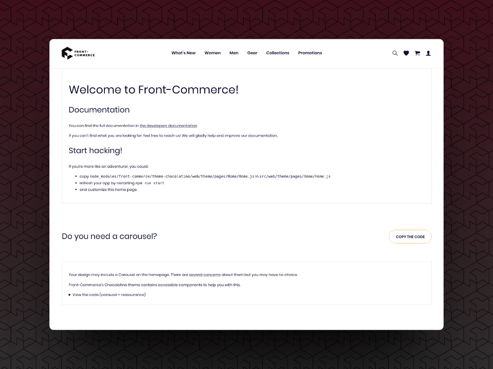

<p>{frontMatter.description}</p>

import ContactLink from "@site/src/components/ContactLink";
import Tabs from "@theme/Tabs";
import TabItem from "@theme/TabItem";

## Preparation

This guide will walk you through the steps to configure your system for
installing Front-Commerce packages from our private npm package repository using
a global `.npmrc` file.

### Prerequisites

:::caution

Front-Commerce is a **closed source product**. This documentation supposes that
you have access to our private repositories.

:::

Access is granted to teams that have signed the relevant legal contracts, either
as a **Partner**, a **Customer** or for a **Time-Limited Trial**.
Please <ContactLink /> if you need help or further information.

Before you begin, ensure that you have the following:

- A [Blackswift Gitlab](https://gitlab.blackswift.cloud/) account authorized to
  access our
  [Front-Commerce private workspace](https://gitlab.blackswift.cloud/front-commerce/)
- A
  [Blackswift Gitlab Personal Access Token](https://gitlab.blackswift.cloud/-/profile/personal_access_tokens)
  with the `read_api` scope
- Node.js and npm installed on your machine

### Step 1: Create a Blackswift Gitlab Personal Access Token

1. Log in to your Blackswift Gitlab account.
2. Navigate to your **Profile** and click on **Access Tokens**.
3. Click on the
   **[Add new token](https://gitlab.blackswift.cloud/-/profile/personal_access_tokens)**
   button.
4. Enter a name for your token and select the `read_api` scope.
5. Click on the **Create personal access token** button.
6. Copy the token value as you will need it in the next step.

### Step 2: Create a `.npmrc` file

1. Create a `.npmrc` file on your system (see
   [npm documentation for more information](https://docs.npmjs.com/cli/v9/configuring-npm/npmrc#files)),
   with the following content:

```ini title="~/.npmrc (for example)"
//gitlab.blackswift.cloud/api/v4/projects/24/packages/npm/:_authToken=<your_token_value>
@front-commerce:registry=https://gitlab.blackswift.cloud/api/v4/projects/24/packages/npm/
```

1. Replace `<your_token_value>` with the token value you copied in Step 1.

### Conclusion

Congratulations! You should now be able to install Front-Commerce packages. If
you encounter any issues during the installation process or are looking for
alternatives, please refer to the
[official Gitlab documentation](https://gitlab.blackswift.cloud/help/user/packages/npm_registry/index.md#install-a-package)
or contact our support team for assistance.

## Installation


<Tabs>
<TabItem value="Using our Skeleton (Remix Stack)">


This is the recommended way to start a new Front-Commerce project.

1. Open your terminal and run the following command (it uses `pnpm`, but you can
   use `npx` if you prefer):

```shell
NPM_CONFIG_LEGACY_PEER_DEPS=true pnpm dlx create-remix@latest hello-v3 --template https://new.front-commerce.app/ -y
```

2. Wait for the installation process to complete and follow the prompts
3. Create another `.npmrc` in the project root with the following content:

```ini title=".npmrc"
legacy-peer-deps=true
```

:::info About `NPM_CONFIG_LEGACY_PEER_DEPS`

This option (or `legacy-peer-deps=true` in `.npmrc`) is currently required when
using `@front-commerce/compat`. This is due to the Apollo version used in 2.x
being incompatible with the latest version `graphql` versions used now.

When not using `@front-commerce/compat`, it is not required. We still have some
usages in Front-Commerce core in the current stable version. Please bare with
us!

:::


</TabItem>
<TabItem value="In an existing project">


This is not something we expect you to do for now, as you'll have to edit your
`entry.*.ts` files, `server.ts` and your root route with Front-Commerce specific
code.

:::tip

Instead of documenting these changes that could evolve, we prefer that
you <ContactLink>contact our support team</ContactLink>. We'll provide a
friendly and up-to-date guidance in a timely fashion! Deal?

:::


</TabItem>
</Tabs>


## Configure your project

You must now configure your project to use Front-Commerce's extensions adapted
to your context. Edit the `front-commerce-config.ts` file to configure your
project, and create a `.env` file with essential configurations. Here are some
examples:

````mdx-code-block
<Tabs>
<TabItem value="Minimal install">
Use Front-Commerce without any extension: only the default theme with static data.
Useful for evaluation purposes, but quickly limited.

```typescript title="front-commerce.config.js"
import { defineConfig } from "@front-commerce/core/config";
import themeChocolatine from "@front-commerce/theme-chocolatine";
import storesConfig from "./app/config/stores";
import cacheConfig from "./app/config/caching";

export default defineConfig({
  extensions: [themeChocolatine()],
  stores: storesConfig,
  cache: cacheConfig,
  configuration: {
    providers: [],
  },
  v2_compat: {
    useApolloClientQueries: true,
    useFormsy: true,
  },
});
```

Finally, create a `.env` file with the following content:

```shell title=".env"
# Front-Commerce configuration
FRONT_COMMERCE_ENV=development
FRONT_COMMERCE_URL=http://localhost:4000
FRONT_COMMERCE_HOST=localhost
FRONT_COMMERCE_PORT=4000
FRONT_COMMERCE_COOKIE_PASS=cookie-secret
FRONT_COMMERCE_SITEMAP_TOKEN=sitemap-secret
FRONT_COMMERCE_CACHE_API_TOKEN=cache-api-secret
```

</TabItem>
<TabItem value="Magento2">
   Use Front-Commerce with a headless Magento2 instance.

```typescript title="front-commerce.config.js"
import { defineConfig } from "@front-commerce/core/config";
import themeChocolatine from "@front-commerce/theme-chocolatine";
import magento2 from "@front-commerce/magento2";
import storesConfig from "./app/config/stores";
import cacheConfig from "./app/config/caching";

export default defineConfig({
  extensions: [magento2({ storesConfig }), themeChocolatine()],
  stores: storesConfig,
  cache: cacheConfig,
  configuration: {
    providers: [],
  },
  v2_compat: {
    useApolloClientQueries: true,
    useFormsy: true,
  },
  pwa: {
    appName: "Front-Commerce",
    shortName: "Front-Commerce",
    description: "My e-commerce application",
    themeColor: "#fbb03b",
    icon: "assets/icon.png",
    maskableIcon: "assets/icon.png",
  },
});
```

:::info

Learn more about
[configuring the Magento2 extension](/docs/3.x/extensions/magento2/) and the
prerequisites.

:::

```shell title=".env"
# Front-Commerce configuration
FRONT_COMMERCE_ENV=development
FRONT_COMMERCE_URL=http://localhost:4000
FRONT_COMMERCE_HOST=localhost
FRONT_COMMERCE_PORT=4000
FRONT_COMMERCE_COOKIE_PASS=cookie-secret
FRONT_COMMERCE_SITEMAP_TOKEN=sitemap-secret
FRONT_COMMERCE_CACHE_API_TOKEN=cache-api-secret

# Magento2 configuration (see https://developers.front-commerce.com/docs/3.x/extensions/magento2#configuration)
FRONT_COMMERCE_MAGENTO2_ENDPOINT=https://magento2.example.com
FRONT_COMMERCE_MAGENTO2_CONSUMER_KEY=xxxxxxxxx
FRONT_COMMERCE_MAGENTO2_CONSUMER_SECRET=xxxxxxxxx
FRONT_COMMERCE_MAGENTO2_ACCESS_TOKEN=xxxxxxxxx
FRONT_COMMERCE_MAGENTO2_ACCESS_TOKEN_SECRET=xxxxxxxxx
```

</TabItem>
<TabItem value="Magento1">
   Use Front-Commerce with a headless Magento1 instance.

```typescript title="front-commerce.config.js"
import { defineConfig } from "@front-commerce/core/config";
import themeChocolatine from "@front-commerce/theme-chocolatine";
import magento1 from "@front-commerce/magento1";
import storesConfig from "./app/config/stores";
import cacheConfig from "./app/config/caching";

export default defineConfig({
  extensions: [magento1({ storesConfig }), themeChocolatine()],
  stores: storesConfig,
  cache: cacheConfig,
  configuration: {
    providers: [],
  },
  v2_compat: {
    useApolloClientQueries: true,
    useFormsy: true,
  },
});
```

:::info

Learn more about
[configuring the Magento1 extension](/docs/3.x/extensions/magento1/) and the
prerequisites.

:::

```shell title=".env"
# Front-Commerce configuration
FRONT_COMMERCE_ENV=development
FRONT_COMMERCE_URL=http://localhost:4000
FRONT_COMMERCE_HOST=localhost
FRONT_COMMERCE_PORT=4000
FRONT_COMMERCE_COOKIE_PASS=cookie-secret
FRONT_COMMERCE_SITEMAP_TOKEN=sitemap-secret
FRONT_COMMERCE_CACHE_API_TOKEN=cache-api-secret

# Magento1 configuration
FRONT_COMMERCE_MAGENTO1_ENDPOINT=https://magento1.example.com
FRONT_COMMERCE_MAGENTO1_CONSUMER_KEY=xxxxxxxxx
FRONT_COMMERCE_MAGENTO1_CONSUMER_SECRET=xxxxxxxxx
FRONT_COMMERCE_MAGENTO1_ACCESS_TOKEN=xxxxxxxxx
FRONT_COMMERCE_MAGENTO1_ACCESS_TOKEN_SECRET=xxxxxxxxx
```

</TabItem>
</Tabs>

````

## Start the application

You should now be able to start the application without errors by running the
`dev` command using your favorite package manager (we recommend
[pnpm](https://pnpm.io/)):

```
pnpm dev
```

🎉 Congrats, you should now see this screen when opening
[http://localhost:4000/](http://localhost:4000/)!


