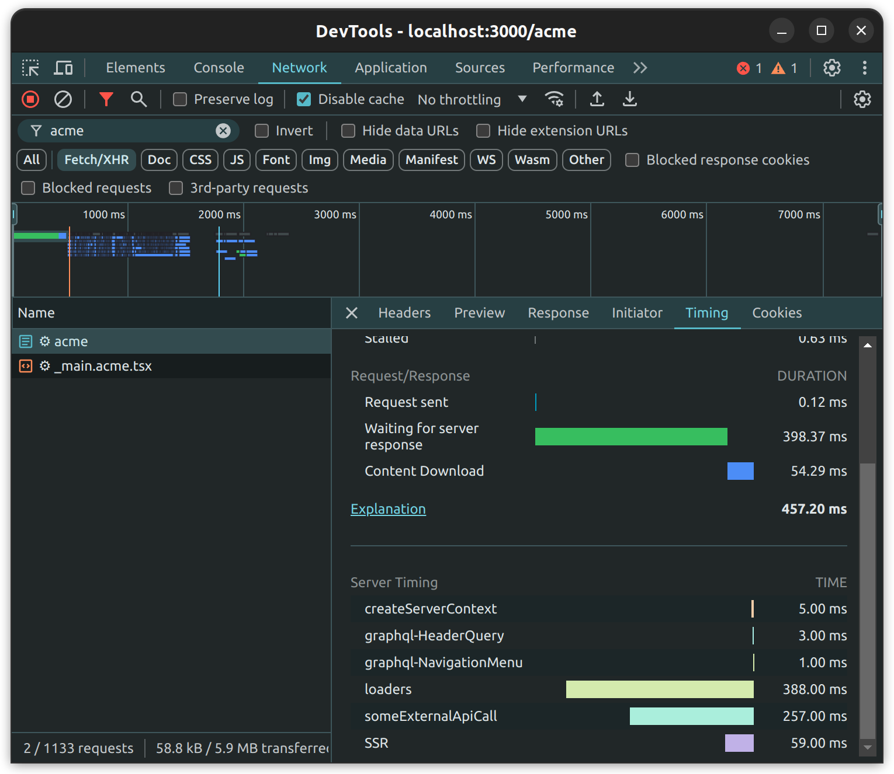
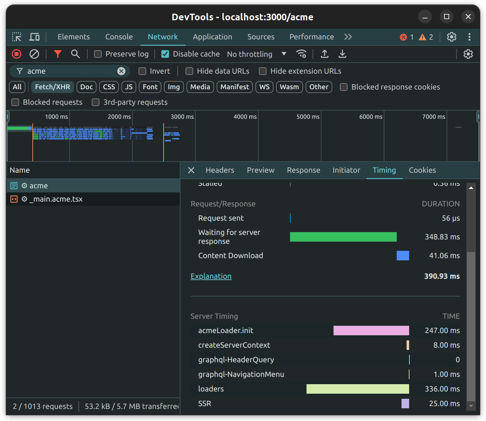

<SinceVersion tag="3.6" />

The `Server-Timing` header communicates one or more metrics and descriptions for
a given request-response cycle. In Front-Commerce, this header is handled by the
`Server-Timing` service.

In this guide, we will show you how to use this to surface backend server timing
metrics in order to diagnose potential performance issues.

:::info

This feature is enabled by default when the application is not in production
mode (i.e. `FRONT_COMMERCE_ENV !== "production"`). If needed, you can also
enable this feature in production by setting
`FRONT_COMMERCE_FORCE_ENABLE_SERVER_TIMINGS` environment variable to `true`.

:::

## Server timings in routes

In this example, we'll consider a route "`_main.acme.tsx`" that uses the
`Server-Timing` service to measure the time an external call takes to resolve.

```tsx title="_main.acme.tsx"
import AcmeComponent from "theme/components/AcmeComponent";
import { someExternalApiCall } from "theme/components/AcmeComponent/someExternalApiCall";
import { useLoaderData } from "@front-commerce/remix/react";
import { FrontCommerceApp } from "@front-commerce/remix";
import { LoaderFunction } from "@remix-run/node";

export const loader: LoaderFunction = async ({ context }) => {
  const app = new FrontCommerceApp(context.frontCommerce);

  // highlight-next-line
  app.services.ServerTimings.start("someExternalApiCall");
  const result = await someExternalApiCall();
  // highlight-next-line
  app.services.ServerTimings.end("someExternalApiCall");

  return { acmeResult: result };
};

export default function Acme() {
  const { acmeResult } = useLoaderData<typeof loader>();

  return <AcmeComponent />;
}
```

By doing this, the timing metrics will automatically be added to the response's
headers. Typically, those headers can be easily visually seen in the browser's
developer tools, under the "network" section, for each request:



## Server timings in GraphQL modules

Similarily to the route way, `ServerTimings` services can also be used from
GraphQL modules. As an example, we'll add a server timing in an "Acme" GraphQL
module's runtime, but note that it can be used the same way wherever the
Front-Commerce services are available.

In this example, we'll consider that the `AcmeLoader` has an async
initialization method that will make a call to an external API, and we want to
know how long this initialization process takes:

```ts title="extensions/acme/modules/acme/runtime.ts"
import { createGraphQLRuntime } from "@front-commerce/core/graphql";
import AcmeLoader from "./loaders";

export default createGraphQLRuntime({
  resolvers,
  contextEnhancer: ({ services }) => {
    const acmeLoader = new AcmeLoader();

    // highlight-start
    services.ServerTimings.start("acmeLoader.init");
    acmeLoader.init();
    services.ServerTimings.end("acmeLoader.init");
    // highlight-end

    return {
      AcmeLoader: acmeLoader,
    };
  },
});
```

Similarily to the route way, it can also be visualized in the browser's
developer console:


