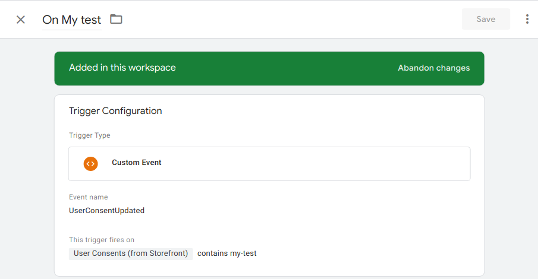

<p>{frontMatter.description}</p>

## Prerequisites

Before configuring Google Tag Manager in Front-Commerce, ensure that you have:

- A GTM container ID.

## Resources

- [GTM Documentation](https://developers.google.com/tag-manager)
- [Plugin Documentation](https://getanalytics.io/plugins/google-tag-manager/)

## Installation

```shell
pnpm add @analytics/google-tag-manager
```

## Configuration

```ts title="app/config/analytics.ts"
import { type AnalyticsConfig } from "@front-commerce/core/react";

export default {
  analytics: {
    enable: true,
    debug: process.env.NODE_ENV !== "production",
    plugins: [
      // highlight-start
      {
        name: "google-tag-manager",
        needConsent: true,
        settings: (authorization, otherAuthorizations) => {
          // This ensure an event is pushed with current authorizations
          // right after the plugin's initialization.
          window.dataLayer = window.dataLayer || [];
          window.dataLayer.push({
            event: "initConsents",
            userConsents: otherAuthorizations,
          });
          return {
            containerId: "GTM-XXXXXX",
          };
        },
        script: () => import("@analytics/google-tag-manager"),
      },
      // highlight-end
    ],
  } satisfies AnalyticsConfig,
};
```

## Setup CSP

You will need to update your <abbr title="Content Security Policy">CSP</abbr> to
allow your Front-Commerce application to communicate with the GTM servers.

```ts title="app/config/cspProvider.ts"
const appCSPProvider = () => {
  return {
    name: "cspConfiguration",
    values: {
      contentSecurityPolicy: {
        __dangerouslyDisable: false,
        directives: {
          // add-next-line
          scriptSrc: ["www.googletagmanager.com"],
          ...[],
        },
      },
    },
  };
};
export default appCSPProvider;
```

## User Consent

In GTM, you will then be able to leverage several specific things configured in
your plugins.

First, pushing the `initConsents` event will push the current customer's
authorization to your dataLayer as `userConsents` value. You can reference it
from a Variable in GTM. Here is an example:

<Figure>


</Figure>

Then, you can leverage the `UserConsentUpdated` event tracked whenever users
update their consent preferences. You could create triggers to enable scripts to
load / remove (depending on the `userConsents` value). Here is an example:

<Figure>



</Figure>

Please note that to retrieve the authorized cookies services in GTM's datalayer,
services must be
[declared in your `analytics.js`](../getting-started#retrieve-authorized-cookie-services-in-analytics).
