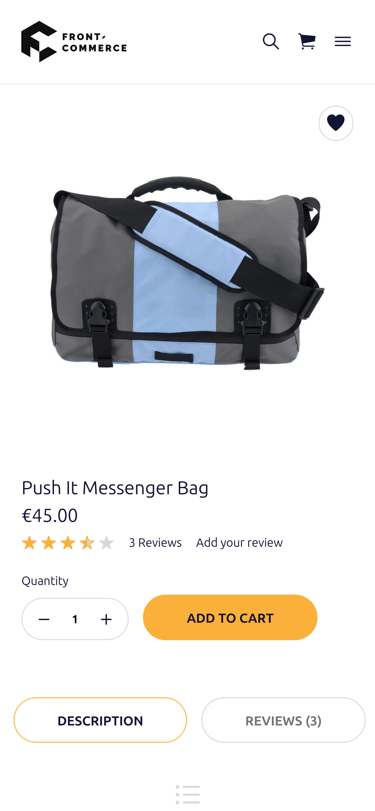

<p>{frontMatter.description}</p>

import Figure from "@site/src/components/Figure";

It is not something that you can do in just a few minutes because your identity
shines in the details. However, you can do all the heavy lifting pretty quickly
by customizing what is called **Design Tokens**.

And it's a great way to familiarize yourself with Front-Commerce!

## Get your Design Tokens

This concept is often closely related to Design Systems. Basically Design Tokens
are the _core styles_ of your design: colors, font families, font sizes,
borders, shadows, etc. Together they are what make your brand unique.

There even exist tools that extract those tokens from existing websites. In this
example, we will use [CSS Stats](https://cssstats.com/) to extract Design Tokens
from [Smashing Magazine](https://www.smashingmagazine.com/) and use them later.

<Figure caption="Here is an example with the awesome Smashing Magazine website">


</Figure>

:::info

If you want to learn more about it, you can have a look at
[Design tokens for dummies](https://specifyapp.com/blog/introduction-to-design-tokens)
which is a very nice introduction.

:::

## Apply these tokens to your theme

Now that we've got our Design Tokens, let's apply them to Front-Commerce's
chocolatine theme.

Since we use the Atomic Design principles, the tokens are within atoms of our
theme. From your application, you will find components in the theme directory
and atoms under its `theme/components/atoms` subdirectory.

:::tip

For example, files for
[theme-chocolatine](/docs/remixed/extensions/theme-chocolatine/), will be in
[`@front-commerce/theme-chocolatine/theme`](https://gitlab.blackswift.cloud/front-commerce/front-commerce/-/tree/main/packages/theme-chocolatine/theme)

The theme-chocolatine will be used as an example for this guide

:::

In this guide, we'll focus on the colors and the typography settings. But feel
free to go further and edit buttons, form inputs, etc.

### Colors

In order to style our HTML, we use [Sass](https://sass-lang.com/), the
well-known CSS preprocessor. Thus, the design tokens often translate to Sass
variables.

For instance, if we want to edit the colors of our application, we need to
override the one defined in the core. To do so:

1.  override the `_colors.scss` theme file in your theme:

    ```shell
    mkdir -p app/theme/components/atoms/Colors/
    cp node_modules/@front-commerce/theme-chocolatine/theme/components/atoms/Colors/_colors.scss \
      app/theme/components/atoms/Colors/_colors.scss
    ```

2.  edit the colors as needed

In Smashing Magazine's case it would be:

```diff title="theme/components/atoms/Colors/_colors.scss"
-$brandPrimary: #fbb03b;
-$brandSecondary: #818199;
+$brandPrimary: #d33a2c;
+$brandSecondary: #2da2c5;

-$fontColor: #131433;
+$fontColor: #333;
```

### Typography

We could change the fonts to match Smashing Magazine's in a similar way. Fonts
are defined in `theme/components/atoms/Typography/_typography.scss`. The
difference here is that we will also introduce a different font for headings and
that we will have to allow the remote font domain in the

<abbr title="Content Security Policy">CSP</abbr> headers.

Follow the same steps than for colors:

1. override the `_typography.scss` and `Heading.scss` theme files in your theme:

   ```shell
   mkdir -p app/theme/components/atoms/Typography/Heading
   cp node_modules/@front-commerce/theme-chocolatine/theme/components/atoms/Typography/_typography.scss \
     app/theme/components/atoms/Typography/_typography.scss
   cp node_modules/@front-commerce/theme-chocolatine/theme/components/atoms/Typography/Heading/_Heading.scss \
     app/theme/components/atoms/Typography/Heading/_Heading.scss
   ```

2. restart the application so the override is detected
3. edit the fonts as needed

   ```diff title="app/theme/components/atoms/Typography/_typography.scss"
   -  $fontFamily: "Poppins", -apple-system, BlinkMacSystemFont, "Segoe UI", Roboto,
   -    Oxygen, Ubuntu, Cantarell, "Fira Sans", "Droid Sans", "Helvetica Neue",
   -    sans-serif;
   +  @font-face {
   +    font-family: "Elena";
   +    font-display: swap;
   +    src: url("https://d33wubrfki0l68.cloudfront.net/a978f759fa0230c1e590d1bdb5a1c03ceb538cec/fed6b/fonts/elenawebregular/elenawebregular.woff2")
   +      format("woff2");
   +  }
   +
   +  @font-face {
   +    font-family: "Mija";
   +    font-display: swap;
   +    src: url("https://d33wubrfki0l68.cloudfront.net/b324ee03d5048d2d1831100e323b0b6336ffce68/0445e/fonts/mijaregular/mija_regular-webfont.woff2")
   +      format("woff2");
   +  }
   +
   +  $fontFamily: Elena, Georgia, serif;
   +  $titleFontFamily: Mija, Arial, sans-serif;
   ```

   ```diff title="app/theme/components/atoms/Typography/Heading/Heading.scss"
   h1,
   .h1 {
     font-size: 2rem;
   + font-family: $titleFontFamily;
     font-weight: normal;
     margin-top: 0.67em;
     margin-bottom: 0.67em;
     line-height: 1.5;
   }
   ```

4. allow `d33wubrfki0l68.cloudfront.net` (the domain we have included fonts
   from) in your <abbr title="Content Security Policy">CSP</abbr> `font-src`
   header value configured in `app/config/website.js`

   ```diff title="app/config/website.js"
          imgSrc: [],
   -      fontSrc: [],
   +      fontSrc: ["d33wubrfki0l68.cloudfront.net"],
          connectSrc: [],
   ```

### Icons

To introduce new icons or
[override existing](https://gitlab.blackswift.cloud/front-commerce/front-commerce/-/blob/main/packages/theme-chocolatine/theme/components/atoms/Icon/icons/app-icons.js)
icons you can add an `app-icons` file including your icons, for example:

```js title="theme/components/atoms/Icon/icons/app-icons.js"
import { FcHome, FcPhone } from "react-icons/fc";
/** @type {Record<string, import("react-icons").IconType>} */
const componentIcons = {
  home: FcHome // this will override the `IoIosHome` icon from the core implementation
  phone: FcPhone // this will add a new icon
};
/** @type {string[]} */
const svgIcons = [];
export default {
  componentIcons,
  svgIcons,
};
```

## A new look

Front-Commerce would then now look like this:

<div style={{
  display: "flex"
}}>
  <Figure caption="Before">



  </Figure>

  <Figure caption="After">


  </Figure>
</div>

Sure it still needs tweaking, but as you can see, it is already far better.
Furthermore, it is an easy first step to start convincing your team and clients
that using modern front-end technologies is for the best.

You can experiment further by changing other tokens such as spacing, form
inputs, buttons…

## Expand your brand theme

Please note that all we've been talking about until now was to adapt the
existing to your convenience. However, that is not the only benefit of having a
Design System already in place. It is actually a perfect canvas to help you
creating new components and styles matching to your brand.

See the [override component guide](/docs/remixed/guides/override-a-component) to
learn more about this.
