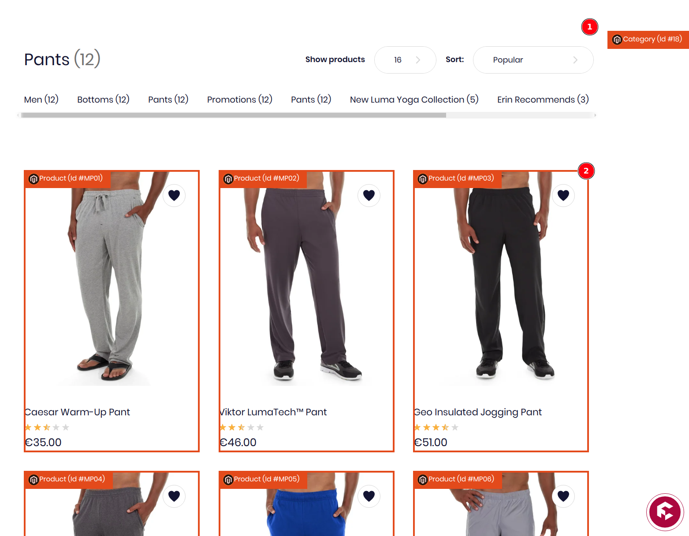

import BrowserWindow from "@site/src/components/BrowserWindow";
import SinceVersion from "@site/src/components/SinceVersion";
import ContactLink from "@site/src/components/ContactLink";

<SinceVersion tag="2.25" />

The **X-Ray** feature enhances your stores functionality by providing an edit
button alongside each content. Content creators can directly access the source
for editing, thereby improving content management efficiency.

## How to activate X-Ray

To activate the **X-Ray** feature, click on the Magic Button and select the
X-Ray option.

<div style={{ width: 600, maxWidth: "100%" }}>
  <BrowserWindow noPadding>
    
  </BrowserWindow>
</div>

When enabled, content composing the page are outlined with a user interface
allowing the contributor to know the source of it and providing a quick access
to the corresponding administration interface.

## X-Ray on custom types

By default, the X-Ray feature is available for the main GraphQL types provided
by Front-Commerce (Product, Categories, …). It is also possible to implement
X-Ray for custom types and/or for existing types that are extended with data
coming from another source.

### Add the `@storefrontContent` directive in the schema referencing a metadata extractor

First, when defining a custom type, you have to use the `@storefrontContent`
directive to instruct the X-Ray feature that an object of that custom type comes
from an external service and can be edited. The directive will dynamically add
an internal resolver to track usage of any field of the type. Your `schema.gql`
would look like:

```graphql title="src/my-module/schema.gql"
type MyCustomType @storefrontContent(extractorIdentifier: "identifier") {
  ID id!
  String name!
}
```

The `extractorIdentifier` identifies a _content metadata extractor_ that must be
registered in the application. This is typically done in the `contextEnhancer`
of
[the GraphQL module](/docs/2.x/essentials/extend-the-graphql-schema#create-a-new-graphql-module):

```javascript title="./my-extension/extractors/custom-type-extractor.js"
import {
  ContentMetadata,
  ContentMetadataExtractor,
} from "@front-commerce/core/graphql/contribution-mode";

export default class MyCustomTypeExtractor extends ContentMetadataExtractor {
  getIdentifier() {
    return "identifier"; // the same value as in schema.gql
  }

  async extract(resolvedData, source, args, context) {
    return new ContentMetadata(
      source.id,
      "MyCustomType",
      // it can be any string identifying a source, we use `magento` or
      // `contentful` for instance. It is used to customize the color and the icon
      // of the X-Ray user interface.
      "aCustomSource",
      `https://a-remote-service.example.com/edit/${source.id}`
    );
  }
}
```

### Register the extractor in the `ContentMetadataExtractorRegistry`

To integrate your custom extractor into the system, you must register it with
the `ContentMetadataExtractorRegistry` service. This process involves using
[lifeCycle hooks](http://localhost:3000/docs/remixed/api-reference/front-commerce-core/defineExtension#unstable_lifecyclehooks)
available in Front-Commerce
[extension definition](/docs/remixed/guides/register-an-extension).

```javascript title="./my-extension/index.ts"
// Import your custom extractor
import MyCustomTypeExtractor from "./extractors/custom-type-extractor";

export default defineExtension({
  name: "my-extension",
  // Additional extension configuration can go here

  // Setup lifecycle hooks
  unstable_lifecycleHooks: {
    // Hook for server initialization
    onServerServicesInit: async (services, request, config) => {
      // Example of configuring your extractor with dynamic parameters from configProviders
      const adminUrl = `${config.someConfig.endpoint}/${config.someConfig.adminPath}`;

      // Register your custom extractors
      // highlight-start
      services.ContentMetadataExtractorRegistry.register([
        new MyCustomTypeExtractor(adminUrl),
      ]);
      // highlight-end
    },
  },
});
```

### Add `<StorefrontContent />` in your React components

After that, you can enrich React components responsible for displaying a
`MyCustomType` object by using `<StorefrontContent />`, that way when X-Ray is
enabled, the user interface can be enriched:

```jsx title="src/web/theme/modules/MyCustomType/MyCustomType.js"
import React from "react";
import StorefrontContent from "theme/modules/StorefrontContent";

const MyCustomType = ({ aMyCustomType }) => {
  return (
    <StorefrontContent type="MyCustomType" id={aMyCustomType.id}>
      <h1>{aMyCustomType.name}</h1>
    </StorefrontContent>
  );
};
```

By default, the X-Ray view will be scoped as **block**. You can make it global
to the whole page by defining the `scope="page"` prop.

```js
<StorefrontContent type="MyCustomPage" id={aMyCustomPage.slug} scope="page">
```

The screenshot below illustrates a page scope for the category (1) and block
scopes for product items (2):
[](./assets/x-ray-blocks-types.png)

### Style a custom source

If your content comes from a specific source, you can configure a dedicated
color and icon for that source. For that, you can can override `app-sources`:

```js title="theme/modules/StorefrontContent/app-sources.js"
const anSvgIcon = /* … */

const customStyle = {
  name: "aCustomSource",
  color: "rgb(147, 74, 97)",
  icon: anSvgIcon,
}

export default [customStyle];
```
