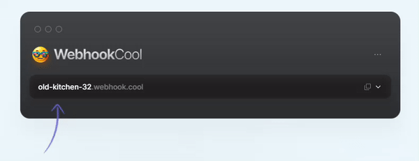

import BrowserWindow from "@site/src/components/BrowserWindow";

<p>{frontMatter.description}</p>

We will create a new integration to dispatch events to [Webhook.cool](https://webhook.cool/).

## Create an integration file

First you need to create a file for the integration. For this example, we will name our integration `Coolwebhook` and will create a new file in `app/server-events/integrations/CoolWebhookIntegration.ts`.

Integrations classes must implement the `Integration` interface from `@front-commerce/core/server-events/integrations`. Copy this code in the newly created file:

```ts title="app/server-evets/integrations/CoolWebhookIntegration.ts"
import type { Integration } from "@front-commerce/core/server-events/integrations";

export default class CoolWehbookIntegration implements Integration {
  compatibleEvents: string[] | "*" = "*";

  webhookId: string; // this is the id of the unique WebhookCool url to use (e.g: `old-kitchen-32` for https://webhook.cool/at/old-kitchen-32)

  constructor(webhookId: string) {
    this.webhookId = webhookId;
  }

  handle(messageId: string, payload: any) {
    console.log(messageId);
    console.log(payload)
  }
}
```

In this class, we have two entities :
- `compatibleEvents`: this indicates which events the integration will handle, it can be `*` to handle all events or an array of string that contains [compatible events](/docs/3.x/guides/server-side-events/faq#what-event-is-implemented-in-front-commerce).
- `handle`: this is the method that will be called when an event is received.

For your integrations, only `compatibleEvents` and `handle` are required, the `webhookId` and the constructor is an example of custom method and properties that you can implement into your integrations.

## Write specific code for your integration

Now we need to implement to logic which sends the event to external service

Since Webhook.cool is a minimalist services, we can use a single `fetch` call to send the event :

```ts title="app/server-evets/integrations/CoolWebhookIntegration.ts"
import type { Integration } from "@front-commerce/core/server-events/integrations";

export default class CoolWehbookIntegration implements Integration {
  compatibleEvents: string[] | "*" = "*";

  webhookId: string;

  constructor(webhookId: string) {
    this.webhookId = webhookId;
  }

  handle(messageId: string, payload: any) {
    // highlight-start
    fetch(`https://${this.webhookId}.webhook.cool`, {
      method: "POST",
      body: JSON.stringify(payload),
    });
    // highlight-end
  }
}
```

:::info

Here, we are posting the raw event details to the webhook, but feel free to manipulate it's data freely to adapt it to your specific integration.

You can find the data format for the payload object in the [FAQ](/docs/3.x/guides/server-side-events/faq#what-are-the-data-returned-by-the-server-events) section.

:::

## Register your integration

Now that our integration is created, we have to register it in Front-Commerce.

To do this in a newly created app, you can register your new integration in the `app/config/serverEvents.ts` configuration file:

```ts title="app/config/serverEvents.ts"
import { ConsoleIntegration } from "@front-commerce/core/server-events/integrations";
// highlight-next-line
import CoolWehbookIntegration from "../server-events/integrations/CoolWehbookIntegration";

export default {
  redis: {
    host:
      process.env.FRONT_COMMERCE_SERVER_EVENT_REDIS_HOST ||
      process.env.FRONT_COMMERCE_CLOUD_REDIS_HOST ||
      process.env.FRONT_COMMERCE_REDIS_HOST ||
      "127.0.0.1",
    port:
      process.env.FRONT_COMMERCE_SERVER_EVENT_REDIS_PORT ||
      process.env.FRONT_COMMERCE_CLOUD_REDIS_PORT ||
      process.env.FRONT_COMMERCE_REDIS_PORT ||
      6379,
  },
  integrations: [
    new ConsoleIntegration(),
    // highlight-next-line
    new CoolWehbookIntegration("old-kitchen-32"),
  ],
};
```

:::info

You need to replace `old-kitchen-32` with your Webhook ID, you can find it on the [Webhook.cool](https://webhook.cool/) page



:::

## Test your integration

We are now ready to test your integration !

Please be sure to read the [run local Server Event Worker guide](/docs/3.x/guides/server-side-events/faq#how-can-i-test-server-events-in-local-environment) before testing your integration.

Then let's try to send an event by going to the server event test page [http://localhost:4000/__front-commerce/test/events](http://localhost:4000/__front-commerce/test/events) and check out the [Webhook.cool](https://webhook.cool/) page.

<div style={{ width: "100%", maxWidth: "100%" }}>
   <BrowserWindow noPadding>
     
   </BrowserWindow>
 </div>

