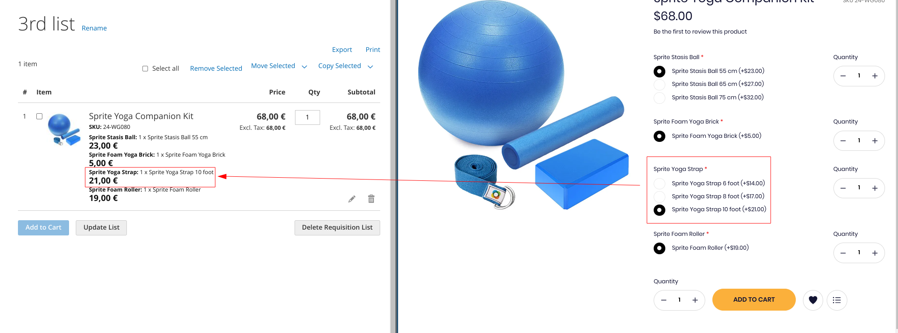
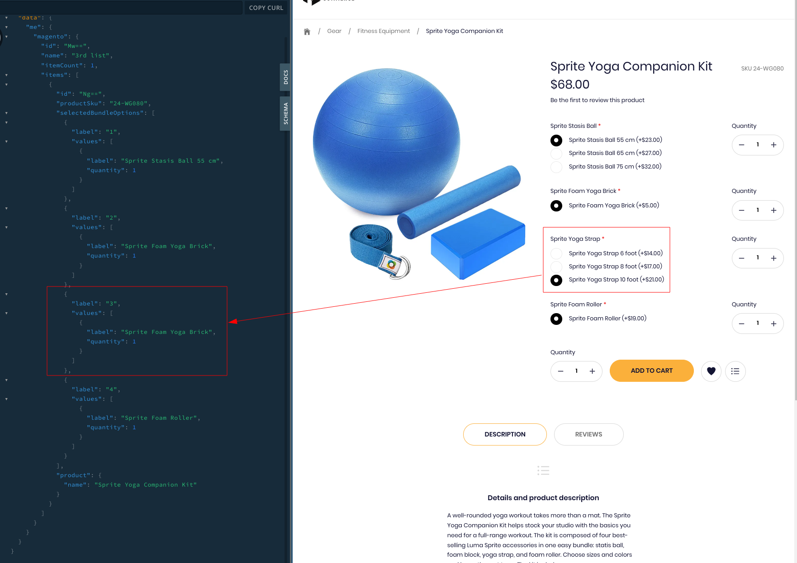
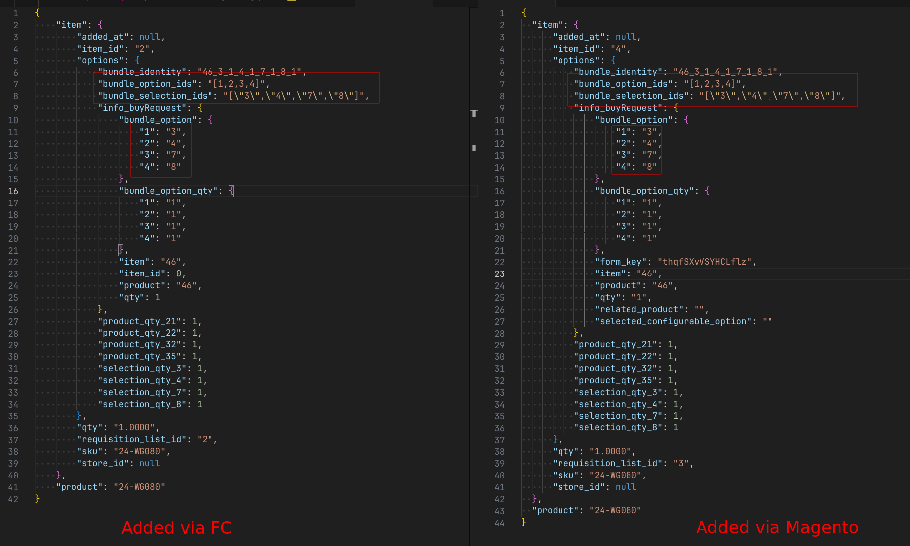
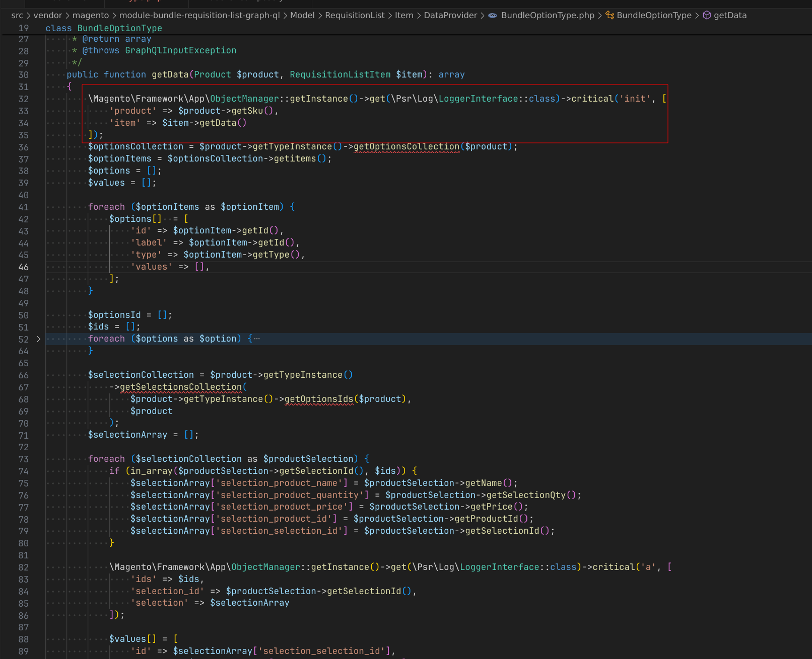

<p>{frontMatter.description}</p>

## Prerequisites

1. On Magento 2 side, you need to
   [install the Front-Commerce Magento2 Commerce module](/docs/2.x/magento2/commerce#magento2-commerce-module-installation).

   You must then install the
   [`front-commerce/magento2-b2b-module-front-commerce`](https://gitlab.blackswift.cloud/front-commerce/magento2-b2b-module-front-commerce)
   module:

   ```shell
   composer config repositories.front-commerce-magento2-b2b git \
       git@gitlab.blackswift.cloud:front-commerce/magento2-b2b-module-front-commerce.git
   composer require front-commerce/magento2-b2b-module

   bin/magento setup:upgrade
   ```

   :::tip

   We recommend to use a specific version of this module and not to blindly rely
   on the latest version.

   :::

2. On Front-Commerce side, you need to setup and install the
   [@front-commerce/magento2 extension](/docs/3.x/extensions/magento2)

## Installation

First ensure you have installed the package:

```bash
$ pnpm add @front-commerce/adobe-b2b@latest
```

## Setup Adobe B2B Extension

Update your `front-commerce.config.ts` to include the Adobe B2B Extension :

```typescript title="front-commerce.config.ts"
import { defineConfig } from "@front-commerce/core/config";
import themeChocolatine from "@front-commerce/theme-chocolatine";
import magento2 from "@front-commerce/magento2";
// add-next-line
import adobeB2B from "@front-commerce/adobe-b2b";
import storesConfig from "./app/config/stores";
import cacheConfig from "./app/config/caching";

export default defineConfig({
  extensions: [
    themeChocolatine(),
    magento2({ storesConfig }),
    // add-next-line
    adobeB2B(),
  ],
  stores: storesConfig,
  cache: cacheConfig,
});
```

## Feature Flags

<details>
<summary>The Adobe B2B extension supports the following feature flags: <strong>Click to expand.</strong></summary>

- `Cart` (default: `true`) - Enable the Cart feature
- `Company` (default: `true`) - Enable the Company feature
- `CompanyStructure` (default: `true`) - Enable the CompanyStructure feature
- `NegotiableQuotes` (default: `true`) - Enable the NegotiableQuotes feature
- `RequisitionList` (default: `true`) - Enable the RequisitionList feature
  - ⚠️ Requires component overrides
- `StoreCredit` (default: `true`) - Enable the StoreCredit feature

</details>

All these features are active by default. To disable a feature you should return
a falsy value for the feature flag in your extension options:

```typescript title="front-commerce.config.ts"
import { defineConfig } from "@front-commerce/core/config";
import themeChocolatine from "@front-commerce/theme-chocolatine";
import magento2 from "@front-commerce/magento2";
import adobeB2B from "@front-commerce/adobe-b2b";
import storesConfig from "./app/config/stores";
import cacheConfig from "./app/config/caching";

export default defineConfig({
  extensions: [
    magento2({ storesConfig }),
    adobeB2B({
      // add-start
      features: {
        Company: false, // Company feature will be disabled
        NegotiableQuotes: false, // NegotiableQuotes feature will be disabled
        RequisitionList: false, // RequisitionList feature will be disabled
        // all other features will be enabled by default
      },
      // add-end
    }),
    themeChocolatine(),
  ],
  stores: storesConfig,
  cache: cacheConfig,
  configuration: {
    providers: [],
  },
});
```

:::tip

If a feature is not defined in the feature flags, it will be enabled by default.

:::

:::caution

The `RequisitionList` feature requires some component overrides as the graphql
documents will no longer be available if this feature is disabled

- [`theme/modules/Cart/CartTitle/CartTitle.jsx`](https://gitlab.blackswift.cloud/front-commerce/front-commerce/-/blob/main/packages/adobe-b2b/theme/modules/Cart/CartTitle/CartTitle.jsx)
  → 📎
  [example override](https://gitlab.blackswift.cloud/front-commerce/front-commerce/-/blob/main/packages/theme-chocolatine/theme/modules/Cart/CartTitle/CartTitle.jsx)
- [`theme/modules/ProductView/ProductItem/ProductItemActions/ProductItemActions.jsx`](https://gitlab.blackswift.cloud/front-commerce/front-commerce/-/blob/main/packages/adobe-b2b/theme/modules/ProductView/ProductItem/ProductItemActions/ProductItemActions.jsx)
  → 📎
  [example override](https://gitlab.blackswift.cloud/front-commerce/front-commerce/-/blob/main/packages/theme-chocolatine/theme/modules/ProductView/ProductItem/ProductItemActions/ProductItemActions.jsx)
- [`theme/modules/ProductView/Synthesis/AddProductToCart.jsx`](https://gitlab.blackswift.cloud/front-commerce/front-commerce/-/blob/main/packages/adobe-b2b/theme/modules/ProductView/Synthesis/AddProductToCart.jsx)
  → 📎
  [example override](https://gitlab.blackswift.cloud/front-commerce/front-commerce/-/blob/main/packages/theme-chocolatine/theme/modules/ProductView/Synthesis/AddProductToCart.jsx)

:::

## Known issues

### Bundle products can't be used in requisition lists

Due to an issue (documented below) with Adobe B2B GraphQL layer, we don't
recommend to use Requistion List with bundle items with the default Adobe B2B
codebase. Please contact your Adobe support team if you plan to use this
feature.

```mdx-code-block
<details>
  <summary className="flex justify-between">Reproduction details and technical insights</summary>
  <div>
```

The issue can be reproduced by not selecting the first value for the first
option of the bundle. It's related to Magento GraphQL layer, because:

- it can be reproduced when reading a requisition list whose item was added from
  the Magento frontend

- when a requisition list is broken, the standard Magento frontend displays the
  correct value

When the first choice is selected for the first option, the requisition list can
be read but has inconsistent data: the "non-first" option having a "non-first"
choice will be resolved as the previous option. E.g: "Sprite Foam Yoga Brick" is
returned instead of "Sprite Yoga Strap 10 foot"):





It seems to be due to some kind of mismatch between and index and its value for
selected options id in the Magento resolver, as the call made natively from
Magento is the same as the one made from Front-Commerce:





```mdx-code-block
  </div>
</details>
```
