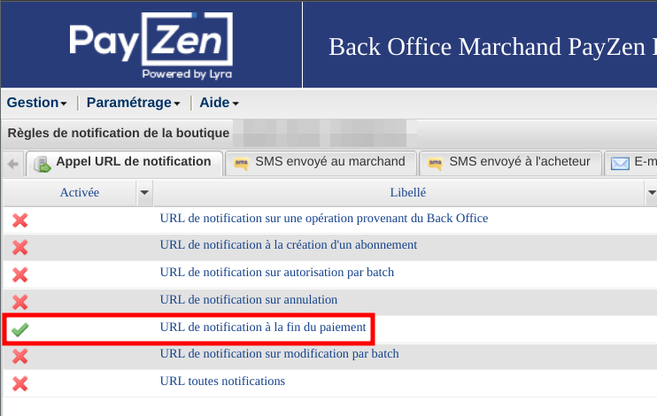

<p>{frontMatter.description}</p>

The implementation use [PayZen embedded form / Javascript with REST API](https://payzen.io/fr-FR/rest/V4.0/javascript/) to create payments.

:::danger

This extension is only compatible with Magento1/OpenMage, we are working on Magento2 compatibility before 3.4.0.

:::

## Installation

First, you need to install the `@front-commerce/payzen` package:

```bash title="Command to install @front-commerce/payzen"
$ pnpm add @front-commerce/payzen
```

## Lyra Collect support

Lyra Collect is a payment solution that shares the same infrastructure and API
with Payzen. In Front-Commerce, it is the exact same module that is used. The
only differences are:

- the `FRONT_COMMERCE_PAYZEN_PRODUCT` environment variable (to be set to
  `lyra_collect`)

## Configure your environment

Get your access keys by following the
[Payzen documentation](https://payzen.io/fr-FR/rest/V4.0/api/get_my_keys.html).
Update your `.env` with the following values:

Follow the [environment variable reference](/docs/3.x/extensions/payzen/reference/environment-variables) to learn how to set them.

```shell title=".env"
FRONT_COMMERCE_PAYZEN_PUBLIC_KEY=58039770:testpublickey_xxxxxxx
FRONT_COMMERCE_PAYZEN_PRIVATE_KEY=58039770:testpassword_yyyyyyy
FRONT_COMMERCE_PAYZEN_SHA256=xxxxxxxxx
#FRONT_COMMERCE_PAYZEN_PRODUCT=payzen # use lyra_collect to switch to Lyra Collect's API URLs
```

You must also configure notifications in Payzen or Lyra "expert mode" to ensure
**only one notification is sent** upon payment, to prevent multiple orders being
created for a single payment:



## Then follow one of this guide to integrate Payzen

- [Use Payzen as a Front-Commerce payment](/docs/3.x/extensions/payzen/how-to/front-commerce)

## Contacting Lyra's support

If you ever have to contact Lyra's support team, here are some recommendations
in order to increase efficiency and ensure your issue could be handled by people
more aware of Front-Commerce.

:::tip Checklist for an efficient support request

- mention the fact that you are using Front-Commerce
- don't mention your backend (i.e: Magento)
- ask that the "support grand comptes" handles your request (Nicolas, Rémi or
  Maxime)

:::
