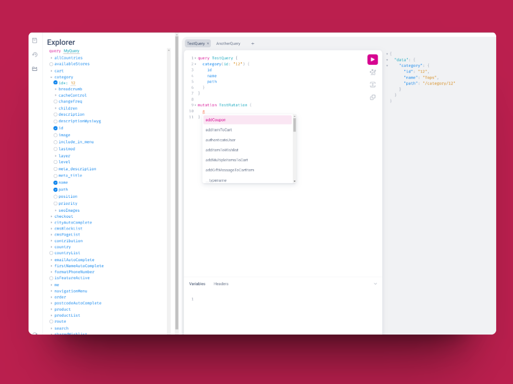

<p>{frontMatter.description}</p>

## The `/graphql` route

By default, Front-Commerce exposes a GraphQL HTTP endpoint on the `/graphql`
URL. This endpoint is available in production and development environments.

It uses [GraphQL Yoga](https://the-guild.dev/graphql/yoga-server) under the
hood, and is configured to use the same unified GraphQL schema as
[the one used across the application (via `app.graphql`)](/docs/3.x/api-reference/front-commerce-remix/front-commerce-app#appgraphql).

You can use this endpoint to query your application's GraphQL API from your
frontend or from any other application.

## GraphQL Playground

In development mode, Front-Commerce exposes a
[GraphiQL](https://github.com/graphql/graphiql) Playground on the
[`/graphql`](http://localhost:4000/graphql) route. This UI allows you to explore
your application's GraphQL API using a Documentation Explorer, and to test
queries and mutations without any additional tool.

<Figure caption="The GraphiQL Playground UI allowing to build queries and execute them when Front-Commerce is in development mode.">

[](./assets/graphiql-screenshot.png)

</Figure>

## Production mode

Several GraphQL DX features are disabled in production mode, in order to improve
performance and security:

- GraphiQL Playground
- GraphQL introspection
- GraphQL fields suggestions

:::info

By production mode, we mean that the `FRONT_COMMERCE_ENV` environment variable
is set to `production`. This is what we recommend for production sites (but not
needed for staging or local environments).

:::

## How-to customize the HTTP GraphQL endpoint

You may want to customize how the GraphQL endpoint is exposed over HTTP. For
example, you may want to expose it for logged in users only, to disable it or to
expose it on a different route. This section explains some of the options
available to you.

### Expose the GraphQL endpoint on a different route

The default `/graphql` route is registered by the `@front-commerce/remix`
package. You can reuse its loader/action in another route to expose the GraphQL
endpoint on a different URL as well.

You will then import the default loader and action from the
`@front-commerce/remix/playground.server` package export. A minimal route
exposing the GraphQL endpoint on the `/my-other-endpoint` would look like this:

```ts title="/app/routes/my-other-endpoint.ts"
export { loader, action } from "@front-commerce/remix/playground.server";
```

To stop exposing the GraphQL endpoint on the default `/graphql` route, you can
follow the next section.

### Override the GraphQL `/graphql` endpoint

One of the most common use case you may have is to customize the default
`/graphql` endpoint for disabling it or for exposing it only for logged in users
for example.

Override the default `/graphql` endpoint by creating a new route with the same
path in your application. You can then import the default loader and action as
illustrated in the previous section.

For example, if you want to expose the GraphQL endpoint only for logged in
users, you can create a new route like this:

```ts title="/app/routes/graphql.ts"
import { FrontCommerceApp } from "@front-commerce/remix";
import {
  loader as defaultLoader,
  action as defaultAction,
} from "@front-commerce/remix/playground.server";
import type { ActionFunction, LoaderFunction } from "@remix-run/node";
import { MagentoUserService } from "@front-commerce/magento2/user";
import type { User } from "@front-commerce/core/graphql";
import { json } from "@front-commerce/remix/node";

const guardAgainstLoggedOutUser = (user: User) => {
  const magentoUser = MagentoUserService.createUser(user);
  if (!magentoUser.isLoggedIn) {
    throw json(
      { errors: [{ message: "Feature not enabled" }] },
      {
        status: 403,
      }
    );
  }
};

export const loader: LoaderFunction = async (args) => {
  const app = new FrontCommerceApp(args.context.frontCommerce);
  guardAgainstLoggedOutUser(app.user);

  return defaultLoader(args);
};

export const action: ActionFunction = async (args) => {
  const app = new FrontCommerceApp(args.context.frontCommerce);
  guardAgainstLoggedOutUser(app.user);

  return defaultAction(args);
};
```

In conclusion, the logic of the default loader and action is reused in your
custom route, and you can any of your own logic before calling them.
