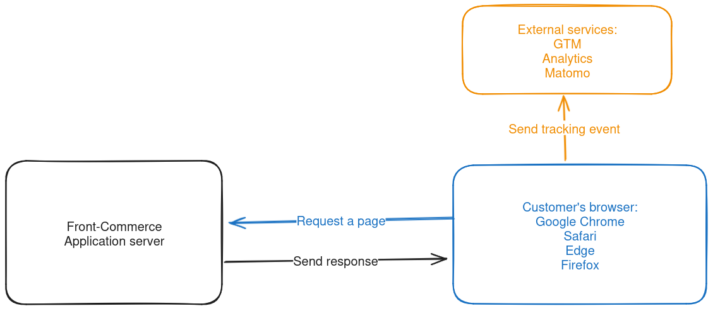
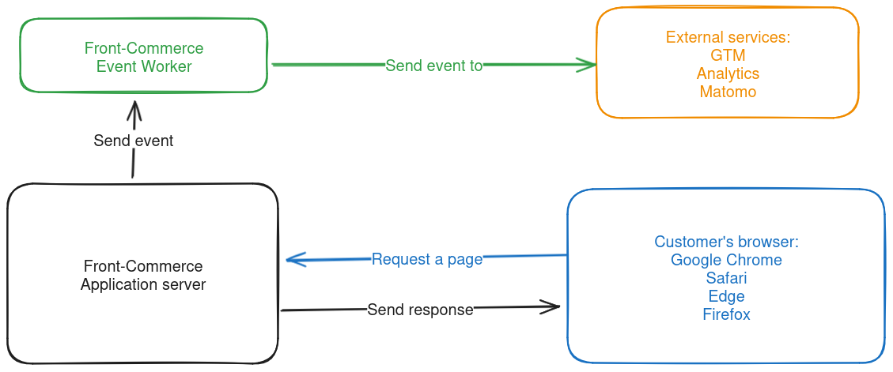

{frontMatter.description}

:::info

Server-side events is a new feature in Front-Commerce V3 and is stil in a beta stage.

:::

## What is an event?

An event is an action that occurred in your application (a customer visiting a page, a user has placed an order, etc.). You may want to track this to get metrics about your store and make statistics.

## Classical client-side events

You may have already integrate solutions like Matomo or GTM that track the customer actions, they rely on external services that can be blocked by user (using cookies denial or script blockers).
Since new RGPD laws have been published, customer are more aware of these tracking techniques and can decide to disable them. But you still want some statistics about your store : what's the most visited category, what's the most popular product, trace of order placed.

Since client-side events may be blocked by customer, we've integrated a new feature in Front-Commerce : Server-side events.

Here's a simple schema showing how it works:

## What's server-side events?

Server-side events are like client-side event, they track user actions, but, they are tracked by the server, so they're execution don't depend on customer browser preferences and are always executed.

Here's a simple schema showing how it works:

## What are the benefits of using server-side events?

- You can use server-side events to track any actions on your store.
- You will track events in a consistent way, not depending on customer preferences.
- You can send events to any external services.

## How does it works?

In Front-Commerce, we have three main components for server-side events :

- Server event worker: it's a sidecar process that will dispatch events to external services.
- Server event emitter: it's a class that will emit events to the server event worker.
- Integrations: it's a connector between Front-Commerce and external services, it's role is to receive events, transform them and send them to external services.

:::caution

Server-side events rely on new Server event worker process in order to dispatch events.

If you're using Front-Commerce Cloud, please contact support in order to get more information on how to enable it in your project.

If you have a self-hosted Front-Commerce, please contact support in order to get more informations about the requirements to make it run.

:::

To learn more please read the guide on how to [create a server event](/docs/3.x/guides/server-side-events/create-an-event) and how to [create an integration](/docs/3.x/guides/server-side-events/create-an-integration) for server events.
