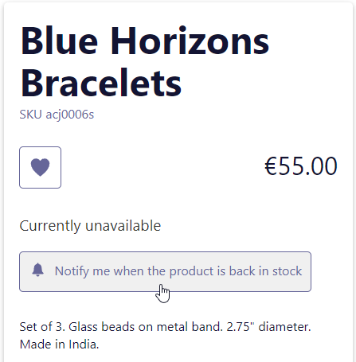

import Figure from "@site/src/components/Figure";
import { Button } from "react-infima";
import Link from "@docusaurus/Link";

> _Since version 2.15_

{frontMatter.description}

Currently supoported for Magento 1 and Magento 2, enabling this feature will add
a button on a product's detail page for every product that is out of stock.

<Figure>

</Figure>

## Enable In-Stock Alerts in your project

To use in-stock alerts in your project, you must first make sure the feature is
enabled in your backend configuration.

### Magento 1

Navigate to `System > Configuration > Catalog > Catalog`. Within the
`Product Alerts` menu, make sure `Allow Alert When Product Comes Back in-Stock`
is set to `Yes`.

### Magento 2

Navigate to `Stores > Configuration > Catalog > Catalog`. Within the
`Product Alerts` menu, make sure `Allow Alert When Product Comes Back in Stock`
is set to `Yes`.

## Customize In-Stock Alert texts

By default, having the configuration enabled for in-stock alerts in your backend
will automatically add the default component (`SubscribeToInStockAlert`) on each
out-of-stock product page.

The placeholders and messages displayed by the `SubscribeToInStockAlert`
component have translation keys prefixed with `modules.SubscribeToInStockAlert`.
You can customize the text from your application translations files.

  <Link to="/docs/advanced/theme/translations">
    <Button size="large" theme="primary" className="py-2">
      Learn about translations in Front-Commerce
    </Button>
  </Link>

