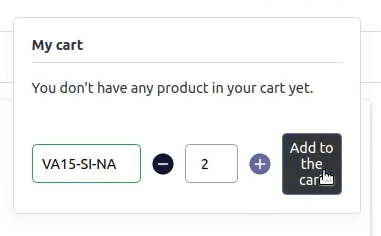

import Figure from "@site/src/components/Figure";
import { Button } from "react-infima";
import Link from "@docusaurus/Link";
import SinceVersion from "@site/src/components/SinceVersion";

<SinceVersion tag="2.11" />

<p>{frontMatter.description}</p>

# QuickOrder Component

The `<QuickOrder />` component adds a user interface allowing your customers to
directly order an item based on its <abbr title="Stock Keeping Unit">SKU</abbr>

<Figure>



</Figure>

## Integrate QuickOrder into your project

You must include the component in your page with the following lines:

```jsx
import React from "react";
// highlight-next-line
import QuickOrder from "theme/modules/QuickOrder";

const MyComponent = () => {
  return (
    <div>
      // highlight-next-line
      <QuickOrder />
    </div>
  );
};
```

You will also need to add the following line to your
`web/theme/modules/_modules.scss` file:

```scss
@import "~theme/modules/QuickOrder/QuickOrder";
```

## Customize the QuickOrder texts

The placeholders and messages displayed by the QuickOrder component have
translation keys prefixed with `modules.QuickOrder`. You can customize the text
from your application translations files.

<div className="text-center pt-4">
  <Link to="/docs/advanced/theme/translations">
    <Button theme="primary" size="large">
      View the QuickOrder component documentation
    </Button>
  </Link>
</div>
