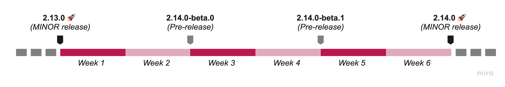

<p>{frontMatter.description}</p>

import ContactLink from "@site/src/components/ContactLink";

Our mission of making your life easier, and your customers happier is an ongoing
process. Front-Commerce will thus regularly evolve. Our main strength is our
flexibility. We do take into account our clients needs and adapt our Roadmap to
match theirs. If you have any particular needs, feel free to <ContactLink /> and
we will see what we can do to help you :)

## Semantic Versioning

We aim at releasing often and follow [Semantic Versioning](https://semver.org)
to clearly communicate our advancements to developers. We document each
migration process (changelog, release notes and documentation updates) and add
deprecation warnings while keeping backwards compatibility to keep upgrades as
seamless as possible.

**TL;DR:** (from the [Semantic Versioning](https://semver.org) documentation)

> Given a version number MAJOR.MINOR.PATCH, increment the:
>
> 1. MAJOR version when you make incompatible API changes,
> 2. MINOR version when you add functionality in a backwards compatible manner,
>    and
> 3. PATCH version when you make backwards compatible bug fixes.
>
> Additional labels for pre-release can (and in our case will) be added to the
> MAJOR.MINOR.PATCH format.

## Release pace

### When to expect a new release?

We release a minor version of Front-Commerce **every 6 weeks** with new features, tech improvements, bug fixes…

In order to follow the pace of our users, we have decided to release 2
intermediate pre-releases between 2 minor releases, to allow early-adopters
to integrate the features as soon as possible and to give us feedback.

Therefore, here is the theoretical rhythm of a cycle (Front-Commerce is
currently in MAJOR version 2):



### Our release calendar


```mdx-code-block
<details open>
  <summary><h3 className="mb-0">2023 releases</h3></summary>
```
- 2.21:
  - 23 december (2022): _2.21.0-beta.0_
  - 6 january: _2.21.0-beta.1_
  - **19 january: 2.21.0**
- 2.22:
  - 3 february: _2.22.0-beta.0_
  - 17 february: _2.22.0-beta.1_
  - **2 march: 2.22.0**
- 2.23:
  - 17 march: _2.23.0-beta.0_
  - 31 march: _2.23.0-beta.1_
  - **13 april: 2.23.0**
- 2.24:
  - 28 april: _2.24.0-beta.0_
  - 12 may: _2.24.0-beta.1_
  - **25 may: 2.24.0**
- 2.25:
  - 9 june: _2.25.0-beta.0_
  - 23 june: _2.25.0-beta.1_
  - **6 july: 2.25.0**
- 2.26:
  - 21 july: _2.26.0-beta.0_
  - 4 august: _2.26.0-beta.1_
  - **17 august: 2.26.0**
- 2.27:
  - 1 september: _2.27.0-beta.0_
  - 15 september: _2.27.0-beta.1_
  - **28 september: 2.27.0**
- 2.28:
  - 13 october: _2.28.0-beta.0_
  - 27 october: _2.28.0-beta.1_
  - **9 november: 2.28.0**
- 2.29:
  - 24 november: _2.29.0-beta.0_
  - 8 december: _2.29.0-beta.1_
  - **21 december: 2.29.0**

*Note: in order to follow Semantic Versioning, we'll very likely switch to a 3.x major version during the year. We'll update the versions accordingly and of course communicate as soon as we'll have more details.*

```mdx-code-block
</details>
```

```mdx-code-block
<details>
  <summary><h3 className="mb-0">2022 releases</h3></summary>
```
- **[2.12.0](/changelog/front-commerce-2.12)**: 6 january
- **[2.13.0](/changelog/front-commerce-2.13)**: 17 february
- **[2.14.0](/changelog/front-commerce-2.14)**: 31 march
- **[2.15.0](/changelog/front-commerce-2.15)**: 12 may
- **[2.16.0](/changelog/front-commerce-2.16)**: 23 june
- **[2.17.0](/changelog/front-commerce-2.17)**: 4 august
- **[2.18.0](/changelog/front-commerce-2.18)**: 15 september
- **[2.19.0](/changelog/front-commerce-2.19)**: 27 october
- **[2.20.0](/changelog/front-commerce-2.20)**: 8 december

```mdx-code-block
</details>
```
