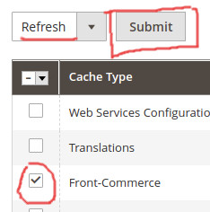

<p>{frontMatter.description}</p>

import Figure from "@site/src/components/Figure";

In this section, you will learn some advanced usages of the Magento 2
integration.

## Caching customers' cart

> _Since version 2.19.0_

By default, the customer cart is systematically fetched from Magento. While this
ensures the freshness of the cart representation, this generates a significant
load on Magento side and slows down some operations in Front-Commerce. In
2.19.0, we have added a cart cache mechanism. For now, this feature is
considered as **experimental** and must be explicitly enabled by defining the
`FRONT_COMMERCE_CART_CACHE_ENABLE` environment variable.

```shell title=.env
FRONT_COMMERCE_CART_CACHE_ENABLE=true
```

:::caution

The cart handling is a critical feature on an eCommerce website, if you enable
the cart cache we strongly advice to fully test your project before going live
with it.

:::

## Additional headers in Magento API calls

> _Since version 2.7.0_

Front-Commerce allows you to send additional headers in all API calls. To do so,
you must define the `magento.api.extraHeaders` (for storefront API) and/or
`magento.api.extraAdminHeaders` (for admin API) configuration values from a
[configuration provider](/docs/advanced/server/configurations#what-is-a-configuration-provider).

These additional headers could be useful if you want to add additional context
to your queries, depending on the request or to detect Front-Commerce requests
from your Magento server.

## Clearing Front-Commerce cache

There are two ways to clear the magento cache:

1. Run the below command from the command line on the magento server:

   ```shell
   bin/magento cache:clean -- front-commerce
   ```

2. From the admin interface go to System > Cache Management then select
   Front-Commerce, make sure that refresh is selected and then click the Submit
   button. (see below screenshot for more details).

<Figure>



</Figure>
