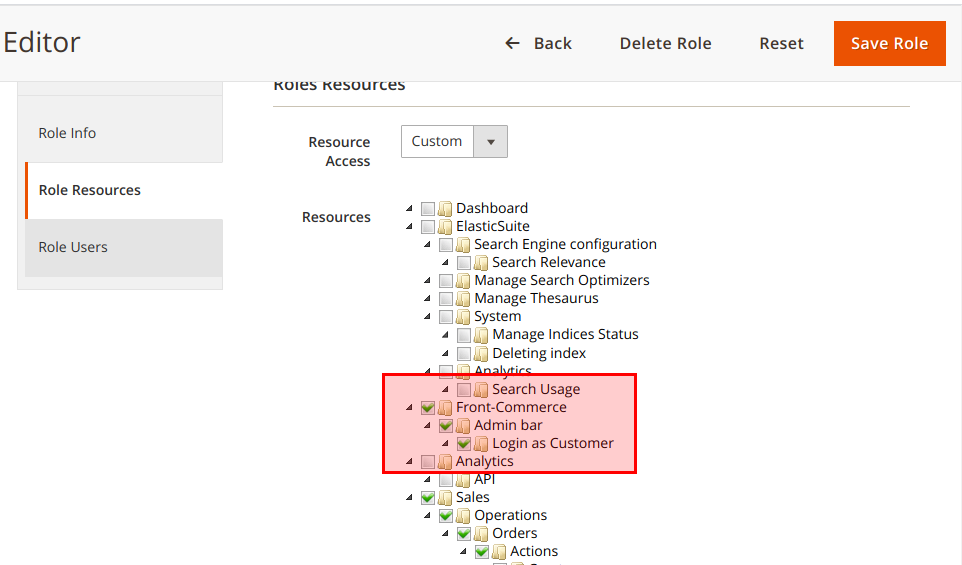
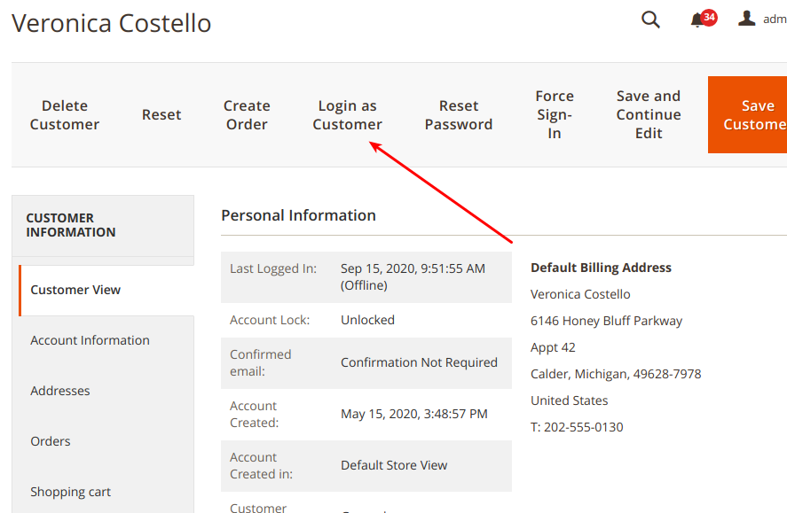

import Figure from "@site/src/components/Figure";
import SinceVersion from "@site/src/components/SinceVersion";

<SinceVersion tag="2.3" />

{frontMatter.description}

This feature is part of
[our Magento Admin detection feature](/docs/magento2/detect-admin-users) to
empower store owners in their day to day activities. You must ensure the Admin
detection feature is correctly configured before enabling this one.

## How does it work?

The "Log as Customer" feature starts from a button from the Magento Customer
page in admin. Clicking on this button will generate an authentication token and
redirects the admin user to the customers default storefront.

Admins can then log out from the customer account and log as another customer if
needed.

## Configuring your environment

**Prerequisites:** the 2.2.x version of the Front-Commerce Magento module is
installed and
[the admin user detection is properly configured](/docs/magento2/detect-admin-users#configuring-your-environment).

Then, you must configure the related ACL for Administrators who must be allowed
to log as Customers:

<Figure>

</Figure>

## Log as Customer

From the Customer page, you must now view a "Login as Customer" button. Click on
it, and if everything is properly configured you might be authenticated on the
storefront as this Customer.

<Figure>

</Figure>
