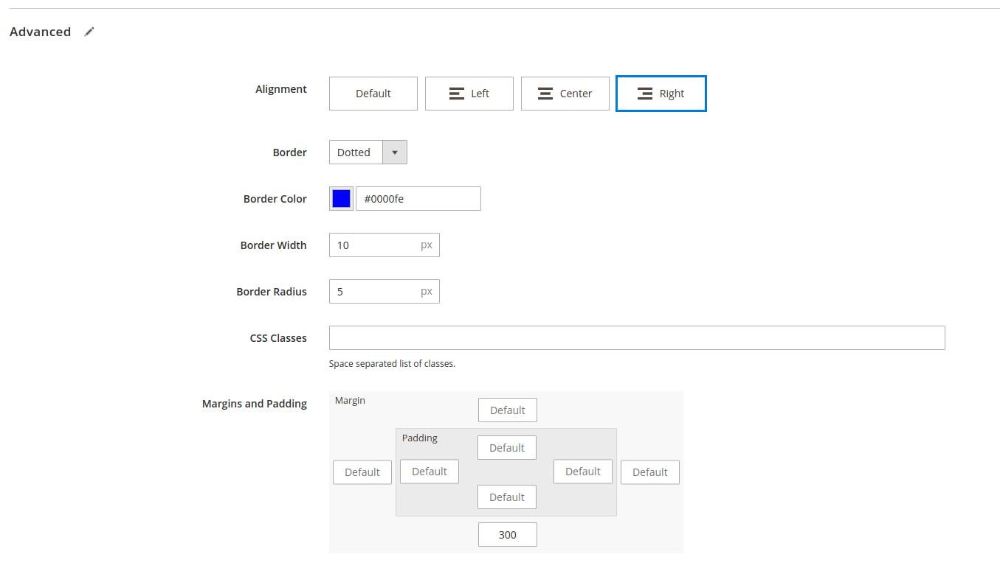

<p>{frontMatter.description}</p>

import Figure from "@site/src/components/Figure";
import ContactLink from "@site/src/components/ContactLink";

> _Since version 2.11.0 (early preview)_

Common tasks as a developer would consist in creating new _content types_ and
refining UI components so that merchants can create the rich shopping
experiences that were designed for _their_ customers.

## Prerequisites

Page Builder is only available for content that:

- are displayed using
  [the `<WysiwygV2>` component and its related `WysiwygFragment` GraphQL fragment](/docs/advanced/theme/wysiwyg#lt-wysiwygv2-gt-usage)
- get data from GraphQL fields resolved using
  [the `MagentoWysiwyg` type](/docs/advanced/theme/wysiwyg-platform#magentowysiwyg)
  **(which is the case of all default Magento rich content fields)**

Please check these prerequisites first if your content does not appear properly.

## Concepts

Page Builder content types have 2 integration points:

- **server side data conversion** will parse Magento HTML response to extract
  rich structured data exposed in GraphQL
- **client side React components** will display the content using existing
  components, from data fetched from GraphQL

## Supported content types

We currently support these content types in a basic way.

:::info

Additional data is exposed via the GraphQL for more more advanced
[Customized UI components](#customize-ui-components) implementations.

:::

### Layout

[Magento Page Builder Layout](https://docs.magento.com/user-guide/cms/page-builder-layout.html)

| Type         | Name      | Description                                 |
| ------------ | --------- | ------------------------------------------- |
| Row          | `row`     | Adds a row container to the stage.          |
| ColumnGroups | `heading` | Adds a column group container to the stage. |
| Column       | `column`  | Adds a column to the stage.                 |

:::caution We only have partial support for the `row` content type.

**Unsupported props:**

<ul className="list-none">
  <li>❌ Mobile Image</li>
  <li>
    ❌ Fluid Width <i>- requires a supported layout</i>
  </li>
  <li>
    ❌ Full Bleed <i>- requires a supported layout</i>
  </li>
  <li>
    ❌ Video Background <i>- data exposed with `video`</i>
  </li>
  <li>
    ❌ Parallax Background <i>- data exposed with `parallax`</i>
  </li>
</ul>

:::

### Elements

[Magento Page Builder Elements](https://docs.magento.com/user-guide/cms/page-builder-elements.html)

| Type       | Name          | Description                                      |
| ---------- | ------------- | ------------------------------------------------ |
| Text       | `text`        | Adds a text container and editor to the stage.   |
| Heading    | `heading`     | Adds a heading container to the stage.           |
| Buttons    | `buttons`     | Adds a set of buttons to the stage.              |
| ButtonItem | `button-item` | Adds a individual button container to the stage. |
| Divider    | `divider`     | Adds a divider container to the stage.           |
| HTML Code  | `html`        | Adds a HTML code container to the stage.         |

### Media

[Magento Page Builder Media](https://docs.magento.com/user-guide/cms/page-builder-media.html)

| Type   | Name     | Description                               |
| ------ | -------- | ----------------------------------------- |
| Image  | `image`  | Adds a image container to the stage.      |
| Slider | `slider` | Adds a slider to the stage.               |
| Slide  | `slide`  | Adds a slide for the slider to the stage. |
| Map    | `map`    | Adds map with locations to the stage.     |

:::caution WIP

Support for internal `product`, `page` and `category` links for `button-item`
and `image`

:::

### Upcoming

- Internal links.
- Native Magento widgets.

Let us know if you have specific needs.

## Styles

Front-Commerce supports custom styles from the _Advanced_ Magento settings of
all content types:

<Figure>



</Figure>

## Extend the Page Builder

You can extend existing Page Builder content types, or register new ones
specific to your projects. To do so, there are 2 extension points: UI and
GraphQL data resolution.

### Customize UI components

:::caution WIP

If you need details right now, please <ContactLink />. We will make sure to
answer you in a timely manner.

:::

- override
  `theme/modules/WysiwygV2/MagentoWysiwyg/PageBuilder/_appComponents.scss` to
  register your custom styles
- override
  `theme/modules/WysiwygV2/MagentoWysiwyg/PageBuilder/appComponentsMap.js` to
  register new components (or override
  [existing ones](https://gitlab.com/front-commerce/front-commerce/blob/main/src/web/theme/modules/WysiwygV2/MagentoWysiwyg/PageBuilder/index.js))

<!-- Override GraphQL fragment too (not yet externalized in a specific fragment FC code) -->

### Expose content types data in GraphQL

:::caution WIP

If you need details right now, please <ContactLink />. We will make sure to
answer you in a timely manner.

:::

The `PageBuilder` loader allows you to register new content types.

First, you must define your content type. Content types must extend the
`ContentType` class (see below). The `name` should match Magento's content type
identifier and the `extractData` method can be used to return structured data to
be exposed as GraphQL fields for this type.

```javascript
import ContentType from "server/modules/magento2/wysiwyg/loaders/content-types/ContentType";

export default class Foo extends ContentType {
  name = "foo";
  extractData(node) {
    return {
      // custom data. Can also be extracted from the passed `node` information
      bar: "baz",
    };
  }
}
```

Then you must register it from a `contextEnhancer`, using the
`PageBuilder.registerContentType` method:

```javascript
PageBuilder.registerContentType(
  new Foo(), // <-- the content type defined above
  "MyPageBuilderFooData" // <-- the GraphQL type for related data default to MagentoPageBuilderDefaultData (if no additional data)
);
```

If your content type exposes additional data with a specific GraphQL type
(`MyPageBuilderFooData` in this current example), you will then have to update
your resolvers. To do so, Front-Commerce provides a generic
`PageBuilderContentTypeResolver` class that will expose data returned by the
content type's `extractData`.

```graphql title="schema.gql"
# Your custom page builder node data must implement
# both MagentoPageBuilderNodeData and WysiwygNodeData GraphQL interfaces
type MyPageBuilderFooData implements MagentoPageBuilderNodeData & WysiwygNodeData {
  dataId: ID
  appearance: String
  bar: String # <- custom structured data
}
```

```javascript title="resolvers.js"
import PageBuilderContentTypeResolver from "server/modules/magento2/wysiwyg/graphql/PageBuilderContentTypeResolver";

export default {
  MyPageBuilderFooData: new PageBuilderContentTypeResolver(),
};
```

<!-- TODO: document advanced usage of custom resolver -->
