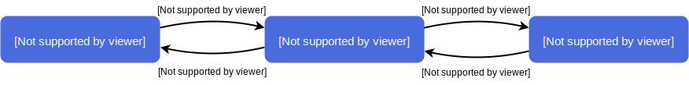
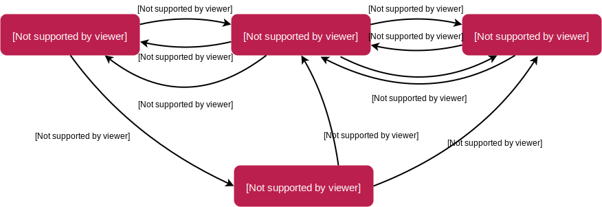
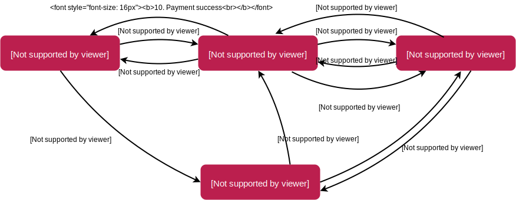

Front-Commerce provides different hooks allowing to use the payment method of your choice. This section explains the high-level payment workflows supported.

A "payment workflow" is a model representing payment scenario from a customer standpoint. This is a core concept to understand for anyone wanting to create a really custom checkout or implement a new payment method. It is important that developers understand them so they could choose a payment method knowingly.

If your goal is to use an existing payment integration, please refer to the integrations listed in the [Payment overview](/docs/advanced/payments/overview.html).

So far, 3 workflows are supported and are explained below:

- Direct Order
- Redirect After Order
- Redirect Before Order

All payment methods available use one of those workflows.

## Direct Order

_Examples:_ check, wire payments, free…

When Customers select the payment method and finish the checkout process, their order is placed immediately without any extra payment step involved and they are redirected on the checkout success page.

It is sometimes possible to display additional input (or external payment forms) during the payment method selection step in Front-Commerce so that Customers can Authorize the payment. When submitting the order, the Direct Order workflow could include additional data (such as account IBAN information for a SEPA payment, an authorization payment token to allow a capture…) that could be stored or used by the eCommerce system or administrators.

Below, a diagram representing successive interactions (with a Magento platform as example):

<figure>

</figure>

## Redirect After Order

_Examples:_ traditional credit cards

When Customers select the payment method and finish the checkout process, their order is placed in a "pending payment" state and they are redirected on the payment provider's website. Upon successful payment, the order is marked as "paid" (usually with a server-to-server <abbr title="Instant Payment Notification">IPN</abbr> asynchronous HTTP call) and Customers are redirected on the checkout success page.

**An Order exists in the commerce platform when the user is redirected to the payment page.**

Below, a diagram representing successive interactions (with a Magento platform as example):

<figure>

</figure>

- Customers submit their payment
- `(1-4)` a GraphQL Mutation triggers the creation of an order in a "pending payment" state in the remote commerce platform
- `(5)` Customers are redirected to the payment provider website to enter their payment information
- `(6)` Customers are redirected back to the eCommerce application while the payment provider sends an <abbr title="Instant Payment Notification">IPN</abbr> to the commerce platform `(6')`
- `(7)` Front-Commerce ensure the payment was successful by checking the IPN state from the commerce platform and then displays the payment success page to Customers `(8)`

## Redirect Before Order

_Examples:_ Paypal Express Checkout

When Customers select the payment method, they can be redirected to the payment platform at any time and authorize a payment matching their Cart total. When they are back on the shop, the order can be placed and the payment captured synchronously. Customers are then redirected on the checkout success page.

**The Order has not yet been created in the commerce platform when the user is redirected to the payment page (for authorization only).** It is created once Customers end the checkout workflow.

Below, a diagram representing successive interactions (with a Magento platform as example):

<figure>

</figure>

- Customers select their payment method
- `(1-5)` a GraphQL Mutation triggers the creation of an payment request token for the current Cart from the remote commerce platform. It usually requires a synchronous HTTP call between the commerce platform and the payment provider `(3)`
- `(6)` Customers are redirected to the payment provider website to enter their payment information and Authorize the amount to be drawn
- `(7)` Customers are redirected back to the eCommerce application with a payment authorization token
- this token can then be used at any moment during the checkout workflow to Capture the payment. It usually is done when placing the Order in the commerce platform `(8)`, which will create a new Order
- `(9)` the Order id is returned to Front-Commerce that can redirect Customers to the payment success page `(10)`
