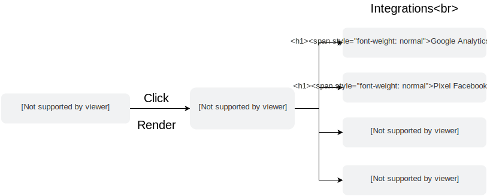

Most e-commerce website need advanced analytics to better understand their users and adapt their shops to their customers needs. But it can often be tedious to maintain when you have many trackings to manage.

In Front-Commerce, we use [`analytics.js`](https://segment.com/docs/sources/website/analytics.js/). It is a library created by [Segment.io](https://segment.com/) that aims at decoupling the tracking settings from the event.

If we represent how it works, it would look like this:

<figure>

</figure>

Across your React application, you can track events using functions such as `trackEvent` or `trackPage`. Then, the event is dispatched to all the relevant integrations registered in your application.

This means that once you have correctly configured events in your React Components, adding new tracking can be really straightforward.

## Track an event

An event is something that happens in your application. For instance, it can happens when a user clicks on a button, opens a dropdown, etc. It usually conveys meaning to your marketing team to better understand what drives your users.

Most of the e-commerce related events are already implemented within Front-Commerce. But each website will have different behaviors, and it can be interesting to add your own events to see how your customers uses your application.

To do so, you will need to call the method `trackEvent` from `web/utils/analytics`.

For instance, let's say that you are building a grocery store and that you have created Recipe pages that display a list of ingredients needed for the current recipe. Below this list, you have created a button that adds all the ingredients to the cart of the user, and you want to know if this button is useful and if users click on it.

The button would likely be a component that would look like this:

```jsx
import React from "react";
import Button from "theme/components/atoms/Button";

const AddIngredientsToCart = ({ addToCart }) => {
  return (
    <Button
      onClick={() => {
        addToCart();
      }}
    >
      Add ingredients
    </Button>
  );
};

export default AddIngredientsToCart;
```

To add your tracking, you would need to call the `trackEvent` method when the user clicks on the Button. Thus, your new component would look like this:

```diff
import React from "react";
import Button from "theme/components/atoms/Button";
+import { trackEvent } from "web/core/analytics";

const AddIngredientsToCart = ({addToCart, ingredients}) => {
  return (
    <Button onClick={() => {
+     trackEvent("Added ingredients to cart", {
+       ingredients: ingredients
+     });
      addToCart();
    }}>
      Add ingredients
    </Button>
  );
}

export default AddIngredientsToCart;
```

This `trackEvent` method is actually a shortcut that lets you call the `analytics.track` method of `analytics.js`. It uses the exact same API. See [the official documentation](https://segment.com/docs/spec/track/) for more detailed information.

Additionally, you may wonder what name and properties you should give to your events. It depends on the integrations you are using and if you want to create a new event or use Semantic ones (supported events within Segment.io). To learn more about this, please refer to the [Semantic Events documentation](https://segment.com/docs/spec/semantic/).

### Track an event as a React Component

If you don't have an actual callback to put the `trackEvent` (like `onClick`), you can use the `withTrackOnMount` enhancer that will let you call the `trackEvent` using [React lifecycle](<(http://projects.wojtekmaj.pl/react-lifecycle-methods-diagram/)>).

For instance, in Front-Commerce's core, we are using `withTrackOnMount` to track when a user sees their cart.

```jsx
import withTrackOnMount from "theme/modules/Analytics/withTrackOnMount";

export default withTrackOnMount({
  event: "Cart Viewed",
  isResolvedFromProps: (props) => !props.loading && props.cart,
  shouldUpdateEvent: (prevProps, nextProps) =>
    prevProps.cart.id !== nextProps.cart.id,
  mapPropsToProperties: (props) => {
    return {
      cart_id: props.cart.id,
      products: props.cart.items.map((item, index) => ({
        sku: item.sku,
        name: item.name,
        quantity: item.qty,
        price: item.priceInfo.price.priceInclTax.value.amount,
        position: index + 1,
      })),
    };
  },
})(Cart);
```

<blockquote class="note">
Please refer to [Analytics React Components](/docs/reference/analytics-components.html#withTrackOnMount) to have a detailed explanation of the API of `withTrackOnMount`.

Note that if you prefer to use render props you can refer to [`TrackOnMount`](docs/reference/analytics-components.html#TrackOnMount).

</blockquote>

### Track page

In tracking scripts, there is often a distinction between the `page` and the `event` even though a `page` event is only a subset of the `event`s.

To make this distinction clear, we provide an enhancer in the same spirit of `withTrackOnMount` but for page events: `withTrackPage`.

`withTrackPage` is an enhancer that lets you track a page each time a component is rendered and when the location has changed.

For instance, in Front-Commerce's core

```jsx
import withTrackPage from "theme/modules/Analytics/withTrackPage";

withTrackPage("Home")(Cart);
```

<blockquote class="note">
Please refer to [Analytics React Components](/docs/reference/analytics-components.html#withTrackPage) to have a detailed explanation of the API of `withTrackPage`.

Note that if you prefer to use render props you can refer to [`TrackPage`](docs/reference/analytics-components.html#TrackPage).

Moreover, we didn't talk about a `trackPage` method here. This is because a `Page` is tightly coupled to a React Component. This is why you shouldn't need to use `trackPage` directly.

</blockquote>

## Add an integration

An integration will listen to each `event` and `page` tracking in your application and will send it to your tracking service. To configure which tracking service your application will use, you need to edit the `config/analytics.js` file:

```js
module.exports = {
  analytics: {
    // Make sure that your analytics is enabled
    enable: true,
    // Enables the debug mode of the `analytics.js` library
    debug: true,
    defaultSettings: {},
    // The list of integrations is defined here
    integrations: [
      {
        // The name allows to know if the user allowed to use
        // this tracking service or not
        name: "google-analytics",
        // Usually we always need to set it to true since GDPR
        needConsent: true,
        // Some integrations may have a privacy mode allowing them
        // to be enabled by default. Use this configuration to always
        // enable it. It is irrelevant if `needConsent` is `false`.
        enabledByDefault: true,

        // Settings can be an object or a function that will be called
        // with the current consent authorization from the visitor (since 2.3).
        // Since 2.6, it also receive a 2nd parameter with codes of the other consents given.
        // Using a function can allow to have different settings depending
        // on the context
        settings: (authorization, otherAuthorizations) => {
          // Settings needed by the integration
          // The fact that it the key "Google Analytics" is
          // defined by the integration itself
          // Note: otherAuthorizations = ['other-code', 'other-code-2']
          return {
            "Google Analytics": {
              trackingId: "UA-123-1",
              anonymizeIp: !authorization,
            },
          };
        },

        // integration that will add itself to the `analytics.js` lib
        script: () =>
          import("@segment/analytics.js-integration-google-analytics"),
      },
      // You can add other integrations here. They are loaded asynchronously and
      // won't impact the user's performance too much (as long as there are not
      // too many).
    ],
  },
};
```

Here we have used the Google Analytics integration. You can find the [list of existing integrations here](https://github.com/segment-integrations).

<blockquote class="warning">
However, please note that some integrations are not up to date. Even if you find one that matches your need, it might not work. However, looking into its code will let you know how to make it work, and you could eventually fork it to fix it.
</blockquote>

### Main integrations

Here is a list of integrations frequently used across e-commerce shops:

#### Google Analytics

- `npm install --save https://github.com/front-commerce/analytics.js-integration-google-analytics`
- Configuration example in `src/config/analytics.js`
  ```js
  {
    name: "google-analytics",
    needConsent: true,
    settings: (authorization) => {
      return {
        "Google Analytics": {
          trackingId: "UA-123-1",
          anonymizeIp: !authorization,
          // enhancedEcommerce: true, // uncomment to enable enhanced ecommerce additional trackings
        },
      };
    },
    script: () =>
      import("@segment/analytics.js-integration-google-analytics"),
  }
  ```

#### Google Tag Manager

- `npm install --save https://github.com/front-commerce/analytics.js-integration-google-tag-manager`
- Configuration example in `src/config/analytics.js`
  ```js
  {
    name: "google-tag-manager",
    needConsent: true,
    settings: (authorization, otherAuthorizations) => {
      return {
        "Google Tag Manager": {
          containerId: "GW-123",
          // the userConsents option is a specific key that the integration will use and expose in the GTM dataLayer
          userConsents: otherAuthorizations
        },
      };
    },
    script: () =>
      import("@segment/analytics.js-integration-google-tag-manager"),
  }
  ```

In GTM, you will then be able to leverage several specific things configured in your integrations _(since Front-Commerce 2.6)_.

First, the `userConsents` configuration option will be pushed to your dataLayer as the `userConsents` value. You can reference it from a Variable in GTM. Here is an example:

<figure>

</figure>

Then, you can leverage the `UserConsentUpdated` event tracked whenever users update their consent preferences. You could create triggers to enable scripts to load / remove (depending on the `userConsents` value). Here is an example:

<figure>

</figure>

### GDPR consent

If your integrations need consent of the user before running, you need to setup the `config/cookieServices.js` file. This file will let you define which cookies and trackings services are used within your application and will let the user chose which tracking service to allow.

```js
export default {
  default_en: [
    {
      // Category of cookies to allow the user to accept all the integrations at once in a specific category
      title: "Analytics",
      description:
        "These cookies allows us to measure the traffic on our contents and hence to improve them.",
      services: [
        {
          // The name should be the same as mentioned in the `config/analytics.js` file
          name: "google-analytics",
          title: "Google Analytics",
          // display all the cookies managed by Google Analytics
          cookies: [
            "_ga",
            "_gat",
            "_gid",
            "__utma",
            "__utmb",
            "__utmc",
            "__utmt",
            "__utmz",
          ],
          description:
            "Google Analytics cookies, from Google, are meant to gather statistics about visits.",
          link: "https://support.google.com/analytics/answer/6004245",
        },
      ],
    },
  ],
};
```

The consent for the cookies is stored in 2 cookies:

1. `hasConsent` cookie which stores if the user provided consent answer (authorized or denied) for all services.
2. `authorizations` cookie which stores a JSON string of all consents given in the following format `{ [service1_name]: true | false, ... }`

These two cookies' expiration SHOULD be configured in `src/config/website.js` (see [website configurations](/docs/reference/configurations#config-website-js) for details on why it is important to configure this). To configure the expiration of the consent cookies you should update `src/config/website.js` as follows:

```diff
module.exports = {
  default_image_url: "https://placehold.it/150x220",
  available_page_sizes: [18, 36],
  ....
  rewrittenToRoot: ["/home"],
  useUserTitles: false,
+  cookieMaxAgeInMonths: 12,
};
```

### How to create a custom integration?

You may need to integrate custom tracking scripts in your own application even if they are not provided in [segment-integrations](https://github.com/segment-integrations). The following example explains how to create your custom integration and register it in your `src/config/analytics.js`.

The example is based on pixel tracking. This is a frequently used technique in marketing & tracking tools. However, if your needs are more complex, feel free to adapt it to your needs.

#### Create a new integration

First, you will need to install the following library:

```sh
npm install --save @segment/analytics.js-integration
```

Then, you will need to create a new file where the integration will be developed. Usually, we put them in a `src/web/analytics` folder in Front-Commerce, and name the file based on the tracking we're trying to implement. Since it's just an example, we'll call it `pixel.js` here.

```js
// src/web/analytics/pixel.js
import integration from "@segment/analytics.js-integration";

const PixelIntegration = integration("Pixel")
  // The option allows to reuse the integration with different
  // parameters. If you don't need to reuse the pixel integration
  // in different context and don't need differences between prod/staging
  // feel free to ignore it. You can add as many options you need.
  .option("trackingId", null)
  .readyOnInitialize();

// If we're trying to load the pixel every time the user opens a new page
// we should implement the PixelIntegration.prototype.page method.
// This method takes a `track` object as parameter, which will give your
// more information about the page you are on (name, URL, etc.).
// If you don't need to track a page, you can ignore the
// PixelIntegration.prototype.page method altogether.
PixelIntegration.prototype.page = function (track) {
  // Construct the url of the pixel you are trying to load in your page.
  // You can use options that were defined with the `option` method above
  const pixelUrl = `http://pixel.example.com/pixel_url?id=${this.options.trackingId}`;

  // Once we have the URL, we can add the `` tag to the DOM, with
  // the correct URL. If you don't have a pixel, but a script or any kind
  // of HTML, you should use it instead of a `img` element.
  const img = document.createElement("img");
  img.setAttribute("src", pixelUrl);
  img.setAttribute("style", "position: absolute; left: -5000px; top: -4000px;");
  document.body.appendChild(img);
};

// If we're trying to load the pixel on an `event` instead, we should implement
// the PixelIntegration.prototype.event method instead. This method takes a
// `track` object as parameter, which allows to get the name of the event and
// its properties. If you are trying to track a specific event, this will be useful.
// If you don't need to track a page, you can ignore the
// PixelIntegration.prototype.page method altogether.
PixelIntegration.prototype.event = function (track) {
  const name = track.name();
  // In this example we're only tracking the event "Order Completed" which
  // is called upon an order success. If you're not sure what event you want
  // to use, enable the `debug` mode in `src/config/analytics.js` and
  // check the event's name in your browser's console.
  if (name === "Order Completed") {
    // Construct the url of the pixel you are trying to load in your page.
    // You can use options that were defined with the `option` method above
    const pixelUrl = `http://pixel.example.com/pixel_order_complete_url?id=${this.options.trackingId}`;

    // Once we have the URL, we can add the `` tag to the DOM, with
    // the correct URL. If you don't have a pixel, but a script or any kind
    // of HTML, you should use it instead of a `img` element.
    const img = document.createElement("img");
    img.setAttribute("src", pixelUrl);
    img.setAttribute(
      "style",
      "position: absolute; left: -5000px; top: -4000px;"
    );
    document.body.appendChild(img);
  }
};

export default PixelIntegration;
```

Please keep in mind that this examples only relies on pixel images to do the tracking. If you want to setup a more complex tracking, you can declare an initialization step in your integration. For instance, let's say that we need to load a script at `https://tracking.example.com/tracking.js` before executing our page or event tracking. Then this means that we need to change our integration implementation like this:

```diff
const PixelIntegration = integration("Pixel")
  // The option allows to reuse the integration with different
  // parameters. If you don't need to reuse the pixel integration
  // in different context and don't need differences between prod/staging
  // feel free to ignore it. You can add as many options you need.
  .option("trackingId", null)
-  .readyOnInitialize();
+  .tag("tagName", '<script src="https://tracking.example.com/tracking.js"></script>');

+PixelIntegration.prototype.initialize = function() {
+  this.load("tagName", this.ready)
+}
```

This means that we're declaring a tag with a name `tagName` that should be loaded during the initialization phase. To do so, we're calling `this.load` with the same `tagName` in `PixelIntegration.prototype.initialize`. And once it's done, we're telling the integration we're done and we can start tracking by calling `this.ready`. You can write an initialization phase as complex as you want. Feel free to dig into `segment-integration`'s repository to see more in depth examples. For instance, [Google Tag Manager's implementation](https://github.com/segment-integrations/analytics.js-integration-google-tag-manager/blob/b6269d800cafeef50461ef012176070ed1f55b96/lib/index.js) can be a good starting point.

#### Register this new integration in your analytics.js

Once you are done with writing your integration, you will need to register this integration in your `src/config/analytics.js`

```diff
module.exports = {
  analytics: {
    // ...
    integrations: [
      // ...
+      {
+        name: "pixel",
+        needConsent: true,
+        settings: (authorization) => {
+          return {
+            // The key `Pixel` here should be the same as the string
+            // you've passed when you called `integration("Pixel")`
+            // in `src/web/analytics/pixel.js`.
+            "Pixel": {
+              // The keys available here are the one available through
+              // the `.option([name], [defaultValue])` method in
+              // `src/web/analytics/pixel.js`. You can have as many as
+              // you want.
+              trackingId: "123",
+            },
+          };
+        },
+        script: () =>
+          // import from the file depending on where you've created it.
+          import("src/web/analytics/pixel.js"),
+      }
    ]
  }
}
```

Just like any other integrations, don't forget to setup the `cookiesServices.js` file accordingly, in order to load the newly created integration only when the user has given their consent.

#### Custom integrations common pain points

In some cases, the documentation for implementing the tracking might not be compatible with <abbr title="Single Page Application">SPA</abbr>'s architectures. This can be the case if they are asking you to add a `script` tag in your head, or at the end of your `body` without any further information.

Indeed, if we're doing this, it's likely to be because the tracking service wants to load the `script` tag each time the person navigates. However, if we do this in an SPA, the `script` will only be loaded once. Here is the list of solutions you can try to implement:

- Look for additional documentation to see if they have a `script` that can be used as a library that gives access to some kind of global variable that can then be called by your implementation. Something that would work like the code shown below. If this is the case, it means that you can call `trackingVariable.track()` in your integration instead of adding a new tag script each time.

  ```html
  <script src="http://tracking.example.com/script.js"></script>
  <script>
    trackingVariable.track();
  </script>
  ```

- Look inside the script itself. The script you've been given may be a shortcut and the solution might live in the script itself. If this is the case, this means that you can try to duplicate the scripts content and adapt it to your integration.
- If none of the solutions above work, you can always try to load the script several times by adding a `?random=${new Date().getTime()}` at the end of the URL. This will trick the browser into thinking they are different scripts and allow you to load it multiple times.

Implementing a great tagging plan for an e-commerce application is a tough journey. If you have any further questions about how to implement them in Front-Commerce, please <span class="intercom-launcher">[contact us](mailto:support@front-commerce.com)</span>. We'll be happy to answer them.
