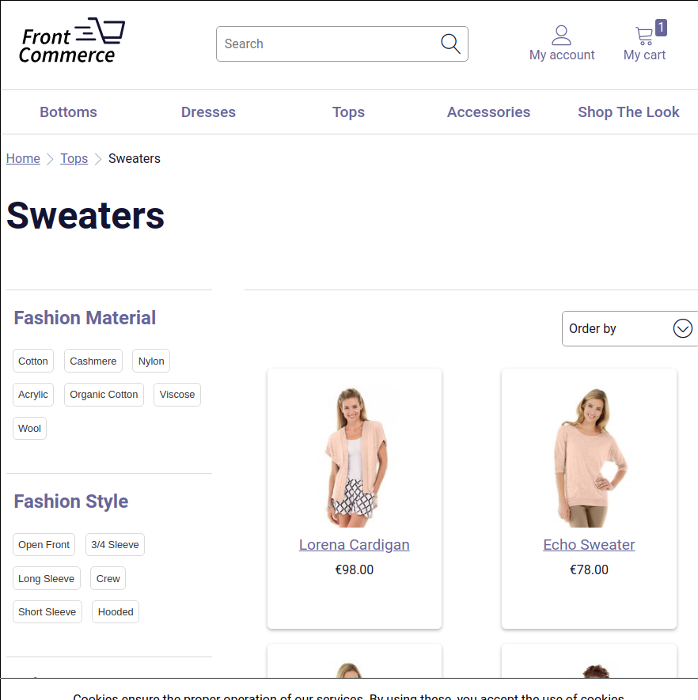
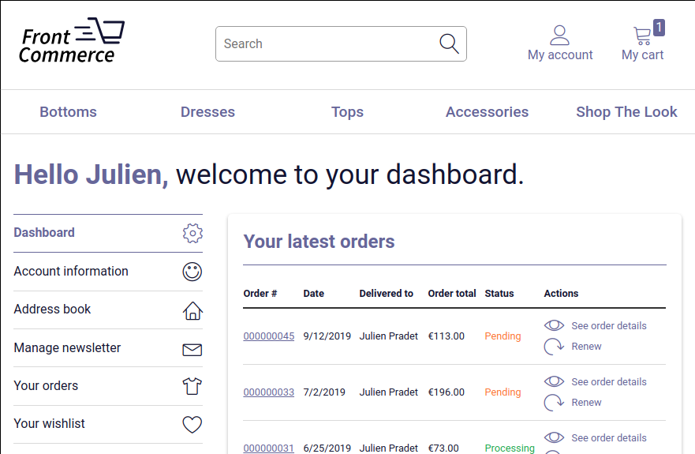

When you are on a website, you expect to see the same kind of information on any page: the logo, the menu, maybe a footer, etc. But in some cases you may needed finer control over which page should display what. How does this translate in Front-Commerce?

By creating `_layout.js` and `_inner-layout.js` files in your `web/theme/routes` folder. This is what we will explain in this guide.

If you don't know what is the purpose of the `web/theme/routes` or how to use it, please first refer to the guide [Add a new page](docs/essentials/add-a-page-client-side.html). Moreover, to complete this guide about layouts, you will need to have a module correctly setup in your project with a [web module preconfigured](http://localhost:4444/docs/essentials/add-a-page-client-side.html#Declare-your-module-as-a-web-module).

## What is a layout?

We call layout anything that wraps a route.

Let's take a Category page.

<figure>

</figure>

The contents that are specific to this Category are the title, the products, the facets, etc. However, the header with the logo and the menu is not specific to the category page. You expect it to see it on the product page too.

Thus, the **layout** is everything that is not specific to the page you are displaying.

However, for more advanced use case, you can have some content that are not specific to the route, but still specific to a part of the application. This is the case for the account pages.

<figure>

</figure>

In this case, the navigation is by definition a layout since it remains across the multiple pages available in the account. However, it is contained in a larger layout: the one displaying the header.

We call this an **Inner layout** because it does not get rid of the layout above it.

## How to implement this in Front-Commerce's routing system?

<abbr title="Too Long; Didn't Read">TL;DR</abbr>

* a Layout should be implemented by creating a component in a `_layout.js` file
* an Inner Layout should be implemented by creating a component in a `_inner-layout.js` file
* Restart on each new file creation in the `web/theme/routes` folder

### Define a new layout for a list of routes

First, a layout will only affect the routes inside a folder, and its sub folders.

For instance, let's say that you are willing to add a Blog to your Front-Commerce application. You could imagine creating the following routes:

```
├── index.js
├── contact.js
├── cart.js
├── ...
├── _layout.js
└── blog
    ├── index.js
    └── [slug].js
```

As is, the urls `/blog` and `/blog/[slug]` you have created will be displayed with the same layout as your cart, contact, or any other page of the application.

However you don't the users to feel like they are still in the shop. You want to have a lighter design for these pages to allow the users to focus on the content. This is why you can create a new `_layout.js` at `/blog/_layout.js`.

```jsx
// web/theme/routes/blog/_layout.js
import React from "react";

const BlogLayout = ({children}) => (
  <div>
    <header>Welcome to our blog!</header>
    <main>
      {children}
    </main>
  </div>
);

export default BlogLayout;
```

The children property here is the content of the route that will be displayed if you navigate to a page within `/blog`.

Other pages will keep the root `_layout.js` and won't be affected by the blog's layout.

To see this live, remember to restart your application before seeing the changes (`npm run start`).

<blockquote class="note">
    **Important:** If you need to to override an existing `_layout.js` you can by recreating theme in your own module. You can also create layouts for a set of routes even if the routes you want to change are in an other module and don't have a layout yet. It will behave just like if you added them in the other module.
</bloquote>

<blockquote class="note">
    **Note:** In Front-Commerce's core, this is already the case for the `/checkout` that uses a leaner layout than the rest of the shop.
</bloquote>

### Define an Inner Layout for a list of route

The concept of creating an Inner Layout is very similar to creating a Layout. The main difference is that instead of creating a `_layout.js` file, you will create a `_inner-layout.js`.

For instance, in the case of the account, we've got an Inner Layout similar to this file:

```jsx
// web/theme/routes/account/_inner-layout.js
import React from "react";
import Link from "theme/components/atoms/Typography/Link";

const AccountLayout = ({children}) => (
  <div>
    <nav>
      <ul>
        <li><Link to="/">Dashboard</Link></li>
        <li><Link to="/orders">Orders</Link></li>
        <li><Link to="/address-book">Address Book</Link></li>
      </ul>
    </nav>
    <div>
      {children}
    </div>
  </div>
);

export default AccountLayout;
```

You can see that it works just like the Blog's layout. However, keep in mind that you don't need to repeat the surrounding layout. For instance, there's no header and logo in my Inner Layout.

To see this live, remember to restart your application before seeing the changes (`npm run start`).

<blockquote class="warning">
    **Warning:** You can't create an `_inner-layout.js` if a `_layout.js` file already exists at the same level. This is the case for the files in *your* modules but also for files in other's modules.
</bloquote>
