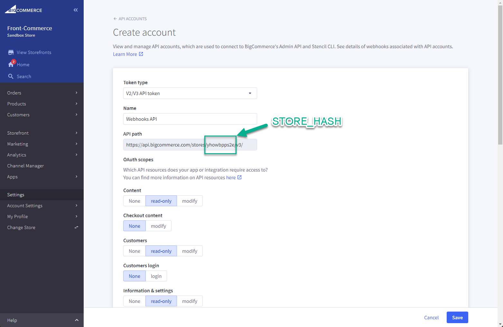
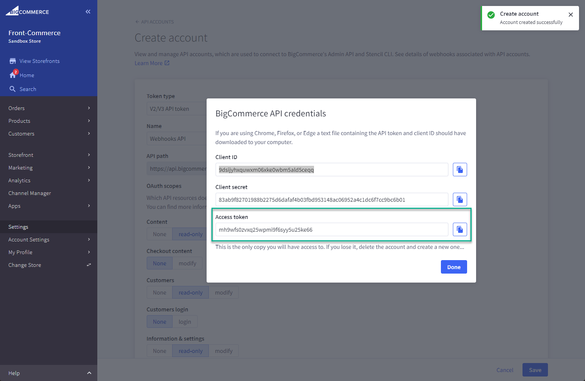

## Setting up Front-Commerce

You need to setup the webhook secret within your Front-Commerce app with the `FRONT_COMMERCE_BIG_COMMERCE_WEBHOOK_SECRET` environment variable.

> **ProTip:** create a random secret by running `openssl rand -hex 25` in your terminal.

Thats all, you should now be ready to recieve webhooks on your application using your webhook secret.

## Setting up BigCommerce

We will now create webhooks for the following scopes:

- `catalog/*`
- `products/*`
- `sku/*`

To do this we first need to setup Authentication for your BigCommerce account, you can refer to the [documentation](https://developer.bigcommerce.com/docs/ZG9jOjIyMDYxMw-v2-and-v3-rest-api-authentication).

We will need to create the webhook api to get an Access Token and the Store Hash

1. Navigate to your BigCommerce account and click on the `Settings` tab, scroll down and open `API > API accounts`.
1. Click on the `+ Create API Account` button.
1. Copy the `API path` as it contains the `Store Hash`. (see figure below)
1. Create a new webhook with `read-only` access on the following scopes
   - `Content`
   - `Products`
   - `Customers`
   - `Information & settings`
   - `Marketing`
   - `Orders`
   - `Get payment methods`
   - `Carts`
   - `Checkouts`
   - `Sites & routes`
1. Save the API account, and copy the `Access Token`. (see figure below)

#### Store Hash

  

#### Access Token

  

You are now ready to get started with your webhooks, we have created a [BigCommerce Webhook API](https://documenter.getpostman.com/view/16678499/UzQys4QZ) in postman to simplify this process, you can hit the `Run in Postman` button and simply replace all the relevant variables to get started [creating your webhooks](#Creating-a-webhook).

### Creating a webhook

You can refer to the Create folder in the [BigCommerce Webhook API](https://documenter.getpostman.com/view/16678499/UzQys4QZ), to create the correct webhooks.

> **Important:** All those webhooks are required for cache invalidation.

### Updating a webhook

To update a webhook, you first need to run the `GET ALL WEBHOOKS` api, it will return an array of webhooks, you can then replace the `WEBHOOK_ID` variable with the id of the webhook that you want to remove.
Once that has been done you can `Create a new webhook` with the new settings.
