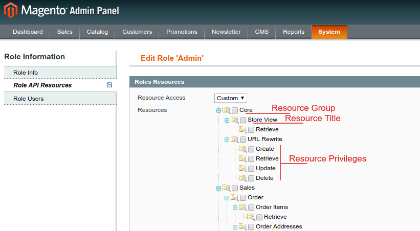
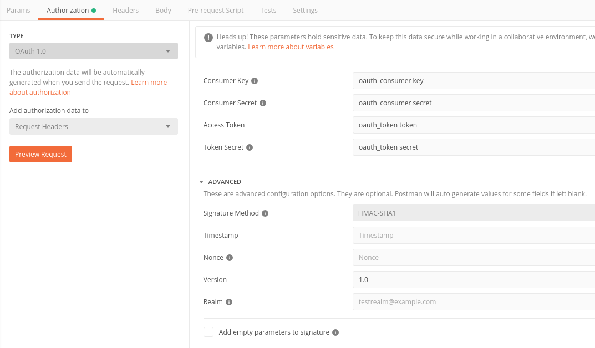

When customizing your shop, you may need to retrieve data from Magento. This is done by fetching data from a REST endpoint of Magento that will be used in a [GraphQL module](/docs/essentials/extend-the-graphql-schema.html).

In this documentation, you will learn how to create a new REST endpoint in your Magento 1 project. This is not specific to Front-Commerce module and you can follow the Magento tutorial [How to Extend the Magento REST API to Use Coupon Auto Generation](https://devdocs.magento.com/guides/m1x/other/ht_extend_magento_rest_api.html) if you need to understand more about the Magento 1 REST API.

This can be done by completing the following steps:

1. Add and complete `api2.xml` file
2. Implement the API method(s)

## Add and complete `api2.xml`

`api2.xml` is your main API config file, you can add this file on your local module in `etc` directory.

This is a basic structure of this config file:

```
<?xml version="1.0"?>
<config>
    <api2>
        <resource_groups>
            <{ACL_UNIQUE_NAME} translate="title" module="{MODULE_NAME}">
                <title>{ACL_NAME}</title>
                <sort_order></sort_order>
            </{ACL_UNIQUE_NAME}>
        </resource_groups>
        <resources>
            <{API_UNIQUE_NAME} translate="title" module="{MODULE_NAME}">
                <group>{ACL_UNIQUE_NAME}</group>
                <model>{MAGENTO_MODEL}</model>
                <title>{API TITLE}</title>
                <sort_order></sort_order>
                <privileges>
                    <!-- API PRIVILEGE (GET / POST / UPDATE / DELETE) -->
                    <admin>
                        <create>1</create>
                        <retrieve>1</retrieve>
                        <update>1</update>
                        <delete>1</delete>
                    </admin>
                    <customer>
                        <create>1</create>
                        <retrieve>1</retrieve>
                        <update>1</update>
                        <delete>1</delete>
                    </customer>
                    <guest>
                        <create>1</create>
                        <retrieve>1</retrieve>
                        <update>1</update>
                        <delete>1</delete>
                    </guest>
                </privileges>
                <attributes>
                    <!-- ATTRIBUTE TO EXPOSE -->
                    <entity_id>Entity ID </entity_id>
                </attributes>
                <routes>
                    <!-- API ROUTES -->
                    <route_entity>
                        <route>/entity/:id</route>
                        <action_type>entity</action_type>
                    </route_entity>
                    <route_collection>
                        <route>/entities</route>
                        <action_type>collection</action_type>
                    </route_collection>
                </routes>
                <versions></versions>
            </{API_UNIQUE_NAME}>
        </resources>
    </api2>
</config>
```

- Below is an example of how such a configuration could appear in the admin area when configuring API Resources authorizations:



- `resource_groups` declares new resource groups.
- `resources` declares a new custom endpoint. Every resource need to have a group (see `resource_groups`), a model and a title.
- `privileges` defines the HTTP Method allowed for `customer`, `guest` and `admin`. ([Rest roles configuration Magento 1](https://devdocs.magento.com/guides/m1x/api/rest/permission_settings/roles_configuration.html))
  - `create` = POST
  - `retrieve` = GET
  - `update` = UPDATE
  - `delete` = DELETE
- `attributes` lists the attributes that can be retrieved or sent ([Rest attributes configuration Magento 1](https://devdocs.magento.com/guides/m1x/api/rest/permission_settings/attributes_configuration.html))
- `routes` configure your URL endpoint

- Example:
  This following example is for a basic social network API, who can retrieve list of social networks posts and specific post thanks to 2 endpoints `/social-network-post/:id` and `/social-network-posts`

```
<?xml version="1.0"?>
<config>
    <api2>
        <resource_groups>
            <social_network translate="title" module="module_network">
                <title>Social network</title>
                <sort_order>100</sort_order>
            </social_network>
        </resource_groups>
        <resources>
            <social_network_posts translate="title" module="module_network">
                <group>social_network</group>
                <model>module_network/api2_post</model>
                <title>Social network posts</title>
                <sort_order>10</sort_order>
                <privileges>
                    <!-- Allow to retrieve for every groups -->
                    <admin>
                        <retrieve>1</retrieve>
                    </admin>
                    <customer>
                        <retrieve>1</retrieve>
                    </customer>
                    <guest>
                        <retrieve>1</retrieve>
                    </guest>
                </privileges>
                <attributes>
                    <entity_id>Post ID</entity_id>
                    <title>Title</title>
                    <description>Description</description>
                    <link>Link</link>
                    <image>Image</image>
                </attributes>
                <routes>
                    <route_entity>
                        <route>/social-network-post/:id</route>
                        <action_type>entity</action_type>
                    </route_entity>
                    <route_collection>
                        <route>/social-network-posts</route>
                        <action_type>collection</action_type>
                    </route_collection>
                </routes>
                <versions></versions>
            </social_network_posts>
        </resources>
    </api2>
</config>
```

## Implement API methods

### Directory
First, your file structure should look like this:
`[MODULE]/[MODEL]/Rest/[Guest / Customer / Admin]/V1.php`

In the social network example above, the directory would be:

- `[MODULE]/Model/Api2/Post/Rest/Guest/V1.php` (for guest mode)
- `[MODULE]/Model/Api2/Post/Rest/Customer/V1.php` (for customer mode)

This file is your API entrypoint.

<blockquote class="warning">
  **Warning:** never forget to add Customer endpoint. If it is the same as the Guest endpoint, you can extend `Guest/V1.php` in `Customer/V1.php`. But if you don't do so, logged in users won't be able to fetch data from Magento, breaking your feature once logged in.
</blockquote>

### Methods to implement

- [GET] `protected function _retrieve()` call for `entity` action type
- [GET] `protected function _retrieveCollection()` call for `collection` action type
- [POST] `protected function _create()` call for `collection` action type, body is mandatory
- [PUT] `protected function _update()` call for `entity` action type, body is mandatory
- [PUT] `protected function _multiUpdate()` call for `collection` action type, body is mandatory
- [DELETE] `protected function _delete()` call for `entity` action type, body is mandatory
- [DELETE] `protected function _multiDelete()` call for `collection` action type, body is mandatory

### Example

```
<?php

/**
 * Class Module_Network_Model_Api2_Post_Rest_Guest_V1
 */
class Module_Network_Model_Api2_Post_Rest_Guest_V1 extends FrontCommerce_Integration_Model_Api2_Abstract
{
    /**
     * Get post list
     *
     * @return array
     */
    protected function _retrieveCollection()
    {
        $collection = $this->_getCollection();
        $this->_applyCollectionModifiers($collection);
        $this->_loadCollection($collection);
        $this->addCacheHeaders($collection->getCacheLifetime());
        $data = $collection->walk('toArray');
        return array_values((array) $data);
    }

    /**
     * Retrieve post collection
     *
     */
    protected function _getCollection()
    {
        $collection = Mage::getResourceModel('module_network/post_collection');
        return $collection;
    }

    /**
     * Retrieve information about specified socialize
     *
     * @throws Mage_Api2_Exception
     * @return array
     */
    protected function _retrieve()
    {
        $entityId = this->getRequest()->getParam('id'); // param name is defined on your route node, for this example is :id
        $post = Mage::getModel('module_network/post')->load($entityId);
        if (!$post || !$post->getId() || $post->getId() != $entityId) {
            $this->_critical(self::RESOURCE_NOT_FOUND);
        }
        return $post->getData();
    }
}

```

### Sending requests to your API

In case you need to ensure your endpoints works as expected, you can either use cURL or [Postman](https://www.getpostman.com/). But advanced clients like Postman will allow you to have credentials and will make it easier to run requests as logged in customers.

- Guest testing: If your endpoint can be access in guest mode, you can simply send GET / POST / DELETE / UPDATE request
  to your endpoint for see the response
- Customer testing: You need to add credential and token for your request. You can retrieve all this information in your database

  - Consumer Key = `key` in table `oauth_consumer`
  - Consumer Secret = `secret` in table `oauth_consumer`
  - Access Token = `token` of user in table `oauth_token`
  - Token secret = `secret` of same user in table `oauth_token`
    

## Good to know

- If you can, extend `FrontCommerce_Integration_Model_Api2_Abstract` in your own API class. This class adds useful helper functions such as:
  - `public function getCustomer()`: Retrieve current customer and save it in customer session.
  - `protected function _initStore()`: Set current store with default store view or store set in request params.
  - `protected function _getStore()`: Rewrite Magento's base method to memoize store value. Retrieve current store according to request and API user type.
  - `protected function _getCurrency()`: Retrieve current currency.
  - ...
- If you apply `_applyCollectionModifiers($collection)` to your own `$collection` you can use dynamic API collection filter (see [Magento documentation](https://devdocs.magento.com/guides/m1x/api/rest/get_filters.html))
- If you need to send back an API error, use `$this->_critical(ERR_CODE);`
