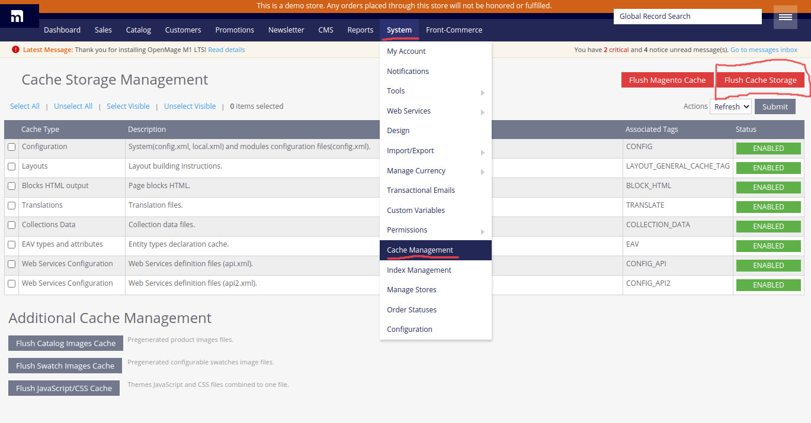

In this section, you will learn some advanced usages of the Magento 1 integration.

## Additional headers in Magento API calls

<blockquote class="feature--new">
_Since version 2.7.0_
</blockquote>

Front-Commerce allows you to send additional headers in all API calls. To do so, you must define the `magento.api.extraHeaders` (for storefront API) and/or `magento.api.extraAdminHeaders` (for admin API) configuration values from a [configuration provider](/docs/advanced/server/configurations.html#What-is-a-configuration-provider).

These additional headers could be useful if you want to add additional context to your queries, depending on the request or to detect Front-Commerce requests from your Magento server.

## Clearing Front-Commerce cache

To clear the front commerce cache, it suffices to flush cache storage from the admin interface. To do this go to System > Cache Management then click on Flush Cache Storage button on the top right corner. (see below screenshot for more details).

  
Click to reveal screenshot

  

