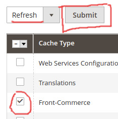

In this section, you will learn some advanced usages of the Magento 2 integration.

## Additional headers in Magento API calls

<blockquote class="feature--new">
_Since version 2.7.0_
</blockquote>

Front-Commerce allows you to send additional headers in all API calls. To do so, you must define the `magento.api.extraHeaders` (for storefront API) and/or `magento.api.extraAdminHeaders` (for admin API) configuration values from a [configuration provider](/docs/advanced/server/configurations.html#What-is-a-configuration-provider).

These additional headers could be useful if you want to add additional context to your queries, depending on the request or to detect Front-Commerce requests from your Magento server.

## Clearing Front-Commerce cache

There are two ways to clear the magento cache:

1. Run the below command from the command line on the magento server:

```sh
bin/magento cache:clean -- front-commerce
```

2. From the admin interface go to System > Cache Management then select Front-Commerce, make sure that refresh is selected and then click the Submit button. (see below screenshot for more details).

<details>
  <summary>Click to reveal screenshot</summary>
  <p></p>
</details>