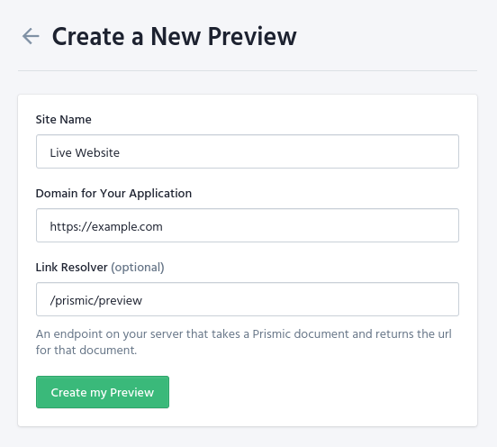

Prismic preview currently redirects content writers to your store's homepage when they click on the preview button, they will then have to navigate to the preview page to see the preview. **We are working on a solution for configurable route resolvers.**

## Configure previews in your Prismic repository

In your repository, go to Settings > Previews > Manage your Previews and select Create a preview. Then fill in the new preview configuration:

- **Site Name:** The display name to identify the website in the preview.
- **Domain for Your Application:** The URL of your site, such as https://example.com/ or http://localhost:3000/
- **Link Resolver:** The route where prismic resolves the preview url. In Front-Commerce we handle this route at `/prismic/preview`.

<div style="text-align:center;">
  
</div>

## Configure previews in your app

Once you have configured Previews in your repository, you need to implement the preview functionality in your project code.

### Update your Content Security Policy

You need to add these domains to enable the scripts and the iframe to be loaded in your website.

```diff
// src/config/website.js

{
  contentSecurityPolicy: {
    directives: {
-      scriptSrc: [],
+      scriptSrc: [
+        "static.cdn.prismic.io",
+        "prismic.io",
+        "https://html2canvas.hertzen.com/dist/html2canvas.min.js",
+      ],
-      frameSrc: [],
+      frameSrc: ["*.prismic.io"],
    },
  },
}
```

- `static.cdn.prismic.io` is the prismic cdn where the script is loaded from
- `https://html2canvas.hertzen.com/dist/html2canvas.min.js` is a third-party script which allows a sharable prismic link
- `*.prismic.io` is the prismic domain of your repository

<blockquote class="tip">
**TIP :** You can replace the `*` in the `frameSrc` with your [repository name](https://prismic.io/docs/core-concepts/what-is-a-repo#accessing-a-repo)
</blockquote>

### The Preview Toolbar

The Prismic Toolbar works together with Previews, giving you a list of the documents in the preview and a link to open them in the Writing Room.

You can include the toolbar by adding it to your app's layout. You can read the [layout documentation](/docs/advanced/theme/layouts.html) to learn more.

<blockquote class="important">
**IMPORTANT :** For the toolbar script to be injected in your dom, you need the search param  `previewRepo` containing your repo name, e.g.  `path/?previewRepo=my-repo`, in your url.
</blockquote>

```js
// src/theme/routes/_layout.js
import React from "react";
import PrismicPreview from "theme/modules/Prismic/PrismicPreview";

const Layout = ({ children }) => {
  return (
    <>
      <PrismicPreview />
      {children}
    </>
  );
};

export default Layout;
```
