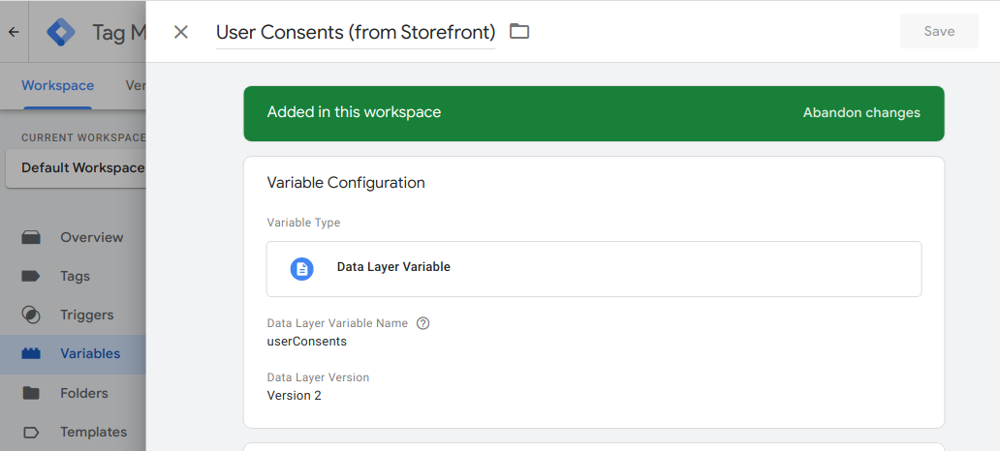
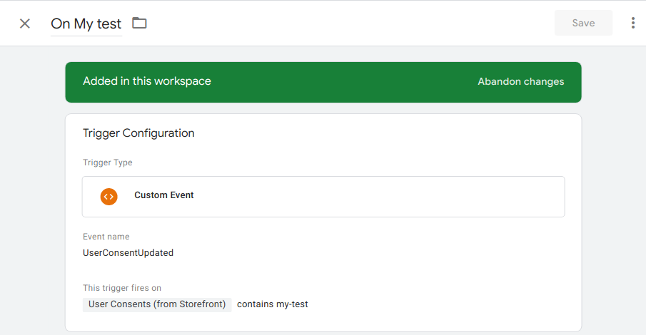

import AnalyticsFigure from "./assets/analytics.svg";
import Figure from "@site/src/components/Figure";
import ContactLink from "@site/src/components/ContactLink";
import { useState } from "react";
import SinceVersion from "@site/src/components/SinceVersion";

<SinceVersion tag="2.19" />

<p>{frontMatter.description}</p>

Plugins are a powerful abstraction that let you:

- add a new analytics provider (like Google analytics or Meta pixel)
- hook into an existing analytics provider plugin
- or add any kind of logic to react to visitor actions

Plugins can be broken down into 2 types:

- **Provider plugins** - connecting to third party analytic services
- **Custom plugins** - additional features, data manipulation, & any other side
  effects.

Both have the same signature, and are registered in the same way, here we will
explore how they are implemented within a Front-Commerce app.

:::info

You can look at the analytics library documentation to learn more about the
plugin types.

- [Plugins](https://getanalytics.io/plugins)
- [Writing Plugins](https://getanalytics.io/plugins/writing-plugins/)

:::

## Writing a new plugin

:::tip

You can also
[request and contribute plugins](https://getanalytics.io/plugins/request/)
within the analytics library ❤️ Open Source

:::

Let's say for this example we want to create a new provider plugin for a third
party analytics tool `acme`. We will name this plugin `acme`.

Provider plugins typically

1. Load in the third party analytics script via initialize
1. Use `track` or `page` events to send data into a third party analytics tool
   (There is also another event `identify` which is not currently implemented in
   Front-commerce)
1. Have a loaded function to let analytics know when its safe to send the third
   party data.

Here is an example if the `acme` plugin:

```js title="my-analytics-module/plugins/analytics-plugin-acme.js"
// `settings` is the value defined in the plugin config in `config/analytics.js`
export default function acmePluginExample(settings) {
  // return object for analytics to use
  return {
    /* All plugins require a name */
    name: "acme",
    /* Everything else below this is optional depending on your plugin requirements */
    config: {
      whatEver: settings.whatEver,
      elseYouNeed: settings.elseYouNeed,
    },
    initialize: ({ config }) => {
      // load provider script to page
    },
    page: ({ payload }) => {
      // call provider specific page tracking
    },
    track: ({ payload }) => {
      // call provider specific event tracking
    },
    identify: ({ payload }) => {
      // call provider specific user identify method
    },
    loaded: () => {
      // return boolean so analytics knows when it can send data to third party
      return !!window.myPluginLoaded;
    },
  };
}
```

### Extending with `EcommercePlugin`

The `EcommercePlugin` plugin is a plugin provided by Front-Commerce. It allows
you to create an interface to map
[e-commerce events and properties](https://developers.google.com/analytics/devguides/collection/ga4/ecommerce)
to the relevant events and properties for your `acme` provider, you can find a
full list of events in the
[EcommercePlugin.js](https://gitlab.blackswift.cloud/front-commerce/front-commerce/-/blob/784684ce56cca69ca5c2e42d5d421a8c0b4bb9c3/src/web/core/analytics/plugins/e-commerce/domain/e-commerce-plugin.js)

Below is an example of how to extend the `acme` plugin to handle e-commerce
events.

```js title="my-analytics-module/plugins/analytics-plugin-acme.js"
import { EcommercePlugin } from "web/core/analytics/plugins/e-commerce";

// Extend the EcommercePlugin with your custom overrides
class AcmeEcommercePlugin extends EcommercePlugin {
  // The event we use during tracking in the case is "Product Viewed"
  productViewed = (payload) => {
    return {
      // Use the event name required by acme
      event: "acme_view_item",
      // Map the props to the required props of acme
      properties: {
        product_id: payload.sku,
        product_name: payload.name,
        product_currency: payload.currency,
        product_price: payload.price,
      },
    };
  };

  // You can also add other events like "Product Reviewed", "Product Shared".
  customEventsAndProperties = {
    // the event key used in your `trackEvent` call
    "Product Reviewed": (properties) => {
      return {
        // the tracking method will be called with this event
        event:"acme_product_reviewed",
        // the tracking method will be called with these properties
        properties: {
           product_id: properties.sku,
           review_rating: properties.rating,
        },
      }
    },
    "Product Shared": (properties) => {
        return {
          event:"acme_product_shared",
          properties: {
             product_id: properties.sku,
             method: properties.method,
          },
        }
    },
  };
}

export default function providerPluginExample(settings) {
  // wrap your config with the ecommerce plugin
  return new AcmeEcommercePlugin({
    // ... same config as defined in the previous example
  };)
}
```

<div>

:::info

We handle this internally for
[known plugins](https://gitlab.blackswift.cloud/front-commerce/front-commerce/-/blob/784684ce56cca69ca5c2e42d5d421a8c0b4bb9c3/src/web/core/analytics/plugins/e-commerce/e-commerce.js#L6-11)
like the [`google-analytics`](https://getanalytics.io/plugins/google-analytics/)
plugin.

If you are aware of any other providers which require this,
please&nbsp;<ContactLink>let us know</ContactLink> or feel free to contribute to
our
[analytics examples](https://gitlab.blackswift.cloud/front-commerce/examples/analytics).

:::

</div>

## Using Plugins

In Front-Commerce the plugins are dynamically required via the `script` property
in your `config/analytics.js` configuration, this allow us to only import and
load scripts based on authorisation (cookies), which in turn reduces the page
loading for your end users.

Let's add our `acme` plugin to our `config/analytics.js` file.

```js title="src/config/analytics.js"
module.exports = {
  analytics: {
    // ...config
    plugins: [
      // ...plugins
     {
        // remember to add the `acme` to your cookieServices config or disable the needConsent
        name: "acme",
        needConsent: true,
        // all these settings will be passed to your plugin script
        settings: {
          whatEver: "foo",
          elseYouNeed: "bar",
        }
        // add a dynamic import to load the plugin script
        script: () => import("my-analytics-module/plugins/analytics-plugin-acme.js"),
      },
    ],
  },
};
```

:::info REMINDER

Just like any other plugin, don't forget to setup the
[`cookiesServices.js`](/docs/2.x/advanced/analytics/getting-started#gdpr-consent)
file accordingly, in order to load the newly created integration only when the
user has given their consent.

:::

### Custom plugins common pain points

In some cases, the documentation for implementing the tracking might not be
compatible with <abbr title="Single Page Application">SPA</abbr>'s
architectures. This can be the case if they are asking you to add a `script` tag
in your `head`, or at the end of your `body` without any further information.

Indeed, if we're doing this, it's likely to be because the tracking service
wants to load the `script` tag each time the person navigates. However, if we do
this in an SPA, the `script` will only be loaded once. Here is the list of
solutions you can try to implement:

- Look for additional documentation to see if they have a `script` that can be
  used as a library that gives access to some kind of global variable that can
  then be called by your implementation. Something that would work like the code
  shown below. If this is the case, it means that you can call
  `trackingVariable.track()` in your integration instead of adding a new tag
  script each time.

  ```html
  <script src="http://tracking.example.com/script.js"></script>
  <script>
    trackingVariable.track();
  </script>
  ```

- Look inside the script itself. The script you've been given may be a shortcut
  and the solution might live in the script itself. If this is the case, this
  means that you can try to duplicate the scripts content and adapt it to your
  integration.
- If none of the solutions above work, you can always try to load the script
  several times by adding a `?random=${new Date().getTime()}` at the end of the
  URL. This will trick the browser into thinking they are different scripts and
  allow you to load it multiple times.

Implementing a great tagging plan for an e-commerce application is a tough
journey. If you have any further questions about how to implement them in
Front-Commerce, please <ContactLink />. We'll be happy to answer them.

## Common Plugins

Here is a list of frequently used plugins across e-commerce shops

### Google Analytics 4

Install the
[google-analytics plugin](https://getanalytics.io/plugins/google-analytics/)

```shell
npm install @analytics/google-analytics
```

Configuration example in `src/config/analytics.js`

```js title="src/config/analytics.js"
{
  name: "google-analytics",
  needConsent: true,
  settings: (authorization) => {
    return {
      measurementIds: ['G-abc123'],
      gtagConfig:{
          anonymize_ip: !authorization
      }
    };
  },
  script: () => import("@analytics/google-analytics"),
}
```

### Google Tag Manager

Install the
[google-tag-manager plugin](https://getanalytics.io/plugins/google-tag-manager/)

```shell
npm install @analytics/google-tag-manager
```

Configuration example in `src/config/analytics.js`

```js title="src/config/analytics.js"
{
  name: "google-tag-manager",
  needConsent: true,
  settings: (authorization, otherAuthorizations) => ({
    containerId: "GTM-123xyz",
    // the userConsents option is a specific key that the plugin will use and expose in the GTM dataLayer
    userConsents: otherAuthorizations
  }),
  script: () => import("@analytics/google-tag-manager"),
}
```

Update your <abbr title="Content Security Policy">CSP</abbr> in
`src/config/website.js` according to the tags you use (see
[Google Tag Manager's documentation](https://developers.google.com/tag-platform/tag-manager/web/csp)
for more details)

In GTM, you will then be able to leverage several specific things configured in
your plugins.

First, the `userConsents` configuration option will be pushed to your dataLayer
as the `userConsents` value. You can reference it from a Variable in GTM. Here
is an example:

<Figure>



</Figure>

Then, you can leverage the `UserConsentUpdated` event tracked whenever users
update their consent preferences. You could create triggers to enable scripts to
load / remove (depending on the `userConsents` value). Here is an example:

<Figure>



</Figure>

### Meta Pixel

You can use our
[example plugin](https://github.com/front-commerce/examples/tree/main/analytics/meta-pixel)
to track a pixel. This is a good starting point, the
[e-commerce events](https://developers.facebook.com/docs/meta-pixel/reference#standard-events)
would also need to be created using the
[`EcommercePlugin`](/docs/2.x/advanced/analytics/plugins#extending-with-ecommerceplugin)

### Matomo

To track in Matomo, you can use our
[example plugin](https://github.com/front-commerce/examples/tree/main/analytics/matomo)
as a good starting point.

:::info

Feel free to browse
[**our examples plugins**](https://github.com/front-commerce/examples), and even
contribute to them if you have any ideas! 💡

:::
