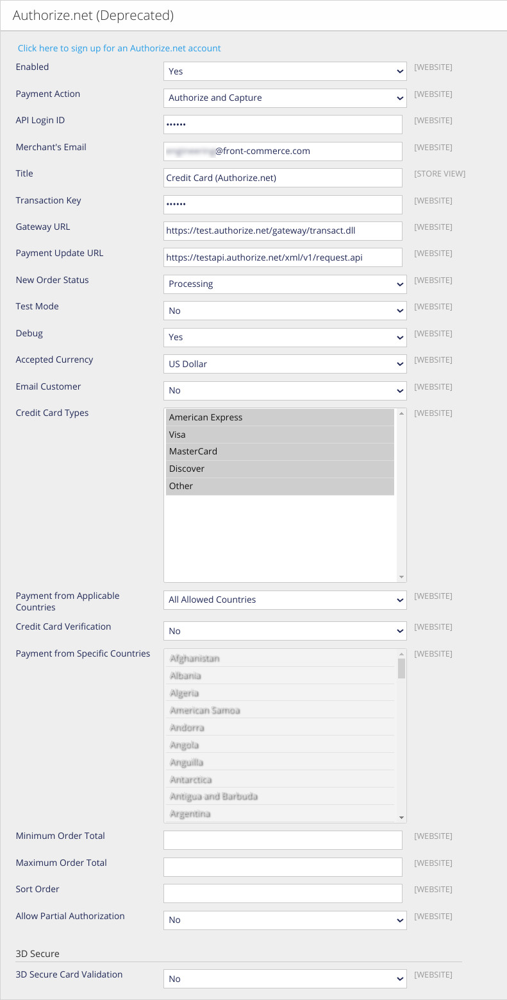

import SinceVersion from "@site/src/components/SinceVersion";

<p>{frontMatter.description}</p>

Authorize.net is a payment gateway service that allows customers to securely
make online payments. It provides a seamless integration for processing credit
card transactions.

## Magento1 (OpenMage LTS)

<SinceVersion tag="2.26" />

### Prerequisites

This feature is directly provided by Magento (OpenMage LTS), but requires the
Front-Commerce Magento module in version >=
[1.5.0](https://gitlab.blackswift.cloud/front-commerce/magento1-module-front-commerce/-/releases/1.5.0).

### Enable Authorize.net in Magento

:::note

This feature is directly provided by Magento (OpenMage LTS). Since documentation
is sparse nowadays on internet, we provide an example that worked for us and our
customers. In case of doubt don't hesitate to contact us and Authorize.net
support.

:::

Go to the
`System > Configuration > Sales > Payment Methods > Authorize.net (Deprecated)`
admin section and configure it after your requirements. Ensure that **Enabled =
Yes**, so it appears in the payment list in your Front-Commerce checkout.

If you already process payments with Authorize.net, the configuration should
work without any changes.

```mdx-code-block
<details>
  <summary>Example configuration for a test environment</summary>
```

For detailed documentation about how to use Authorize.net, please visit the
[Authorize.net developer documentation](https://developer.authorize.net/).

Some highlights of this configuration:

- **URLs** are for the test services. Here are the URLs you could use:
  - Sandbox:
    - Gateway URL: https://test.authorize.net/gateway/transact.dll
    - Payment Update URL: https://apitest.authorize.net/xml/v1/request.api
  - Production:
    - Gateway URL: https://secure.authorize.net/gateway/transact.dll
    - Payment Update URL: https://api.authorize.net/xml/v1/request.api
- **API login ID and Transaction Key** are for the test environment. To retrieve
  them
  ([source](https://developer.authorize.net/hello_world/common_setup_questions.html)):
  > 1. For sandbox API requests, log into the sandbox Merchant Interface at
  >    https://sandbox.authorize.net. For production API requests, log into the
  >    production Merchant Interface at https://account.authorize.net.
  > 2. Navigate to Account > Settings > API Credentials & Keys.
  > 3. Click New Transaction Key.
  > 4. Click Submit.
  > 5. Request and verify a PIN in order to see the transaction key.
- **Debug** mode is optional
- **Test mode** is optional



```mdx-code-block
</details>
```

### Register the `AuthorizeNetForm` component in Front-Commerce

1. Override the file that lets you register additional payments components in
   Front-Commerce

   ```shell
   mkdir -p my-module/web/theme/modules/Checkout/Payment/AdditionalPaymentInformation/
   cp -u node_modules/front-commerce/src/web/theme/modules/Checkout/Payment/AdditionalPaymentInformation/getAdditionalDataComponent.js my-module/web/theme/modules/Checkout/Payment/AdditionalPaymentInformation/getAdditionalDataComponent.js
   ```

1. Register the component `AuthorizeNetForm` to be used for `authorizenet`
   payments in `getAdditionalDataComponent.js`

   ```diff title='my-module/web/theme/modules/Checkout/Payment/AdditionalPaymentInformation/getAdditionalDataComponent.js'
   -const ComponentMap = {};
   +import AuthorizeNetForm from "./AuthorizeNetForm";

   +const ComponentMap = {
   + authorizenet: AuthorizeNetForm,
   +};

   const getAdditionalDataComponent = (method) => {
    return ComponentMap[method.code];
   ```

### Restart Front-Commerce and test

After having **restarted Front-Commerce**, you should be able to use this
payment method when available.

You can find **Test cards** on
[Authorize.net documentation](https://developer.authorize.net/hello_world/testing_guide.html).
