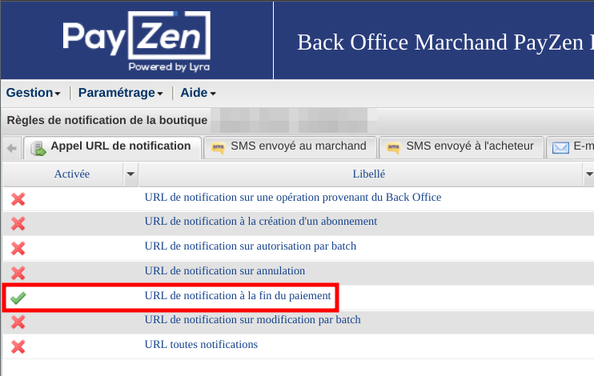

import ContactLink from "@site/src/components/ContactLink";

<p>{frontMatter.description}</p>

There are different ways for you to accept payments with
[PayZen](https://payzen.eu/) or
[Lyra Collect](https://www.lyra.com/lyra-collect/) in your Front-Commerce
application.

- [Front-Commerce Payment](#front-commerce-payment)
  - [Lyra Collect support](#lyra-collect-support)
  - [Configure your environment](#configure-your-environment)
    - [Define environment variables](#define-environment-variables)
    - [Configure notifications in your account](#configure-notifications-in-your-account)
    - [Ensure Lyra's IP addresses are allowed](#ensure-lyras-ip-addresses-are-allowed)
  - [Register the PayZen payment module](#register-the-payzen-payment-module)
    - [Magento2](#magento2)
    - [Magento1 (OpenMage LTS)](#magento1-openmagelts)
  - [Register your PayZen payment component](#register-your-payzen-payment-component)
  - [Update your CSPs](#update-your-csps)
  - [Advanced: customize data sent to PayZen](#advanced-customize-data-sent-to-payzen)
  - [Contacting Lyra's support](#contacting-lyras-support)
- [Magento2 module](#magento2-module)

:::note

Each integration method is independent from the others, meaning that you don't
have to install additional modules on your eCommerce platform if using
Front-Commerce payments.

:::

## Front-Commerce Payment

This section explains how to configure and customize the PayZen Front-Commerce
Payment module into an existing Front-Commerce application. The implementation
use
[PayZen embedded form / Javascript with REST API](https://payzen.io/fr-FR/rest/V4.0/javascript/)
to create payments.

### Lyra Collect support

Lyra Collect is a payment solution that shares the same infrastructure and API
with Payzen. In Front-Commerce, it is the exact same module that is used. The
only differences are:

- the `FRONT_COMMERCE_PAYZEN_PRODUCT` environment variable (to be set to
  `lyra_collect`)
- the URLs to use when [updating your CSPs](#update-your-csps) should be
  `api.lyra.com` instead of `static.payzen.eu`

### Configure your environment

#### Define environment variables

Get your access keys by following the
[Payzen documentation](https://payzen.io/fr-FR/rest/V4.0/api/get_my_keys.html).
Update your `.env` with the following values:

```shell title=".env"
FRONT_COMMERCE_PAYZEN_PUBLIC_KEY=58039770:testpublickey_xxxxxxx
FRONT_COMMERCE_PAYZEN_PRIVATE_KEY=58039770:testpassword_yyyyyyy
FRONT_COMMERCE_PAYZEN_SHA256=xxxxxxxxx
#FRONT_COMMERCE_PAYZEN_PRODUCT=payzen # use lyra_collect to switch to Lyra Collect's API URLs
```

#### Configure notifications in your account

You must also configure notifications in Payzen or Lyra "expert mode" to ensure
**only one notification is sent** upon payment, to prevent multiple orders being
created for a single payment:



#### Ensure Lyra's IP addresses are allowed

If your server has a firewall, or your staging environment is protected by a
HTTP basic authentication, you must allow Lyra's IP addresses to access your
server. This is necessary for the payment confirmation to be sent to your
server.

The list of IP addresses can be found in the
[PayZen documentation](https://payzen.io/payzen/fr-FR/form-payment/quick-start-guide/tla1427193445290.pdf).
As of 2024-10-15, the IP range to allow is: `194.50.38.0/24`

### Register the PayZen payment module

In your Front-Commerce application:

#### Magento2

```diff title='.front-commerce.js'
   modules: [],
   serverModules: [
     { name: "FrontCommerce", path: "server/modules/front-commerce" },
-    { name: "Magento2", path: "server/modules/magento2" }
+    { name: "Magento2", path: "server/modules/magento2" },
+    { name: "PayZen", path: "server/modules/payment-payzen" }
   ]
```

#### Magento1 (OpenMage LTS)

```diff title='.front-commerce.js'
   modules: [],
   serverModules: [
     { name: "FrontCommerce", path: "server/modules/front-commerce" },
-    { name: "Magento1", path: "server/modules/magento1" }
+    { name: "Magento1", path: "server/modules/magento1" },
+    { name: "PayZen", path: "server/modules/payment-payzen/index.magento1.js" }
   ]
```

```diff title="theme/pages/Checkout/checkoutFlowOf.js"

const checkoutFlowOf = (method) => {
  ...

-  if (method === "payzen_embedded") return "asyncOrder";
+  if (method === "payzen_embedded") return "directOrder";

  ...
};
```

### Register your PayZen payment component

1. Override the file that lets you register additional payments forms in
   Front-Commerce

   ```shell
   mkdir -p my-module/web/theme/modules/Checkout/Payment/AdditionalPaymentInformation/
   cp -u node_modules/front-commerce/src/web/theme/modules/Checkout/Payment/AdditionalPaymentInformation/getAdditionalDataComponent.js my-module/web/theme/modules/Checkout/Payment/AdditionalPaymentInformation/getAdditionalDataComponent.js
   ```

2. Register PayZen

   ```diff title='my-module/web/theme/modules/Checkout/Payment/AdditionalPaymentInformation/getAdditionalDataComponent.js'
   +import PayzenEmbeddedForm from "./PayzenEmbeddedForm";

   const ComponentMap = {
   +  payzen_embedded: PayzenEmbeddedForm
   };
   ```

### Update your CSPs

To allow loading PayZen related remote resources:

```diff title="my-module/config/website.js"
  contentSecurityPolicy: {
    directives: {
-      scriptSrc: [],
-      frameSrc: [],
-      styleSrc: [],
-      imgSrc: [],
+      scriptSrc: ["static.payzen.eu", "secure.payzen.eu", "api.lyra.com"],
+      frameSrc: ["static.payzen.eu", "secure.payzen.eu", "api.lyra.com"],
+      styleSrc: ["static.payzen.eu", "secure.payzen.eu", "api.lyra.com"],
+      imgSrc: ["static.payzen.eu", "secure.payzen.eu", "api.lyra.com"],
      styleSrc: [],
      imgSrc: [],
      connectSrc: [],
      baseUri: []
    }
  },
```

:::info Important

When using the **Lyra Collect** integration, use the `api.lyra.com` and
`secure.lyra.com` values instead of `static.payzen.eu` and `secure.payzen.eu` in
the example above.

:::

### Advanced: customize data sent to PayZen

:::caution WIP

<span>
  This advanced pattern must be documented with further details. While we are
  working on it, please <ContactLink /> if you need further assistance.
</span>

:::

The PayZen payment module is extensible. It leverages Front-Commerce's "data
transform" pattern to allow developers to customize payloads sent to PayZen for
a
[Payment Request creation](https://payzen.io/en-EN/rest/V4.0/api/playground/?ws=Charge/CreatePayment#vMGdf).

The Payment request object can be customized at application level. It allows to
add additional metadata depending on your own logic. For this, you can use the
`registerPaymentRequestDataTransform` method of the Payzen loader to add your
custom transformers.

See the test for an example (while a detailed documentation is being written):

- https://gitlab.blackswift.cloud/front-commerce/front-commerce/-/blob/c1ca1ef8a60ecb545e2758d04a4d11577e764658/src/server/modules/payment-payzen/__pacts__/loader.js#L132

### Contacting Lyra's support

If you ever have to contact Lyra's support team, here are some recommendations
in order to increase efficiency and ensure your issue could be handled by people
more aware of Front-Commerce.

:::tip Checklist for an efficient support request

- mention the fact that you are using Front-Commerce
- don't mention your backend (i.e: Magento)
- ask that the "support grand comptes" handles your request (Nicolas, Rémi or
  Maxime)

:::

## Magento2 module

:::danger PHP Module Compatibility

At the time of writing, we support the Payzen module up to version 2.5. Support
for next version will be available in the future.

:::

:::caution WIP

<span>
  This integration is aimed at being transparent for administrators and
  developers. That is why we haven't duplicated documentation from existing
  Magento resources. Please <ContactLink /> if you need further assistance.
</span>

:::

Front-Commerce Magento2 module contains
[headless payment adapters](/docs/2.x/magento2/headless-payments) for the
[**PayZen Standard** method](https://github.com/lyra/plugin-magento) (Lyra's
official Magento module).

The PayZen module must be configured in a normal way, as for a non-headless
Magento store.
