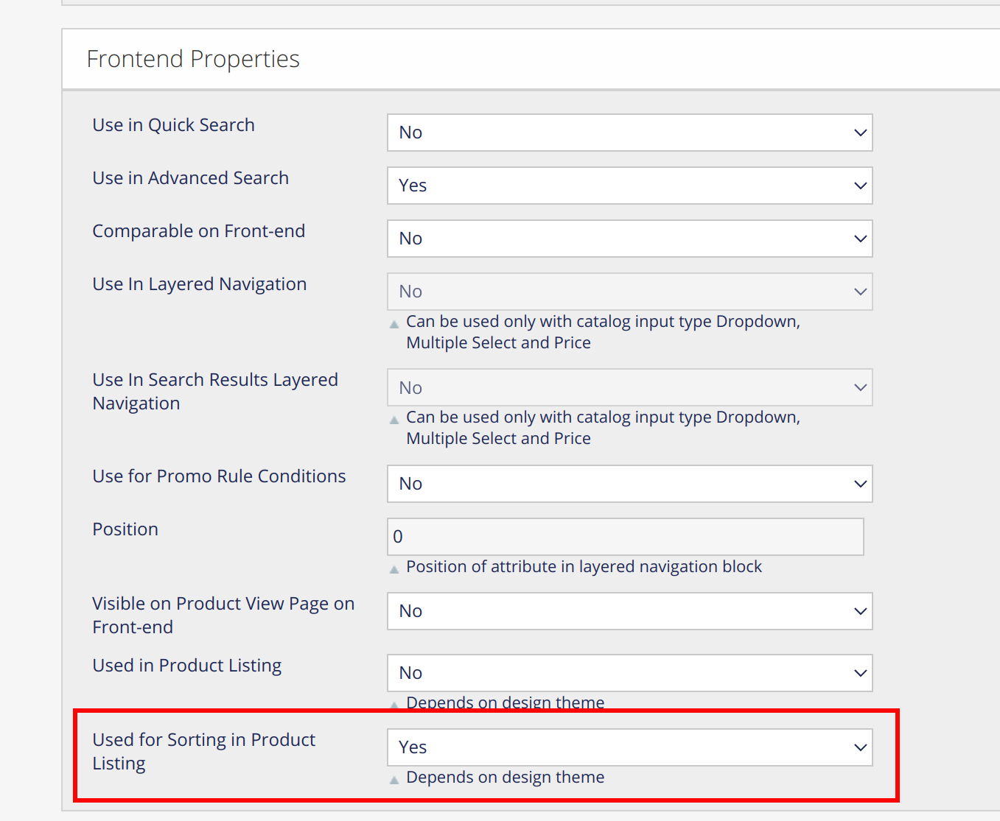
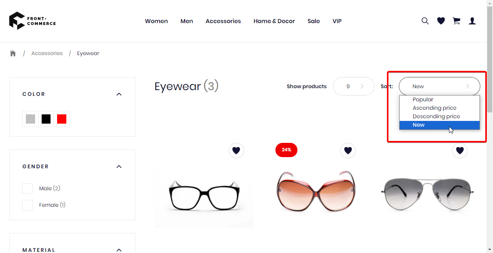

import Figure from "@site/src/components/Figure";
import ContactLink from "@site/src/components/ContactLink";

<p>{frontMatter.description}</p>;

## Set an attribute as sortable

### In Magento1

In Magento1 back office, navigate to `Catalog > Attributes > Manage Attributes`.
In the list shown, find the attribute you want to set as sortable (i.e.
`news_from_date`), and click on it. Scroll down to section
`Frontend Properties`, and set `Used for Sorting in Product Listing` to "Yes".

<Figure>



</Figure>

### In Magento2

:::info

This feature is not supported for Magento2 yet. If your project requires this
feature, please <ContactLink>contact us</ContactLink>.

:::

## Add sorting attribute in your theme

In order to add a new sorting attribute to your PLP, you will need to override
`theme/modules/Layer/LayerSorting/useOptions.js` like so:

```jsx title="theme/modules/Layer/LayerSorting/useOptions.js"
import config from "config/website";
import { useIntl, defineMessages } from "react-intl";

const DEFAULT_OPTIONS = [
  {
    label: "default",
    value: "",
  },
  {
    label: "asc",
    value: JSON.stringify({ field: "price", direction: "asc" }),
  },
  {
    label: "desc",
    value: JSON.stringify({ field: "price", direction: "desc" }),
  },
  // highlight-start
  // Add your new sorting attribute
  {
    label: "new",
    value: JSON.stringify({ field: "news_from_date", direction: "desc" }),
  },
  // highlight-end
];

const messages = defineMessages({
  default: {
    id: "components.molecules.Sorting.default",
    defaultMessage: "Popular",
  },
  asc: {
    id: "components.molecules.Sorting.price.asc",
    defaultMessage: "Ascending price",
  },
  desc: {
    id: "components.molecules.Sorting.price.desc",
    defaultMessage: "Descending price",
  },
  // highlight-start
  // Add the attribute's translation
  new: {
    id: "components.molecules.Sorting.news_from_date",
    defaultMessage: "New",
  },
  // highlight-end
});

//...
```

After these steps, your should be able to use your attribute to sort you PLP:

<Figure>



</Figure>
