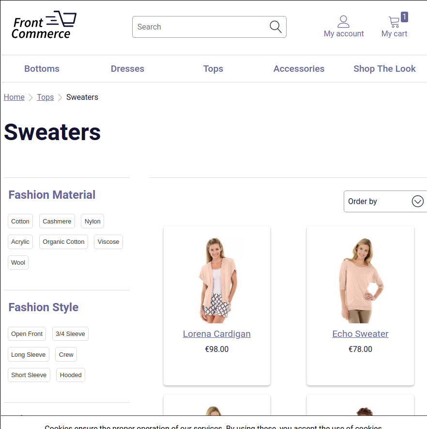

import Figure from "@site/src/components/Figure";

<p>{frontMatter.description}</p>

**How does this translate in Front-Commerce?** By creating `_layout.js` and
`_inner-layout.js` files in your `web/theme/routes` folder to enable dynamic
layouts. This is what we will explain in this guide.

If you don't know what is the purpose of the `web/theme/routes` or how to use
it, please first refer to the guide
[Add a new page](/docs/essentials/add-a-page-client-side). Moreover, to complete
this guide about layouts, you will need to have a module correctly setup in your
project with a
[web module preconfigured](/docs/essentials/add-a-page-client-side#declare-your-module-as-a-web-module).

## What is a layout?

We call layout anything that wraps a route.

Let's take a Category page.

<!-- TODO - update this figure with theme-chocolatine example? -->

<Figure>



</Figure>

The contents that are specific to this Category are the title, the products, the
facets, etc. The header with the logo and the menu are not specific to the
category page. You expect it to see it on the product page too.

Thus, the **layout** is everything that is not specific to the page you are
displaying.

However, for more advanced use case, you can have some content that are not
specific to the route, but still specific to a part of the application. This is
the case for the account pages.

<!-- TODO - update this figure with theme-chocolatine example? -->

<Figure>


</Figure>

In this case, the sidebar navigation is by definition a layout since it remains
across the multiple pages available in the account. However, it is contained in
a larger layout: the one displaying the header.

We call this an **Inner layout** because it does not get rid of the layout above
it.

## How to implement this in Front-Commerce's routing system?

<abbr title="Too Long; Didn't Read">TL;DR</abbr>

- a Layout should be implemented by creating a component in a `_layout.js` file
- an Inner Layout should be implemented by creating a component in a
  `_inner-layout.js` file
- Restart on each new file creation in the `web/theme/routes` folder

### Define a new layout for a list of routes

First, a layout will only affect the routes inside a folder, and its sub
folders.

For instance, let's say that you are willing to add a Blog to your
Front-Commerce application. You could imagine creating the following routes:

```
├── index.js
├── contact.js
├── cart.js
├── ...
├── _layout.js
└── blog
    ├── index.js
    └── [slug].js
```

As is, the urls `/blog` and `/blog/[slug]` you have created will be displayed
with the same layout as your cart, contact, or any other page of the
application.

However you don't want users to feel like they are still in the shop. You want
to have a lighter design for these pages to allow the users to focus on the
content. This is why you can create a new `_layout.js` at `/blog/_layout.js`.

```jsx title="web/theme/routes/blog/_layout.js"
import React from "react";

const BlogLayout = ({ children }) => (
  <div>
    <header>Welcome to our blog!</header>
    <main>{children}</main>
  </div>
);

export default BlogLayout;
```

The children property here is the content of the route that will be displayed if
you navigate to a page within `/blog`.

Other pages will keep the root `_layout.js` and won't be affected by the blog's
layout.

Remember to restart your application to see the changes (`npm run start`).

:::info Important

If you need to override an existing `_layout.js` you can by coping it in your
own web module. Moreover, you can create new layouts wherever you want. For
instance, if a module defined some routes in `/blog` but didn't create a
`/blog/_layout.js`, you can create it in your own module and all the routes in
`/blog` will use this new layout.

:::

:::note

In Front-Commerce's core, this is already the case for the `/checkout` route,
which uses a leaner layout than the rest of the shop.

:::

### Define an Inner Layout for a list of route

The concept of creating an Inner Layout is very similar to creating a Layout.
The main difference is that instead of creating a `_layout.js` file, you will
create a `_inner-layout.js`.

For instance, in the case of the account, we've got an Inner Layout similar to
this file:

```jsx title="web/theme/routes/account/_inner-layout.js"
import React from "react";
import Link from "theme/components/atoms/Typography/Link";

const AccountLayout = ({ children }) => (
  <div>
    <nav>
      <ul>
        <li>
          <Link to="/">Dashboard</Link>
        </li>
        <li>
          <Link to="/orders">Orders</Link>
        </li>
        <li>
          <Link to="/address-book">Address Book</Link>
        </li>
      </ul>
    </nav>
    <div>{children}</div>
  </div>
);

export default AccountLayout;
```

You can see that it works just like the Blog's layout. However, keep in mind
that you don't need to repeat the surrounding layout. For instance, there's no
header and logo in my Inner Layout.

Remember to restart your application to see the changes (`npm run start`).

:::warning

You can't create an `_inner-layout.js` if a `_layout.js` file already exists at
the same level. This is the case for the files in _your_ modules but also for
files in other's modules. However you can use
[`front-commerce-prepare.js:onCreateRoute`](/docs/reference/front-commerce-prepare#oncreateroute)
to filter the file you don't need in your project.

:::

:::note

`_inner-layout.js` can be nested as many times as you need. For instance, you
could imagine an inner layout for pages in `/account` and another one in
`/account/orders`. By doing this, for a route at `/account/orders/details` you
will have the order details wrapped in `/account/orders/_inner-layout.js` which
itself is wrapped in `/account/_inner-layout.js`.

:::
