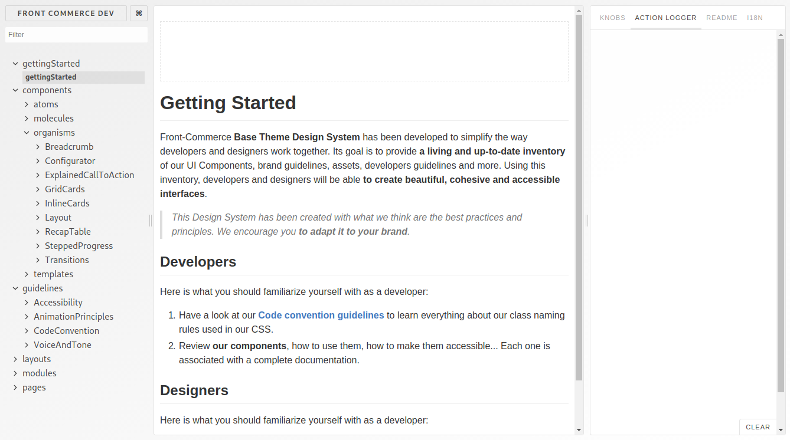
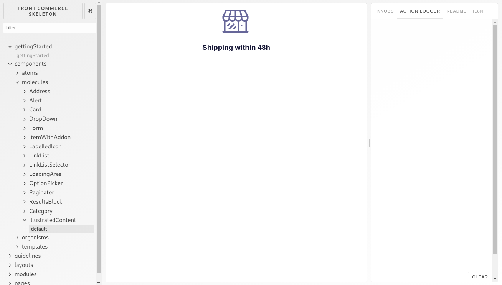

<p>{frontMatter.description}</p>

import Figure from "@site/src/components/Figure";

The concept lying behind a Design System is to document how your brand
communicates with its users. This goes from global guides such as "Voice and
tone", "Code Convention", "Accessibility"… to components documentation that
focus on where and how to use a specific component.

Such a Design System should be customized to the way your team(s) work and
should evolve according to your needs. But with Front-Commerce, we provide you a
base you can iterate on.

Technically, we use Storybook which is a tool that references `stories` for each
component you want to document. With these stories, it will launch for you a
website that allows you to browse through your components.



In this documentation we will go through a basic tutorial that gets you started
with writing stories within Front-Commerce. But if you want to learn more about
Storybook, please refer to
[their documentation](https://storybook.js.org/basics/writing-stories/).

<!-- TODO For more detailed information about Front-Commerce specific configurations of Storybook, please refer to TODO -->

## Add your own story

In order to add your own story, you need to create a new file, that will
document how to use a component and will reference each edge cases for this
component. Each case will be what we call a `story`.

As explained in
[Storybook's documentation](https://storybook.js.org/basics/writing-stories/):

> Technically, a story is a function that returns a React element.

To do this, you will create a `.story.js` file next to your component. In this
example, we will use the same component as in
[Create a UI Component](./create-a-ui-component)'s page:
`IllustratedContent.js`. Hence, your stories file will be
`IllustratedContent.story.js` and will look like this:

```jsx title="web/theme/components/molecules/IllustratedContent/IllustratedContent.story.js"
import React from "react";
import IllustratedContent from "./IllustratedContent.js";
import { storiesOf } from "@storybook/react";
import Icon from "theme/ui/atoms/Icon";
import { H3 } from "theme/ui/atoms/Typography/Heading";

storiesOf("components.molecules.IllustratedContent", module).add(
  "default",
  () => {
    return (
      <IllustratedContent media={<Icon icon="calendar-full" />}>
        <H3>Shipping within 48h</H3>
      </IllustratedContent>
    );
  }
);
```

Thanks to this file, when you will launch Storybook (`npm run styleguide`), it
will **register** the stories for the component `IllustratedContent`. It will
make it accessible in the Storybook's website under `components` > `molecules`
\> `IllustratedContent`. And if you click on the `default` story in the
navigation, it will display a default story which will show the standard usecase
of the `IllustratedContent` component.

<Figure>



</Figure>

:::note

As you might have noticed, once you have added the above `IllustratedContent`
story, if you edit the story or the component itself, it will update
automatically in Storybook (this feature is called hot reloading). It greatly
improves the experience of authoring UI components.

:::

For now, we've registered only one story for the `IllustratedContent`. But you
can add more to better explain edge cases of your component. For instance you
could add a story with a very long content in order to better see how it will
behave.

```js title="web/theme/components/molecules/IllustratedContent/IllustratedContent.story.js"
import React from "react";
import IllustratedContent from "./IllustratedContent.js";
import { storiesOf } from "@storybook/react";
import Icon from "theme/ui/atoms/Icon";
import { H3 } from "theme/ui/atoms/Typography/Heading";
// highlight-start
import Paragraph from "theme/ui/atoms/Typography/Paragraph";
// highlight-end

storiesOf("components.molecules.IllustratedContent", module)
  .add("default", () => {
    <IllustratedContent media={<Icon icon="calendar-full" />}>
      <H3>Shipping within 48h</H3>
    </IllustratedContent>;
  })
  // highlight-start
  .add("with long content", () => {
    return (
      <IllustratedContent media={<Icon icon="calendar-full" />}>
        <H3>Shipping within 48h</H3>
        <Paragraph>
          We are using many delivery services to let you choose what is best for
          you!
        </Paragraph>
      </IllustratedContent>
    );
  });
// highlight-end
```

This can be a nice and efficient way to show your designer how the
implementation will behave and ask for feedback to improve the User Experience.

## Add a new usecase to an existing story

There are some cases where the story already exists but you want to add a new
edge case. This will usually happen when you override a core component of
Front-Commerce and you want to update its story to document the new use case.

In this example, we will consider that you have overridden and updated the
`Button` component (as explained in [Extend the theme](./extend-the-theme)) to
add a new type of button: `tertiary`.

To add this story, you will need to override the `Button.story.js` in the same
way you overrode the `Button.js`. This means that you should copy the existing
story from
[`node_modules/front-commerce/src/web/theme/components/atoms/Button/Button.story.js`](https://gitlab.blackswift.cloud/front-commerce/front-commerce/-/blob/784684ce56cca69ca5c2e42d5d421a8c0b4bb9c3/src/web/theme/components/atoms/Button/Button.story.js)
to `my-module/web/theme/components/atoms/Button/Button.story.js`.

Once you have copied the file, you need to restart the Storybook with
`npm run styleguide`. There should be no change in Storybook's interface, but if
you add the following story in your newly created file, you should see a new
`tertiary` story appear in the navigation, that will display the tertiary
button.

```diff
+  .add("tertiary", () => (
+    <Button
+      onClick={action("Button clicked")}
+      tertiary
+    >
+      Click!
+    </Button>
+  )
```

## Create stories for complex components

You now are able to customize your stories and document all your components.
However, you may stumble into more complex issues such as internationalisation,
routing and data fetching in some of your components.

But it is your lucky day! With Front-Commerce's components, we have had the same
issues and have created helpers that should make your life easier when
documenting those complex components.

These helpers are located in
[`node_modules/front-commerce/src/web/storybook/addons`](https://gitlab.blackswift.cloud/front-commerce/front-commerce/tree/2.x/src/web/storybook/addons)
and you can import them by using the alias `web/storybook/addons/...`. For now,
we have four of them:

- [`web/storybook/addons/apollo/ApolloDecorator`](https://gitlab.blackswift.cloud/front-commerce/front-commerce/-/blob/784684ce56cca69ca5c2e42d5d421a8c0b4bb9c3/src/web/storybook/addons/apollo/ApolloDecorator.js):
  mocks the data fetched by your components
- [`web/storybook/addons/form/formDecorator`](https://gitlab.blackswift.cloud/front-commerce/front-commerce/-/blob/784684ce56cca69ca5c2e42d5d421a8c0b4bb9c3/src/web/storybook/addons/form/formDecorator.js):
  mocks a Form surrounding the input component you are documenting
- [`web/storybook/addons/router/routerDecorator`](https://gitlab.blackswift.cloud/front-commerce/front-commerce/-/blob/784684ce56cca69ca5c2e42d5d421a8c0b4bb9c3/src/web/storybook/addons/router/routerDecorator.js):
  mocks the routing and the URLs of your application

<!-- TODO document usage of each of these helpers -->

## Display only the relevant stories to your Design System

If you run the styleguide for your own project, you may notice that
Front-Commerce comes with a lot of stories. This is what serves as documentation
Front-Commerce base theme's core components.

However, you might not use each one of them in your final theme, and some
stories might become irrelevant in your design system. To chose which one to
display, you need to update the `.front-commerce.js` configuration file, and add
the key
[`styleguidePaths`](/docs/2.x/reference/front-commerce-js#styleguidepaths).

```js title=".front-commerce.js"
module.exports = {
  name: "Front Commerce Demo",
  url: "https://demo.front-commerce.com",
  modules: ["./my-module"],
  serverModules: [
    { name: "FrontCommerce", path: "./modules/front-commerce" },
    { name: "Magento2", path: "./modules/magento2" },
    { name: "SampleBlog", path: "./model/blog" },
  ],
  // highlight-start
  styleguidePaths: [
    /.?\/components\/atoms\/.*.story.js$/,
    /.?\/components\/molecules\/.*.story.js$/,
  ],
  // highlight-end
};
```

The value is an array containing the regex that matches the stories you want to
use in your styleguide. In this example, we only want to display atoms and
molecules from our UI Components. But please remember that this will fetch the
stories within all the `web/theme` folder from
[`modules` defined in `.front-commerce.js`](/docs/2.x/reference/front-commerce-js#modules).

Hence, if you don't want to have an atom that is defined within Front-Commerce
core, but still want the other atoms, you will need to be more specific within
your [`styleguidePaths`](/docs/2.x/reference/front-commerce-js#styleguidepaths)
array. For instance, if you only want the `Typography` related stories, and the
`Button` related stories, you will need to write like this:

```diff
  styleguidePaths: [
-    /.?\/components\/atoms\/.*.story.js$/,
+    /.?\/components\/atoms\/Button\/.*.story.js$/,
+    /.?\/components\/atoms\/Typography\/.*.story.js$/,
    /.?\/components\/molecules\/.*.story.js$/,
  ]
```

:::info

If you don't define the
[`styleguidePaths`](/docs/2.x/reference/front-commerce-js#styleguidepaths) key
in your `.front-commerce.js` file, each story found in the `web/theme` folder
will be used.

:::
