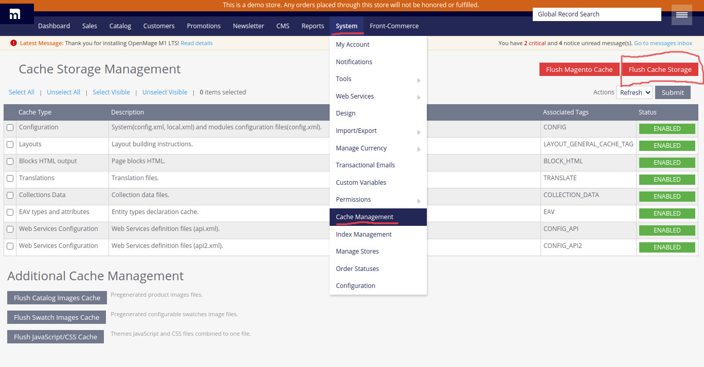

import SinceVersion from "@site/src/components/SinceVersion";

{frontMatter.description}

import BrowserWindow from "@site/src/components/BrowserWindow";

## Additional headers in Magento API calls

<SinceVersion tag="2.7" />

Front-Commerce allows you to send additional headers in all API calls. To do so,
you must define the `magento.api.extraHeaders` (for storefront API) and/or
`magento.api.extraAdminHeaders` (for admin API) configuration values from a
[configuration provider](/docs/advanced/server/configurations#what-is-a-configuration-provider).

These additional headers could be useful if you want to add additional context
to your queries, depending on the request or to detect Front-Commerce requests
from your Magento server.

## Clearing Front-Commerce cache

To clear the Front-Commerce cache, you can flush cache storage from the admin
interface. To do this go to System > Cache Management then click on Flush Cache
Storage button on the top right corner. (see below screenshot for more details).

<BrowserWindow url="http://magento1.localhost.me/admin" fullscreen>

</BrowserWindow>
