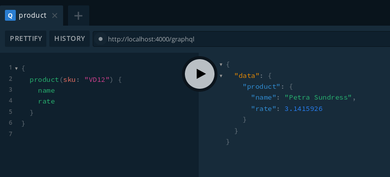
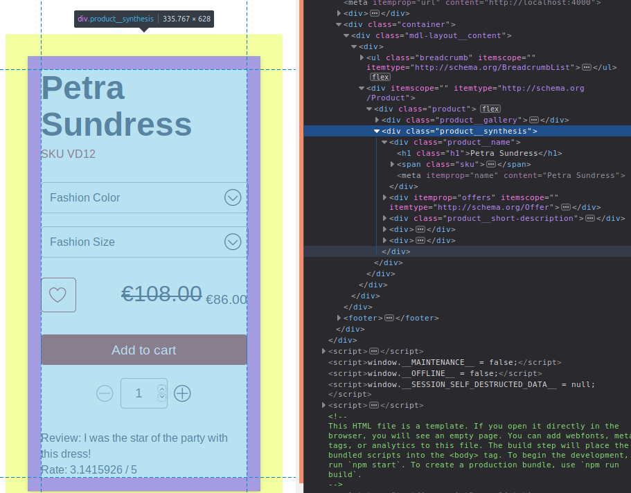
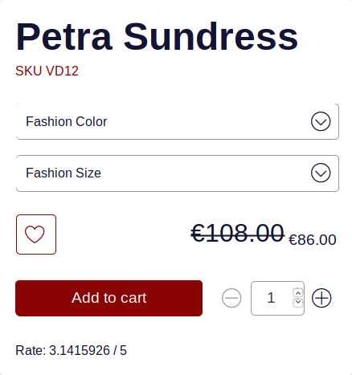

<p>{frontMatter.description}</p>

import BrowserWindow from "@site/src/components/BrowserWindow";
import Figure from "@site/src/components/Figure";

Let's say we want to add a new element to display on a product's page (for
instance, a product's rate). You will have to:

1. Add an attribute to your Magento 2.
2. Expose the attribute in your GraphQL schema.
3. Display it on screen.

## Add a value to your database

The process to do so may vary with the backend software you are using. For
Magento 2 (used in this example), you can refer to
[How to Create Product Attributes in Magento 2](https://www.fastcomet.com/tutorials/magento2/product-attributes).

## Expose the attribute in your GraphQL schema

We want to display the `rate` of a product on the product page. To keep it
simple, it will only consist in displaying a number, which can be manually
edited by the merchant. This feature will be stored in a new module called
`my-module`.

:::info

You could directly edit the files at
`node_modules/front-commerce/path/to/something`, but this is not recommended
since running `npm install` might erase any modification. You can learn
[how to extend the GraphQL schema](/docs/2.x/essentials/extend-the-graphql-schema).

:::

Let's create a new module along with its folder structure. At the root of your
repository, type the following command.

```shell
mkdir -p my-module/server/modules/ratings
```

### Add the module to Front-Commerce

Now we will add the module we just made to Front-Commerce. Edit the
`.front-commerce.js` file (root folder) as shown below to do so.

```diff title=".front-commerce.js"
module.exports = {
  name: "Front-Commerce Skeleton",
  url: "http://localhost:4000",
- modules: ["./src"],
+ modules: ["./my-module", "./src"],
  serverModules: [
    { name: "FrontCommerce", path: "server/modules/front-commerce" },
-   { name: "Magento2", path: "server/modules/magento2" }
+   { name: "Magento2", path: "server/modules/magento2" },
+   { name: "Ratings", path: "./my-module/server/modules/ratings" }
  ]
};
```

### Expand the Product definition

First, we need to tell the server how to customise the GraphQL schema. To do so,
we will create a file named `schema.gql` and type the following code. It means
that we are expanding the definition of a product: it can now be rated.

```graphql title="my-module/server/modules/ratings/schema.gql"
extend type Product {
  rate: Float
}
```

### Implement the resolver

We must now define what Front-Commerce should fetch when `rate` is requested in
a GraphQL query; in other words we must write the code that will **resolve** the
queries for the rates.

Create a file named `resolvers.js` and type the following code. It implements
the resolver.

```js title="my-module/server/modules/ratings/resolvers.js"
export default {
  Product: {
    rate: ({ rate }) => parseFloat(rate),
  },
};
```

### Declare the module

If we want our code to be taken into account when the module is loaded, we must
reference it.

In the file named `index.js`, type the following code. It references the schema
and the resolver from earlier.

```js title="my-module/server/modules/ratings/index.js"
import typeDefs from "./schema.gql";
import resolvers from "./resolvers";

export default {
  namespace: "Ratings",
  typeDefs: typeDefs,
  resolvers: resolvers,
};
```

### Discover the playground

By typing `yourhostname/playground` or `yourhostname/graphiql` (in our case
`localhost:4000/playground`) in your browser address bar, you can access a
GraphQL playground with a nice GUI to test your queries. For instance, type the
following code in the left pane and press `Ctrl` + `Enter` (or click the
**play** button).

**You will need to restart the application to access the updated schema in the
playground.**

And here is a screenshot of the GraphQL query.

<BrowserWindow url="http://localhost:4000/playground" fullscreen >



</BrowserWindow>

```graphql title="http://localhost:4000/playground"
{
  product(sku: "yourSKUhere") {
    name
    rate
  }
}
```

From this GraphQL query, you should get a JSON content that looks like this:

```json
{
  "data": {
    "product": {
      "name": "Your product name",
      "rate": // the value stored in your backoffice (Magento 2 in this case)
    }
  }
}
```

## Display the attribute in a product page

Now that you have access to your attribute, you can display it however you want
in your React application. In this example, we will add it on the product's
page, in the right section.

### How to find which files to edit

On your web page, right click on the element you wish to edit, then click on
**Inspect Element**. In the inspector, you can look for the `class` that holds
the elements you want to edit. Here, the `class` is `product__synthesis`.

<Figure>



</Figure>

Then you can search for that keyword in your `node_modules/front-commerce/src`
folder and you will find the right files.

<Figure>


</Figure>

### Overriding the files

In **this** example, the files to be overridden are
`ProductSynthesisFragment.gql` and `Synthesis.js` both located at
`node_modules/front-commerce/src/web/theme/modules/ProductView/Synthesis/`. Copy
and paste them into `my-module/web/theme/modules/ProductView/Synthesis`.  
See [Extend the theme](/docs/2.x/essentials/extend-the-theme) for more details.

Once you have created the new files, **restart your application** to ensure that
these are used instead of the core ones.

### Updating the query

In
`my-module/web/theme/modules/ProductView/Synthesis/ProductSynthesisFragment.gql`,
add the following query line. It means that the application will request the
`rate` field as well when sending the query. (Depending on the version of
Front-Commerce you are using, the content might differ slightly.)

```graphql title="my-module/web/theme/modules/ProductView/Synthesis/ProductSynthesisFragment.gql"
#import "theme/components/organisms/Configurator/ProductConfiguratorFragment.gql"
#import "theme/modules/AddToCart/ProductStockFragment.gql"
#import "theme/components/atoms/Typography/Price/ProductPriceFragment.gql"
#import "theme/modules/ProductView/Details/ProductDetailsFragment.gql"

fragment ProductSynthesisFragment on Product {
  sku
  name
  ...ProductPriceFragment
  description
  // highlight-next-line
  rate
  ...ProductConfiguratorFragment
  ...ProductStockFragment
  ...ProductDetailsFragment
  configurations {
    product {
      sku
      ...ProductPriceFragment
    }
  }
}
```

:::info

GraphQL queries can be split in Fragments and each fragment is supposed to live
next to a component in order to easily request all the data needed for your
component. Thus, since we need to display some new data on the
`ProductSynthesis` component, we update the `ProductSynthesisFragment`.

:::

## Displaying the result on screen

We're almost there! In the file `Synthesis.js` (which generates the product
page), you can add some code to display the `rate`. Knowing React.js or at least
HTML syntax is necessary to perform this step without impacting other items on
the page.

```jsx
// Many more things here
const ProductSynthesis = (props) => {
  const {
    product,
    // Many more things here
  } = props;
  return (
    <div className="product__synthesis">
      {/* Many more things here */}
      // highlight-next-line
      <div>Rate: {product.rate} / 5</div>
      {/* Many more things here */}
    </div>
  );
};

export default ProductSynthesis;
```

## Conclusion

Here is a screenshot of the final result on the product page.

<Figure>



</Figure>

We suggest you try to add your own custom attribute, just to make sure you
understood the concepts and you master the process.
