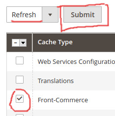

import SinceVersion from "@site/src/components/SinceVersion";
<SinceVersion tag="2.7" />;

<p>{frontMatter.description}</p>

import Figure from "@site/src/components/Figure";

In this section, you will learn some advanced usages of the Magento 2
integration.

## Caching customers' cart

<SinceVersion tag="2.19" />

By default, the customer cart is systematically fetched from Magento. While this
ensures the freshness of the cart representation, this generates a significant
load on Magento side and slows down some operations in Front-Commerce. In
2.19.0, we have added a cart cache mechanism. For now, this feature is
considered as **experimental** and must be explicitly enabled by defining the
`FRONT_COMMERCE_CART_CACHE_ENABLE` environment variable.

```shell title=.env
FRONT_COMMERCE_CART_CACHE_ENABLE=true
```

:::caution

The cart handling is a critical feature on an eCommerce website, if you enable
the cart cache we strongly advice to fully test your project before going live
with it.

:::

When the cart cache is enabled, Front-Commerce will cache the cart and as with
any cache mechanism, at some point, the cache needs to be expired.
Front-Commerce takes care of expiring the cart cache when an operation can have
an effect on the cart representation (for instance when adding an item to the
cart). If you use an API that changes the cart, you will also have to expire the
cart cache. To do that, you can use
[`decorateWithCartCacheExpire`](https://gitlab.blackswift.cloud/front-commerce/front-commerce/-/blob/784684ce56cca69ca5c2e42d5d421a8c0b4bb9c3/src/server/modules/magento2/cart/cache/decorateWithCartCacheExpire.js)
in the loader where this API is used. You can have a look at how it is used in
[`CachedCartLoader`](https://gitlab.blackswift.cloud/front-commerce/front-commerce/-/blob/d8d74295d36455419f5e80c4d28e69987976b59c/src/server/modules/magento2/cart/loaders/CachedCartLoader.js#L20-24)
or
[`CartCacheAwareStoreCreditLoader`](https://gitlab.blackswift.cloud/front-commerce/front-commerce/-/blob/d29c30a0c6a513472b66f10441bd2c620903b11c/src/server/modules/magento2-commerce/store-credit/loaders/CartCacheAwareStoreCreditLoader.js#L43-51)
where the cart cache is expired after some operations.

:::caution

To avoid any cache corruption, make sure to always use the `CartCache` instance
created by the `Magento2/Cart` GraphQL module (see for instance
[the initialization of the `StoreCredit` loader](https://gitlab.blackswift.cloud/front-commerce/front-commerce/-/blob/10a4e81004d0b5b331bdb62b96b1a6daf3e66788/src/server/modules/magento2-commerce/store-credit/index.js#L31))

:::

## Caching current customers' information

<SinceVersion tag="2.19" />

By default, any GraphQL query fetching data under the `Query.me` field
(`Customer` type) systematically leads to customer data being fetched from
Magento. While this ensure the freshness of current customer's information, it
has several drawbacks:

- Magento is hit more often than needed
- child resolvers are resolved after this initial query is received (waterfall
  effect)

Considering that customer's information are likely not updated without user
interaction on the application, we've added a way to cache customer's
information in their user session in 2.19.0. It allows to greatly improve the
perceived performance of transactional user journeys, but should be adopted with
care.

For now, this feature is considered as **experimental** and must be explicitly
enabled by defining the `FRONT_COMMERCE_CURRENT_CUSTOMER_CACHE_ENABLE`
environment variable.

```shell title=.env
FRONT_COMMERCE_CURRENT_CUSTOMER_CACHE_ENABLE=true
```

:::caution

If you enable current customer's cache, we strongly advice to fully test your
project before going live with it. You can use the
`DEBUG=front-commerce:customer:cache` flag to monitor what happens in your
process output.

:::

When the current customer cache is enabled, Front-Commerce will cache customer's
information in its own session. As with any cache mechanism, at some point, the
cache needs to be expired.

Front-Commerce takes care of expiring these information when an operation can
have an effect on the customer information (for instance when adding an address
to the account). If you use an API that updates customer information, you will
also have to expire the cart cache.

To do that, you can use
[`makeCurrentCustomerCache`](https://gitlab.blackswift.cloud/front-commerce/front-commerce/-/blob/784684ce56cca69ca5c2e42d5d421a8c0b4bb9c3/src/server/modules/magento2/customer/cache/makeCurrentCustomerCache.js)
factory to create an instance of this cache, and `expire()` it. You can have a
look at how it is used in
[`CustomerLoader`](https://gitlab.blackswift.cloud/front-commerce/front-commerce/-/blob/784684ce56cca69ca5c2e42d5d421a8c0b4bb9c3/src/server/modules/magento2/customer/loaders/CustomerLoader.js)
where the customer cache is expired after some operations.


## Optimized add multiple products to the cart

<SinceVersion tag="2.27" />

By default, the `addMultipleItemsToCart` mutation relies on the Magento2 REST
API. When this mutation is called, Front-Commerce triggers sequentially as many
REST API calls as there are different products to add to the cart. With a high
number of products, this process can be quite slow.

By setting the `FRONT_COMMERCE_OPTIMIZED_ADD_MULTIPLE_CART_ITEMS` environment
variable, the `addMultipleItemsToCart` mutation leverages the Magento2 GraphQL
API to add many products to the cart in a maximum 3 API calls no matter the
number of products. This feature is not enabled by default because it comes with
2 limitations:

* the Magento2 mutation used behind the scene does not support bundle products
  where several products can be picked for an item (input type `checkbox`)
* With Magento 2.4.6, the mutation is not able to set customizable options.


## Additional headers in Magento API calls

<SinceVersion tag="2.7" />

Front-Commerce allows you to send additional headers in all API calls. To do so,
you must define the `magento.api.extraHeaders` (for storefront API) and/or
`magento.api.extraAdminHeaders` (for admin API) configuration values from a
[configuration provider](/docs/2.x/advanced/server/configurations#what-is-a-configuration-provider).

These additional headers could be useful if you want to add additional context
to your queries, depending on the request or to detect Front-Commerce requests
from your Magento server.

:::tip

You can refer to our
[Quanta module example](https://github.com/front-commerce/examples) for a
working example using this feature.

:::

## Clearing Front-Commerce cache

There are two ways to clear the magento cache:

1. Run the below command from the command line on the magento server:

   ```shell
   bin/magento cache:clean -- front-commerce
   ```

2. From the admin interface go to System > Cache Management then select
   Front-Commerce, make sure that refresh is selected and then click the Submit
   button. (see below screenshot for more details).

<Figure>



</Figure>

## Deactivating URL rewrites in emails

<SinceVersion tag="Magento2 module 2.10.0" />

For Merchants also using their Magento2 backend in a non-headless way, it is
possible to disable URL rewrites for emails related to the monolithic Magento2
frontend while rewriting emails sent from a Front-Commerce API call.

This feature is an opt-in feature, which means that merchants can choose to
enable or disable it based on their requirements.

To do so, go to the "**Stores > Configuration > General > Front-Commerce**"
section and update the configuration as illustrated below:


- when this configuration is `Yes` (default), URLs in all emails sent are
  rewritten to use the Front-Commerce frontend URL.
- when this configuration is `No`, URLs in emails are not rewritten except if
  the email is directly sent from a Front-Commerce API call.
