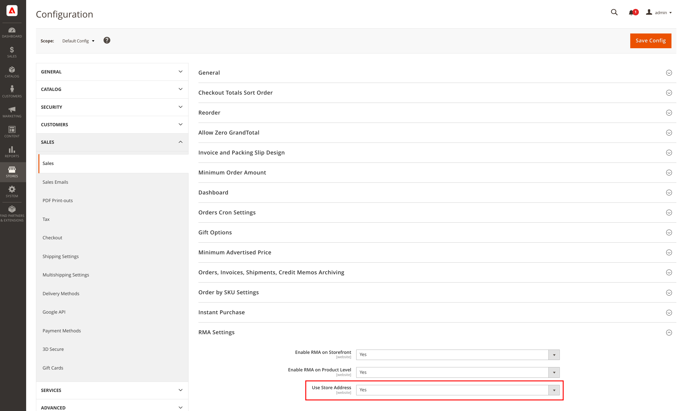
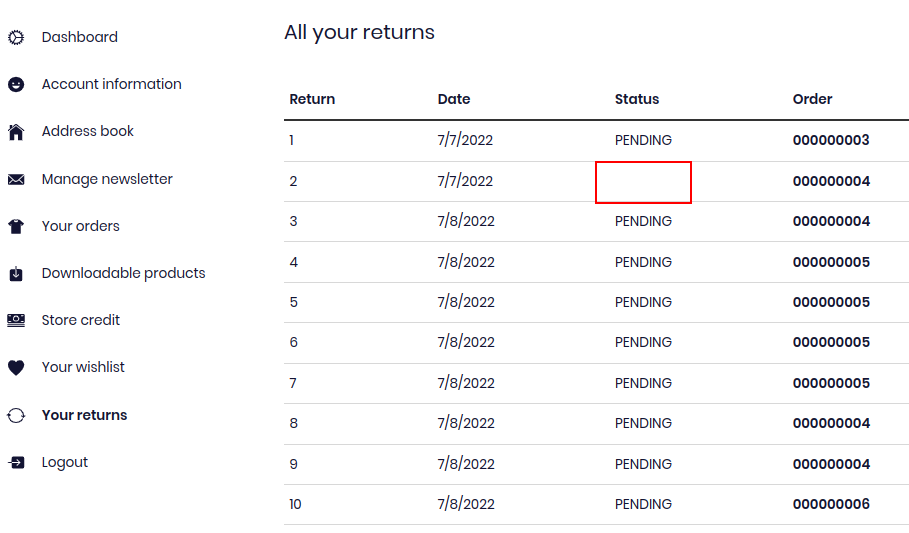

import ContactLink from "@site/src/components/ContactLink";
import SinceVersion from "@site/src/components/SinceVersion";
import BrowserWindow from "@site/src/components/BrowserWindow";

<SinceVersion tag="2.11" />

<p>{frontMatter.description}</p>

The Adobe Commerce improves existing features such as Cms Pages (to partially
expose <a href="https://docs.magento.com/user-guide/cms/page-hierarchy.html">the
Page Hierarchy mechanism</a> and bring support for Adobe Commerce specific
features such as <abbr title="Return Merchandise Authorization">RMA</abbr> or
Store Credits.

## Enable Magento Commerce support

### Magento2 Commerce module installation

You need to install the
[`front-commerce/magento2-commerce-module` module](https://gitlab.blackswift.cloud/front-commerce/magento2-commerce-module-front-commerce/):

```shell
composer config repositories.front-commerce-magento2-commerce git \
    git@gitlab.blackswift.cloud:front-commerce/magento2-commerce-module-front-commerce.git

composer require front-commerce/magento2-commerce-module

php bin/magento setup:upgrade
```

:::tip

We recommend to use a specific version of this module and not to blindly rely on
the latest version.

:::

### Front-Commerce configuration

To enable Magento2 Commerce features, you need to enable the Magento2 Commerce
module:

```diff
diff --git a/.front-commerce.js b/.front-commerce.js
index d607e0c..426619f 100644
--- a/.front-commerce.js
+++ b/.front-commerce.js
@@ -13,6 +13,7 @@ module.exports = {
       path: "datasource-elasticsearch/server/modules/magento2-elasticsearch",
     },
     { name: "Magento2", path: "server/modules/magento2" },
+    { name: "Magento2Commerce", path: "server/modules/magento2-commerce" },
   ],
   webModules: [
     { name: "FrontCommerce", path: "front-commerce/src/web" },
```

After having restarted Front-Commerce, the Magento2 Commerce module should be
enabled.

## Features

### Cms Page children

The `magento2-commerce` module improves the Graph to expose the children pages
of a Cms Page. With this module, you can for instance run the following the
query:

```graphql
query CmsPage {
  cmsPageList(identifiers: ["customer-service"]) {
    identifier
    title
    children {
      # <- only available with magento2-commerce module
      identifier
      title
    }
  }
}
```

Depending the actual page hierarchy in Magento2, it could return something like:

```json
{
  "data": {
    "cmsPageList": [
      {
        "identifier": "customer-service",
        "title": "Customer Service",
        "children": [
          {
            "identifier": "how-to-return",
            "title": "How to return a product"
          },
          {
            "identifier": "faq",
            "title": "Frequently asked questions"
          }
        ]
      }
    ]
  }
}
```

This can be handy to build a structured menu for instance.

### <abbr title="Return Merchandise Authorization">RMA</abbr>

The `magento2-commerce` module implements the required GraphQL resolvers to
provide
[Front-Commerce Return Merchandise Authorization features](/docs/2.x/advanced/features/return-merchandise-authorization)
using Adobe Commerce APIs.

Enabling the module is the only thing you'll have to do. It would then work as
you might expect.

#### Known issues

As of Adobe Commerce 2.4.4, there are **known issues** in the Adobe Commerce
APIs used by Front-Commerce. It leads to some minor limitations explained in
this section.

```mdx-code-block
<details>
  <summary>Impossible to use the feature with "Use Store Address" enabled</summary>
  <div>
```

You may encounter an "_Address for returns is not configured in admin_" error
when browsing pages using RMA-related data in your application (e.g: browsing an
order page):

```js
  An error occurred during an inner GraphQL query xxxxxxx
  […]
    "data": [
      {
        "message": "Address for returns is not configured in admin.",
        "extensions": {
          "category": "graphql-no-such-entity"
        },
```

This error is due to a configuration in Magento that doesn't seem to be
supported yet.

Please check your RMA settings ("_Configuration > Sales > RMA Settings_") and
ensure that "_Use Store Address_" is "_No_" if it isn't the case yet. You will
have to duplicate your return store address information here, which will make
the above error disappear.



```mdx-code-block
  </div>
</details>
```

<!--------------------DETAILS-------------------->

```mdx-code-block
<details>
  <summary>Processed and Closed RMA have no status displayed</summary>
  <div>
```

When a return is "_Processed and Closed_" in Magento, the Magento GraphQL API
returns a `null` value for the status.

Under the hood, the following error is occurring in Magento:

> report.ERROR: Expected a value of type "ReturnStatus" but received: (empty
> string) (status is `null` )

[We've decided](https://gitlab.blackswift.cloud/front-commerce/front-commerce/-/merge_requests/1382/#note_1020963128)
to cope with this flaw, ignore the error and display an empty status for such
returns.



```mdx-code-block
  </div>
</details>
```

<!--------------------DETAILS-------------------->

```mdx-code-block
<details>
  <summary>Impossible to create a new return (patch needed)</summary>
  <div>
```

[A known bug in Magento core](https://github.com/magento/magento2/issues/35910#issuecomment-1238916647)
can lead to an error "_Value of reason is incorrect_" when creating a new
Return.

The Front-Commerce Magento2 OpenSource module contains a patch for this known
issue
[since its version 2.8.3](https://gitlab.blackswift.cloud/front-commerce/magento2-module-front-commerce/-/releases/2.8.3).

Please ensure that your project is properly patched by ensuring that L42 of
`vendor/magento/module-eav/Model/ResourceModel/Entity/Attribute/OptionValueProvider.php`
filters on ` option_id` instead of `value_id`.

If it isn't the case, there is an issue with the patching process in your
project. <ContactLink>Contact us and we'll help you to troubleshoot
this</ContactLink>.

```mdx-code-block
  </div>
</details>
```

<!--------------------DETAILS-------------------->

```mdx-code-block
<details>
  <summary className="flex justify-between"><span>The <code>Yes/No</code> field returns the id instead of value to the end user</span></summary>
  <div>
```

When configuring the "Yes/No" field, the default options `Yes` equates to the
value `1` and `No` to the value `0`.

```json
{
  label: "Yes",
  value: "1"
},
{
  label: "No",
  value: "0"
}
```

When the user selects the `Yes` option, the value `1` is displayed in the return
details page instead of the option label `Yes`.

<BrowserWindow noPadding>

<video width="100%" height="400" controls className="video video-contain">
  <source
    src={require("./assets/rma-yes-no-limitation.mp4").default}
    type="video/mp4"
  />
  Your browser does not support the video tag.
</video>

</BrowserWindow>

This is due to the way the Magento Commerce module returns the submitted values,
we do not currently have any way of detecting that the field is a boolean field
to eventually map the values to their labels.

#### Possible solutions

##### 1. Use a dropdown field (recommended)

Use the dropdown field with the options `Yes` and `No`. The dropdown field
correctly use the option values instead of the option ids.

##### 2. Override the `ReturnedItemAttributeTable`

You can override the `ReturnedItemAttributeTable` component to map the values
based on a static label, for example

```jsx title="src/web/theme/modules/User/Order/OrderReturns/ReturnedItemAttributeTable.js"
import React from "react";
import { FormattedMessage } from "react-intl";
import Wysiwyg from "theme/modules/WysiwygV2";

/**
 * @typedef Attribute
 * @property {string} label
 * @property {TODO_TypeDef} value
 */

/**
 * @type {React.FC<{ attributes:Attribute[] }>} props
 */
const ReturnedItemAttributeTable = (props) => {
  return (
    <table>
      <thead>
        <tr>
          <th>
            <FormattedMessage
              id="modules.User.Order.OrderReturns.ReturnedItemAttributeTable.question"
              defaultMessage="Question"
            />
          </th>
          <th>
            <FormattedMessage
              id="modules.User.Order.OrderReturns.ReturnedItemAttributeTable.answer"
              defaultMessage="Answer"
            />
          </th>
        </tr>
      </thead>
      <tbody>
        {props.attributes.map((attribute, i) => (
          <tr key={attribute.label + `-${i}`}>
            <td>{attribute.label}</td>
            <td>
              // remove-next-line
              <Wysiwyg content={attribute.value} />
              // add-start
              {attribute.label === "Yes/No" ? (
                attribute.value === "1" ? (
                  "Yes"
                ) : (
                  "No"
                )
              ) : (
                <Wysiwyg content={attribute.value} />
              )}
              // add-end
            </td>
          </tr>
        ))}
      </tbody>
    </table>
  );
};

export default ReturnedItemAttributeTable;
```

```mdx-code-block
  </div>
</details>
```

<!--------------------DETAILS-------------------->

```mdx-code-block
<details>
  <summary className="flex justify-between"><span>The <code>Text Area</code> field filter and min/max lengths</span></summary>
  <div>
```

1. When submitting a TextArea with html, the Magento API strips any html tags
   regardless of the filter option.

2. When setting a min/max length and saving the Text Area field, the values are
   not saved.

```mdx-code-block
  </div>
</details>
```

#### Returns Attributes

You can learn more about configuring Returns Attributes on the
[Magento Commerce documentation](https://experienceleague.adobe.com/docs/commerce-admin/stores-sales/order-management/returns/attributes-returns.html)

##### Supported Input Types

| **Input Type** | **Supported**                      | **Notes**                                                          |
| -------------- | ---------------------------------- | ------------------------------------------------------------------ |
| `Text Field`   | <SinceVersion tag="2.23" inline /> |                                                                    |
| `Dropdown`     | <SinceVersion tag="2.17" inline /> |                                                                    |
| `Yes/No`       | <SinceVersion tag="2.23" inline /> | see [known issues](#known-issues)                                  |
| `Text Area`    | <SinceVersion tag="2.23" inline /> | see [known issues](#known-issues)                                  |
| `File`         | ❌                                 | Magento is not yet ready to handle such files in its current state |
| `Image File`   | ❌                                 | Magento is not yet ready to handle such files in its current state |
