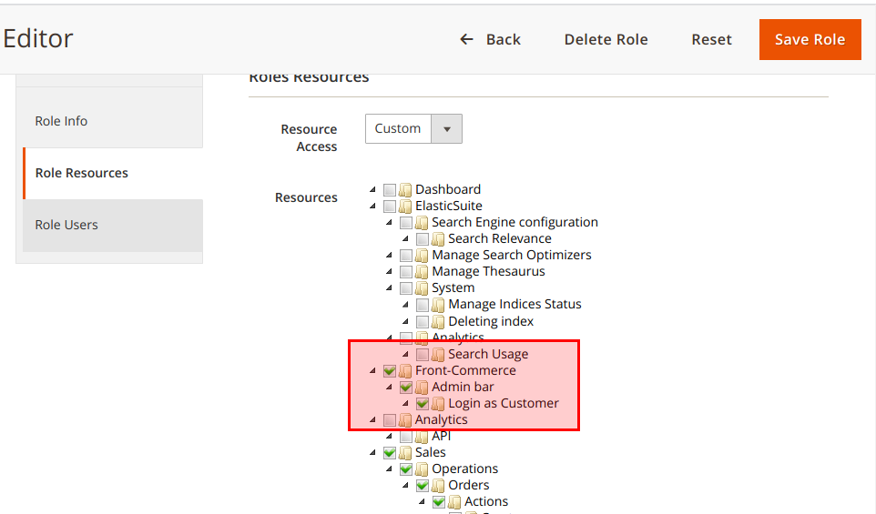
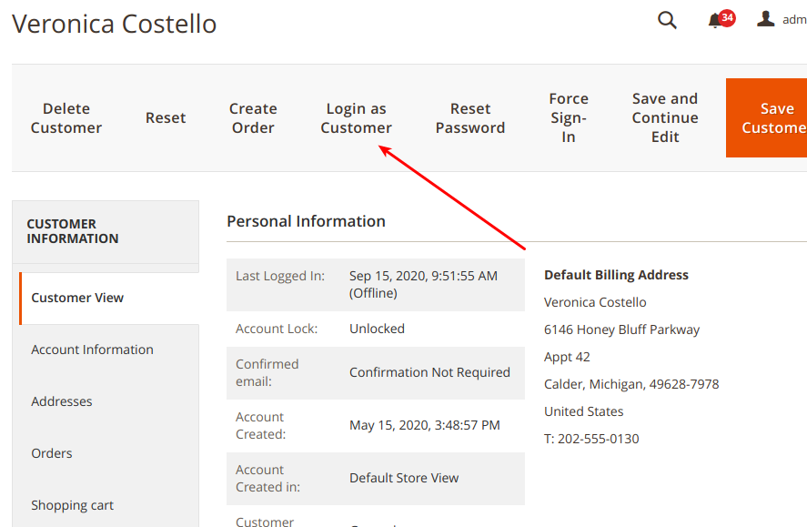

import Figure from "@site/src/components/Figure";
import SinceVersion from "@site/src/components/SinceVersion";

<SinceVersion tag="2.3" />

{frontMatter.description}

This feature is part of
[our Magento Admin detection feature](/docs/2.x/magento2/detect-admin-users) to
empower store owners in their day to day activities. You must ensure the Admin
detection feature is correctly configured before enabling this one.

## How does it work?

The "Log as Customer" feature starts from a button from the Magento Customer
page in admin. Clicking on this button will generate an authentication token and
redirects the admin user to the customers default storefront.

Admins can then log out from the customer account and log as another customer if
needed.

:::caution

This feature does not work with Firefox because of [Total Cookie Protection in
Standard
mode](https://support.mozilla.org/en-US/kb/introducing-total-cookie-protection-standard-mode).
To workaround this issue, [you can turn off the Enhanced Tracking
Protection](https://support.mozilla.org/en-US/kb/introducing-total-cookie-protection-standard-mode#w_what-do-i-do-if-a-site-seems-broken)
for your Magento admin interface.

:::

## Configuring your environment

**Prerequisites:** the 2.2.x version of the Front-Commerce Magento module is
installed and
[the admin user detection is properly configured](/docs/2.x/magento2/detect-admin-users#configuring-your-environment).

Then, you have to make sure that Magento admin interface users that need to be
able to log in as a customer have the corresponding ACL in their assigned role
under _Systems_ &gt; _Permissions_ &gt; _User Roles_:

<Figure>

</Figure>

## Log as Customer

From the Customer page, you must now view a "Login as Customer" button. Click on
it, and if everything is properly configured you might be authenticated on the
storefront as this Customer.

<Figure>

</Figure>
